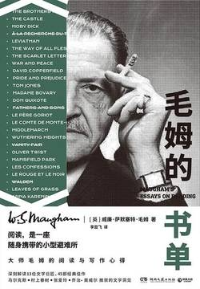

# 《毛姆的书单》

作者：【英】威廉·萨默塞特·毛姆

## 【文摘 & 笔记】

### 阅读与人生

你正在读的书有多大的价值，只有你自己才能做出最终评判

### 跳跃式阅读和小说精简本

聪明人绝不会把阅读小说当成一种任务，他完全是为了消遣。

### 什么是好小说

现在，我要冒昧地谈谈一部好的小说应该具备哪些特点。

首先，其主题必须能够引起读者的广泛兴趣。

故事情节要合乎情理，不但要促进主题的展开，还应当在故事中形成。

小说中的人物要个性鲜明

人物的行为需要符合其性格，人物的语言亦是如此。

最后我要说的是，小说还应当给人带来娱乐

当他的作品涉及这些题材时，最好不要忘了约翰逊博士的一句名言：“关于上帝、灵魂以及生命的话题，没有人能够发表任何新颖而真实或是真实而新颖的见解。”

> 原文：作者的创作力很有可能会随时间的推移而衰退，于是他只能凭借顽强的毅力和写作素养坚持下去。如果这种情况下写出的作品还能吸引读者，那可真是让人惊叹。 过去的读者往往更重视小说的“量”而不是“质”，他们花了钱，就希望小说的篇幅尽可能地长。于是，作家们为了应付出版商，就绞尽脑汁往小说里添加各种与故事发展并无太大关联的内容。他们还找到了一条捷径，就是在一篇小说中插入另一篇小说。有时候，被插入的内容足有一个中篇那么长，而这些内容与主题无关，即便有点关联，也是十分勉强的。塞万提斯的《堂·吉诃德》简直将这种生拼硬凑的行为发挥到了极致。
> 🖊：现在的网络小说差不多就这样吧，一本书写好几年，数百万字，一点一点的凑

### 爱听故事是人类的天性

> 原文：小说家们很快发现了由此导致的两性关系变化，为了维持读者的兴趣，他们频繁地让作品中的人物发生男女关系
> 🖊：美剧中常见桥段

### 两种常见的写作手法

小说的写作手法大概可以分为两类，而这两类手法各有优缺点。一类是第一人称写法，另一类是全知视角写法。

有三部书信体小说可以称为佳作，那便是《克莱丽莎》《新爱洛绮丝》以及《危险的关系》

### 建立属于你自己的哲学体系

人生的目的仅仅是追求自身的快乐，那些舍己为人的行为只是出于一种自我幻想，他们以为自己所追求的就是作为一个奉献者所得到的满足感。

### 哲学很有趣

当我头晕目眩地跟随普罗提诺从一片孤寂走进另一片孤寂时，我感到无比欣喜。纵使我清楚地知道笛卡儿在合理的前提条件下得出了极为荒谬的结论，却仍为他简洁明快的语言而着迷。阅读笛卡儿的作品就如同在清澈见底的湖中畅泳，那碧水清波定会让你心旷神怡。至于第一次读斯宾诺莎的作品则是我人生中的重要体验，他让我的内心充满了庄严、欣喜的感觉，仿佛在仰望一座巍峨高耸的山峰。

### 哲学理论随想

唯我论者只相信自己以及自身经验，他眼中的世界就是他自己的活动范围，而这个世界由他的思想和情感组成。除此之外，一切皆不存在。

从普通人的角度出发，我觉得哲学家们提出的各类有关物质与精神关系的理论中，斯宾诺莎的观点最令人信服。他认为思维实体和广延实体并无差别，属于同一类实体。当然，如今我们可以简单地称之为能量。伯特兰·罗素曾经提出过一种“中性材料”的概念，他认为这种材料是构成精神世界和物质世界的最初原料。如果我没有理解错，他的这一观点和斯宾诺莎并无太大差别，只是在语言表述上更加现代罢了。

### 精神上的休憩地

我现在所说的是那些将对于艺术的思考和鉴赏作为赖以为生的事业的人。我对此类人并不赞赏，他们往往过于自负。他们无法妥善处理生活中的各类事务，却又蔑视那些谦虚工作的人。他们自认为读过许多书，看过许多画，可以高人一等。他们打着艺术的名号来逃避生活，还愚昧无知地蔑视普通事物，否定人类基本活动的价值。事实上，他们和那些瘾君子并没有太大差别，甚至更为恶劣，因为那些瘾君子至少不像他们那样自以为是，也不会蔑视身边的人。艺术的价值和神秘论的价值一样，在于它的实际作用。如果它只能给人带来愉悦，那么不管这种精神上的愉悦有多大，其影响也极为有限，换句话说，它所带来的享受比一打牡蛎或是一杯蒙特拉谢葡萄酒大不到哪儿去。

> 原文：我对此类人并不赞赏，他们往往过于自负。他们无法妥善处理生活中的各类事务，却又蔑视那些谦虚工作的人。他们自认为读过许多书，看过许多画，可以高人一等。他们打着艺术的名号来逃避生活，还愚昧无知地蔑视普通事物，否定人类基本活动的价值。
> 🖊：一些不事生产的人，吃穿全赖别人的劳动，却觉着别人的人生没有意义

让艺术成为一种慰藉便已足够

艺术的真正价值不是美，而是正确的行为。

当你所爱的人不再爱你，这是个不小的悲剧，然而谁都帮不了你。

爱不是盲目的，死心塌地地去爱一个根本不值得爱的人，这是人生最大的悲剧。

生命之美，不过是顺应其天性，做好分内之事罢了。

### 毛姆的书单

《摩尔·弗兰德斯》

《格列佛游记》

《弃儿汤姆·琼斯的历史》和《项狄传》

《多情客游记》

《约翰逊传》

吉本的《自传》

《大卫·科波菲尔》和《众生之路》

《大卫·科波菲尔》

简·奥斯汀的《曼斯菲尔德庄园》

赫兹里特的《初识诗人》

《名利场》和《呼啸山庄》

乔治·爱略特的《米德尔马契》、特罗洛普的《尤斯塔斯钻石》和梅瑞狄斯的《利己主义者》

阅读诗歌需要有特定的心情和环境。我倾向于选择夏日的傍晚，在花园中读诗；或是坐在海边的崖壁上面，又或是躺在林中青苔密布的溪边，捧起一卷诗歌细细品味。

我心目中最好的三部诗选分别是帕格雷夫的《英诗金库》《牛津英诗选》和杰拉尔德·布莱特编写的那部广受赞誉的《英国短诗精华》

### 英国文学漫谈（二）

特罗洛普的《尤斯塔斯钻石》、梅瑞狄斯的《利己主义者》和乔治·爱略特的《米德尔马契》

### 《堂·吉诃德》和《蒙田随笔》

对于诗歌作品，最好还是阅读原文，否则还不如不读。

我并不是诗人，所以对于诗歌的鉴赏也不是很有把握。不过在我看来，韵律感是欣赏诗歌中不可或缺的因素，而这正是无论多么高明的翻译都无法呈现的。

蒙田的任何一篇散文都会给读者带来极大的享受，但是第三卷称得上是最佳之选

### 法国文学漫谈

19世纪的法国涌现出了大量优秀的小说作品，而这个时期最伟大的三位小说家非巴尔扎克、司汤达和福楼拜莫属。

### 巴尔扎克与《高老头》

人们不仅仅过他们自己的生活，还参与了别人的生活；在他们自己的生活中，他们扮演着主角；在别人的生活中，他们扮演的角色有时候是重要的，但常常是微不足道的。

### 美国文学漫谈

自传一类作品在文学史中所占比例很小，而在这为数不多的自传中，没有哪一部比《富兰克林自传》更具有经久不衰的趣味性。这本书语言质朴，这一点正如作者本人。

《红字》

现在我们赶快来谈谈19世纪。这个时期诞生了三位伟大的作家：赫尔曼·麦尔维尔、沃尔特·惠特曼以及埃德加·爱伦·坡。

霍桑曾说过：“与不同于自己的人为伍，这样的习惯对人的道德和精神健康都大有裨益。这种人不会关心你的追求，而你必须有能力走出自己的世界，才能真正地去欣赏他。”

《英国人的特性》。这本书更多的是实质性的内容，不像《论文集》的内容那样含糊、散漫、肤浅。

### 托尔斯泰和《战争与和平》

小说家的职责不是创造想法，而是创造充当他们原型的人物。想法就像人类、人类生存的城乡环境、发生的事件（事实上就是关于人类的一切）一样，可以为小说家随意使用，以创造出一件艺术品。