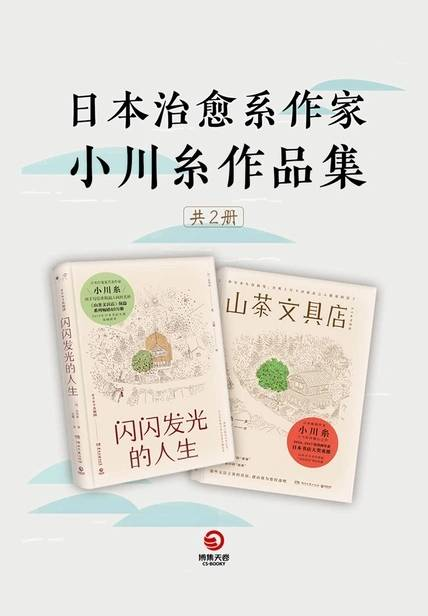

# 《山茶文具店+闪闪发光的人生（共2册）》

作者：小川糸

## 【文摘 & 笔记】
### 夏

信封是一封信的体面，所以必须写得特别仔细优美，字迹清晰。  

如果说，信封的正面像是脸，那么邮票就是决定脸部整体印象的口红。  

### 秋

> 原文：起初我并没有认出是帆子小姐，但看到她丰满的胸部，立刻想起是她。
> 
> 🖊：有引人注目的特点，才能更好的被别人记住

“偶尔堕落一下很开心。”  

### 冬

### 蜂斗菜味增

川端康成在《一人的幸福》这部短篇中，曾写过这样的话——“一生中即使只能使一个人幸福，那也是自己的幸福。”  