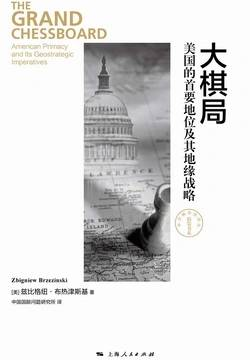

# 《大棋局》

作者：兹比格涅夫·布热津斯基

## 【文摘 & 笔记】
### 第一章 新型的霸权

> 原文：对中国人来说，“俄”音同“饿”，俄国意味着“饥饿的土地”。
> 
> 🖊：这个就太扯了吧

### 第二章 欧亚大棋局

### 第三章 民主桥头堡

> 原文：政治极端主义、狭隘民族主义或社会享乐主义
> 
> 🖊：这不就是现在的美国吗？

### 第四章 黑洞

三个高加索国家——格鲁吉亚、亚美尼亚和阿塞拜疆  

### 第五章 欧亚大陆的巴尔干

欧亚大陆的巴尔干包括9个以某种方式符合上述描述的国家，另外还有两个国家被视为潜在的候补成员。这9个国家是哈萨克斯坦、吉尔吉斯斯坦、塔吉克斯坦、乌兹别克斯坦、土库曼斯坦、阿塞拜疆、亚美尼亚和格鲁吉亚——它们都曾是已垮台的苏联的一部分——还有阿富汗。可能加入这一行列的还有土耳其和伊朗  

高加索的三个国家亚美尼亚、格鲁吉亚和阿塞拜疆可以说是建立在真正具有历史性的民族基础之上的  

阿塞拜疆的脆弱性对本地区有更为广泛的影响，因为这个国家的位置使它成为地缘政治的支轴。它可以被形容为一个至关重要的“软木塞”，控制着进入一个装着里海盆地和中亚的富饶资源的“瓶子”的通道  

### 第七章 结论

  > 原文：美国霸权所造就的一个没有战争威胁的、复杂的国际新秩序，可能会局限于世界的一些地区。
  > 
  >🖊： 美国可是在到处挑起战争呀 

> 原文：印度民主制的存在是重要的，因为它比大量的学术争论更有力地驳斥了人权和民主纯粹是西方的地方性现象这样一种观念。
> 
> 🖊：印度的人权，呵呵😄

## 【想法】

书中一再的提及“民主”，美国政府也是宣扬要向世界推行民主，然而，美国有今日的国际地位，所谓的美国民主起了多大作用？

美国在二战后成为超级大国，原子弹功不可没，而这代表的是军事力量、科技力量，支撑这些的则是发达的经济，美国的 GDP 一度占到世界 GDP 的一半以上。美国发达的经济，雄厚的科技，又不断的吸引世界各国的人才来美国发展，甚至加入美国，人才储备充足，又促进了美国的科技发展、经济发展，乃至于军事发展。形成了不断的循环增强。

二战后，美国给日本、德国投入技术支持，也使得这两个国家快速恢复，并成为经济、科技强国。

时至今日，科技的发展已不能为经济的发展带来像过去那样的推动力，他们的经济增速在不断的放缓，再回首看看他们所谓的民主政治，为他们的国家带来了多少优势？

美国介入中东国家事务，声言要推行民主，出兵伊拉克、阿富汗等国，但是为哪个国家带来了如日本、德国般的经济增长？

一个稳定的国家政权，才能够发展经济、发展科技、发展军事，这是美国称霸世界的根基，也是战后日德发展起来的根本，这也是中国目前在走的道路，而美国强行接入的中东诸国，即便实行了民主政治，可是连政局都稳定不下来，跟别说其它了。

至少，可以肯定的是，美国所谓的民主政治并不是一个国家快速发展的必由之路。