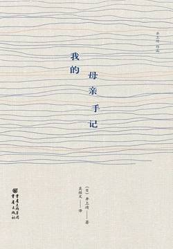

# 《我的母亲手记》

作者：井上靖

## 【文摘】

### 二

这样看来，或许母亲是让橡皮擦将自己一路走来长长的人生之线，从一端开始抹除净尽了。当然这并非出自母亲的本意，拿橡皮擦的是老衰，教人无可奈何的老衰。它将母亲数十年的人生之线，从最近的地方逐渐擦拭一空。

### 三

看看古老寺院的柱子就知道了，时间一久，材质比较松软的部分会消磨凹陷，只剩下比较坚实的纹理留下来。人差不多也是这样吧，欢乐的记忆逐渐模糊，那些痛苦烦恼倒记得清清楚楚。

活着就是这样，时时刻刻都有看得见看不见的尘劳，飘降到我们肩上，而如今的母亲正在感受它的重量吧。