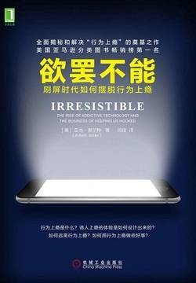

# 《欲罢不能：刷屏时代如何摆脱行为上瘾》

作者：亚当·奥尔特

## 【文摘】

### 楔子 令人上瘾的时代

瘾君子和我们其他人之间并没有清晰的界限。只要出现合适的产品或体验，谁都有可能上瘾。

行为上瘾由6种要素构成：可望而不可即的诱人目标；无法抵挡、无法预知的积极反馈；渐进式进步和改善的感觉；随着时间的推移越来越困难的任务；需要解决却又暂未解决的紧张感；强大的社会联系

### 第1章 行为上瘾的兴起

研究人员借助头戴式摄像头表明，婴儿本能地会追随父母的眼睛。分心的家长会培养出分心的孩子，因为如果家长都不能集中注意力，就会把相同的关注模式教给孩子。用该论文首席研究员的话来说：“孩子维持注意力的能力，是在语言习得、问题解决和其他关键认知发展里程碑领域取得成功的公认重要指标。如果在孩子玩耍的过程中，照料的人总是分心，或是眼睛爱漂移，会给婴儿关键发育期当中刚刚萌芽的注意力幅度造成消极影响。”

### 第2章 我们所有人的心瘾

>原文：1971年6月17日，总统尼克松召开新闻发布会上，宣布要对毒品发起战争。他意志坚决地看着摄像机说：“美国的头号公敌是毒品泛滥。”
>
>🖊：如今美国的一些州，大麻合法化👎

### 第4章 诱人的目标

注册社交媒体账户，你很快就会热衷于粉丝和点赞的增长。创建电子邮件账户，你会不停地想要保持收件箱零未读邮件。戴上健身手表，你会每天迈上一定的步数。玩“糖果传奇”（CandyCrush，一款手机游戏），你会想着打破现有的高分纪录

### 第5章 不可抗拒的积极反馈

### 第7章 逐渐升级的挑战

维果斯基解释说，如果学习资料刚好比孩子们当前的能力超出一点点，他们学得最好，最有动力。放到课堂的语境里来说，这意味着老师要指导他们扫清任务带来的障碍，但这些障碍不能太过沉重，不能让孩子们觉得依靠自己现有的技能没法找到任务的解决途径。维果斯基称之为“最近发展区”（zoneofproximaldevelopment），并用以下这张简单的图表做了表示。

### 第10章 让孩子远离行为上瘾

有相当充分的研究结果表明，儿童健康发育的最重要因素是积极的亲子关系，它以温暖、关爱的互动为特点，家长和其他照料人士敏锐地对孩子的行为线索做出响应，提供适龄互动，鼓励孩子的好奇心和学习。

自我决定理论

### 第11章 改变习惯和行为构建

行为构建不仅是让你少做错事的工具，也是让你多做好事的工具。

### 第12章 游戏化

游戏化研究员凯文·韦巴赫（KevinWerbach）和丹·亨特（DanHunter）检验了100多个游戏化案例，确认了3个共同元素：分数、徽章和排行榜。

### 尾声 不上瘾，我们能做到

发达国家里有半数人口都对某样东西上了瘾，在我看来，对大多数人而言，这里的“东西”指的是一种行为。