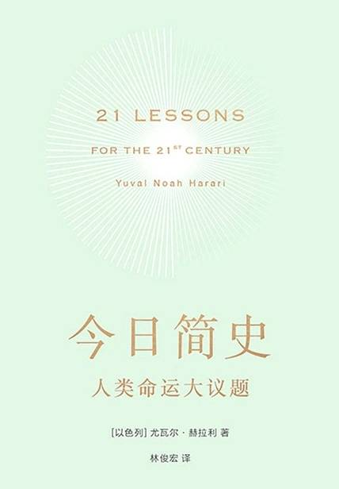

# 《今日简史：人类命运大议题》

【以色列】由瓦尔·赫拉利

## 【文摘 & 笔记】
### 第2章 就业：等你长大，可能没有工作

全民基本收入（universal basic income, UBI）。全民基本收入认为，政府应该对控制算法和机器人的亿万富翁和企业征税，再用这笔税金为每个人提供足以满足其基本需求的慷慨津贴。这样一来，既能解决因失业和经济混乱而产生的贫穷问题，也能保护富人不受平民主义的怒火洗礼。

### 第3章 自由：数据霸权与社会公平

未来的危险还不止数字独裁一项。自由主义秩序背后的价值观除了自由之外，也很重视平等。自由主义一直强调政治上的平等，也慢慢发现经济上的平等几乎同样重要。如果没有社会安全网的机制与一定的经济平等，自由就毫无意义。然而，正因为大数据算法可能会抹去自由，同时也就可能创造出历史上最不平等的社会，让所有的财富和权力集中在一小群精英手中。大多数人类的痛苦将不再是受到剥削，而是更糟的局面：再也无足轻重。  

### 第8章 宗教：神祇只是为国家服务

### 第10章 恐怖主义：切忌反应过度

> 原文：正如“恐怖主义”一词的字面含义所示，这种军事策略意图通过传播恐惧改变政治局势，而不是为了带来实质伤害。

🖊：人杀人给人们带来的恐惧远胜于车祸疾病带来的死亡
  

### 第17章 后真相时代：谎言万世永存

在第20章，我们会再次深入探讨如何避免被洗脑、怎样分辨现实与虚构，但这里我想先提供两个重要的黄金法则。  

第一条黄金法则：如果你想得到可靠的信息，必然要付出昂贵的代价。如果你总是免费得到信息，有可能你才是整个商业世界的产品  

第二条黄金法则：如果觉得某些问题似乎对你特别重要，就该真正努力阅读相关的科学文献。  

### 第1章 理想的幻灭：从旧故事到新故事

> 原文：举例来说，未来的交易可能多半无须再使用本国货币甚至任何货币，国家将不可能再针对货币所得来收税。

🖊：至少目前看来这种可能性很低，比特币等加密货币只是投机工具，他们依赖于现有的金融货币体系，根本就不可能取代他们。世界用一种统一的货币体系，几乎不可能。

自由主义的故事，是一套关于普通人的故事 。