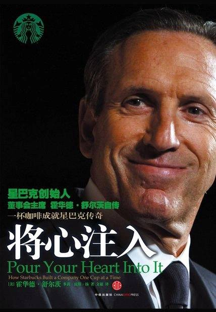

# 《将心注入》

作者：[美]霍华德·舒尔茨，多莉·琼斯·扬

### 第一部分 重新发现咖啡

每天，我都几百次提醒自己，我的物质生活和精神生活都取决于他人的劳动，无论逝者还是生者，我须尽一切努力以使自己配得上自己的所得。——阿尔伯特·爱因斯坦

每当你看见一个成功的企业，必定是有人做出过勇敢的决策。——彼得·德鲁克

布 兰奇·里基（Branch Rickey）是布鲁克林道奇队的总经理，是他签下了黑人棒球手杰基·罗宾逊，打破了种族肤色歧视，他经常说的一句话是：“幸运只眷顾有规划的人。”

坏运气的到来往往像晴天霹雳，说来就来，让你措手不及；而好运气呢，却更像是有意为之的结果。

### 第三部分 重塑企业精神

你不妨以这样的态度一点点做起：对每一位顾客每次都给以诚挚的服务，对每一家新店都付出自己的心血，对每一个市场机会都去认真把握。事实上，那也许就是取信于顾客的最佳方式。经过若干岁月耐心的磨砺，你的口碑就建立起来了，这就有可能把一个地方性的好牌子提升为一个全国性的知名品牌——而这个品牌依然与个体的顾客和社区保持着紧密联系。

建立一个影响久远的伟大品牌，首先是要有一个有吸引力的产品

其实，安全这东西差不多是一种迷信。自然界并不存在什么安全，人类的子子孙孙也不曾体验过安全。长期来看，躲避危险并不比全然暴露在外更安全。生活，要么敢于冒险，要么一无所成。——海伦·凯勒《敞开的门》（1957年）

根本性的工作是在大的框架内实现小的目标。——E·F·舒马赫《小的是美好的》

## 【笔记】

星巴克的故事。

产品：咖啡豆、咖啡（饮料），产品研发

品牌：天天-> 星巴克

连锁店： 选址、店面设计， 加盟店

库存：咖啡豆受产地自然灾害的影响，咖啡豆价格上涨 -> 应对能力、风险管理能力

管理：引入外部专业的管理人员

