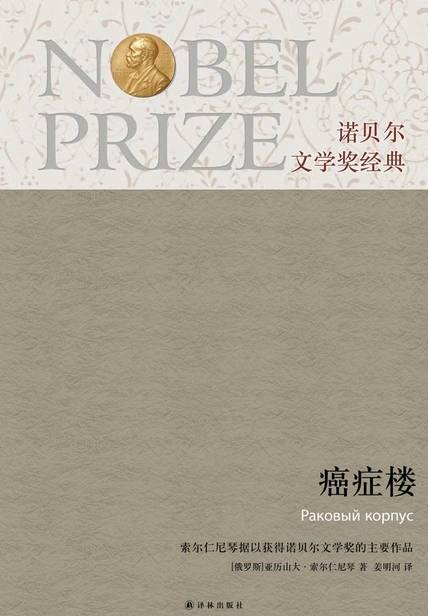

# 《癌症楼》

作者：亚历山大·索尔仁尼琴

## 【文摘】
### 第三章 小蜜蜂

“他是好样的！一个真正的人！我跟他握了手。我应该知道！既然在这之前我受了半年的折磨，而最后一个月弄得我既不能躺又不能坐，也不能站，怎么也无法止疼，一昼夜打不上几回盹儿，那我当然会把那事仔细地想过！这一秋我切身体验到，人可以在自己的肉体还没有死亡的时候跨过死亡线。体内尽管还保持着某种血液循环和食物消化过程，但是心理上已经做好了死亡的一切准备，甚至感受到死亡的滋味。对周围的一切都无动于衷，仿佛是从棺材里看到的。虽然你不把自己算做基督教徒，有时甚至相反，可是你会突然发现自己竟然宽恕了所有欺侮过你的人，就连对迫害过你的人也已无仇恨。对你来说，任何事和任何人都已无所谓了，你不想去纠正什么，什么也不会使你觉得遗憾。我甚至认为，这是一种十分平衡的心理状态，泰然自若的心境。现在，我已经脱离了这种状态，但是我不知道，这是不是值得高兴。种种欲望和激情全都会回到身上，包括好的和坏的。”

### 第四章 病号的焦虑

### 第五章 医生的焦虑

当我们觉得一团看不见的、但是浓密而沉重的迷雾进入胸膛，把那里的一切都紧紧地裹起来，向中间挤压的时候，该把这种感觉称做什么呢？懊丧？压抑？在这种时刻，我们只感觉到这团迷雾的收缩、凝聚，一时间甚至闹不清楚，究竟是什么压得我们透不过气来。

乌云虽然已经飘走，但这里那里还残留着团团疑云。

### 第七章 治病的权利

大概，这条规律带有普遍性：任何一个做事情的人做的结果总是包含两个方面——既有益处，又有害处。只不过有的益处多些，有的害处多些

### 第十一章 桦树癌

### 第十四章 审判

他感到睡意已完全没有了，起保护作用的一层雾幕已经消失。这时，恐惧马上袭来，揪住他胸膛中央的下方，而且愈攥愈紧

千头万绪开始云集和翻滚：在鲁萨诺夫的脑海中，在房间里以及更远的黑暗空间里。

### 第十五章 每人都有自己难念的经

“生下来随风飘，长大了尽胡闹，通往西天的路可只有这一条。”

### 第十八章 哪怕在墓道入口处

自行车，铁环，一旦滚动起来，便只能在运转中保持平衡，而运转一停就会倒下。男女之间的游戏也是如此，一旦开了头，便只能在发展中保持其继续存在。要是今天与昨天相比，一点进展也没有，那么游戏也就不存在了。

俗话说：肚子饿了你就吃，趁你年轻就去爱。

### 第十九章 接近于光的速度

当然，鲁萨诺夫也知道，既然所有的人都免不了要死去，自己也终究有一天要安排后事。但那是在某个时候，而不是现在！某个时候死去并不可怕，可怕的是此刻死去。

### 第二十章 美好的回忆

因为人们的幸福并不取决于富有的程度，而是取决于心与心的关系和我们的生活观。

不要相信什么预兆和先声，不要相信什么贝多芬式的叩门声！这一切都是虚幻的泡影。横下一条心，不存任何幻想！对未来不抱任何希望，不抱美好未来的幻想！有什么就满足于什么！永久——那就永久好了。

### 第二十一章 阴影消散

好像是高尔基曾经说过这样的话：如果孩子不比你强，那你算是白白生了他们，你也是白活了一辈子。
### 第二十四章 输血

世上的事不可能全知道。无论怎样，到死的时候还是个傻瓜。

### 第二十五章 薇加

凡是节日，对于单身的人来说，都是一种负担。

如今，跟过去一样，我仍然独自一人……

龙舌兰一生只开一次花，之后很快就会死去。

一个人愈是脆弱，就愈需要有几十次、甚至几百次偶然的机会才能接近一个跟自己类似的人。每一次新的巧合，只会多少提高一点点接近的程度。然而，只要有一点儿合不到一起，就会马上前功尽弃。这种合不到一起的现象又总是那么很早地出现，那么明显地暴露出来。简直没有人可以商量：该怎么办？日子该怎么过？

世上有多少人，就有多少生活道路。

### 第三十章 老医生

他送东佐娃走后，回到饭厅，在摇椅里坐下。这是一张黑漆弯木摇椅，网状的椅背因年深月久已被磨黄。他坐下时把椅子轻轻一摇，等它自己停下来之后，就不再摇动。就在摇椅提供的这种像是失去平衡和不受牵制的特殊状态中，他默默地坐了许久，动也不动。现在他经常需要这样休息。他的身体需要通过这样的休息恢复精力，他的内心状态，特别是在老伴去世以后，同样需要清静和沉思，不受外界声音、谈话的干扰，摆脱工作上的考虑，甚至摆脱作为一个医生必不可少的种种念头。他的内心状态仿佛需要清洗、净化。在这样的时刻，他觉得生存的全部意义，包括他本人漫长过去和短暂未来的一生，他的亡妻的一生、他那年轻的孙女儿以及一切人的生存的意义，并不在于他们倾注全部心力和兴趣并为他人所知的主要活动，而在于他们能在多大程度上使人生来就具有的第一个永恒形象保持不模糊、不颤动、不歪曲。就像平静的水潭里映照着一轮银月。

### 第三十四章 结局也比较悲惨

我从哪本书里可以读到关于我们的事情？关于我们的事情！难道说真的要过一百年不成？

### 第三十六章 也是最后的一天

离她的家愈近，他的神经就愈紧张。这是不折不扣的恐惧！然而这种恐惧又使人感到幸福，又使人高兴得要死。单凭这种恐惧，他此刻就有一种幸福之感！

## 【想法】

在特定的时代背景下，大部分个人的命运往往难以自行抉择，只能任时代裹挟着前行。

书中的背景设在斯大林逝世前后吧，据说斯大林进入会场，斯大林不示意，掌声就不会停下来，可在他逝世两年后，逝世纪念活动都没了，真是任你权势滔天，死后一切成空。

人都会迎来死亡，可如果知道了死亡的大概时间，有谁能坦然面对？而癌症往往就是给人们提前下了死亡通牒，所以医生往往不愿告诉病人真相，医生束手无策让病人出院，亦或者暂时控制住病情出院的人，在不知情或不愿知情中，走向死亡，或者怀着躲过一劫的侥幸继续自己的生活。
