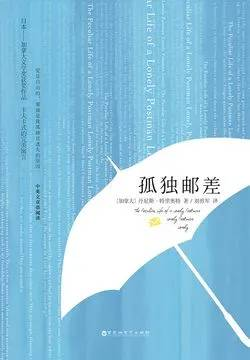

# 《孤独邮差》

作者： [加]丹尼斯·特里奥特

## 【文摘】

### 第二章

就算情人节已经过了，爱情仍然是芸芸众生老生常谈的话题。  

### 第六章

格朗普雷的死并没有在街区引起多大的轰动，因为邻居对这个人几乎一无所知。而在玛德琳诺餐厅，塔尼娅在他经常喝咖啡的桌子上摆放了一枝康乃馨。仅此而已。看来我们离开这个世界的方式大抵如此，比洛多心想。或许不经意间就走了，一切都是那样的波澜不惊，甚至都不会留下一丝痕迹，如同燕子在天空中一闪而过，一只松鼠冒冒失失地跑到马路上，很快便会被人遗忘。 大概也就这样吧。  

比洛多抖动着那些诗篇，希望能够再次出现奇迹，结果只是把纸张弄得皱巴巴。就连塞格琳写的东西也让他提不起劲儿，那一瞬间，他生平第一次——绝对是头一次——觉得那般孤独。如同一个巨大的海浪将他吞没了，让他体会到了内心最深处的孤独，将他卷入深海的无尽黑暗中，在那里，强大的旋涡又将他卷入了一个长着血盆大口的深渊中，如同一个巨大的下水道口。他挥舞着手臂，想要找到什么攀附的东西，结果却只能触及他灵魂深处的孤独，让他痛苦不堪。  

### 第一十七章

当你拿不准结果的时候，最煎熬的莫过于等待了。  

