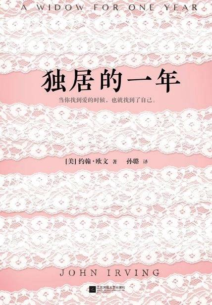

# 《独居的一年》

作者：约翰·欧文

## 【文摘】

### 到这里来……

照片即故事，故事即照片。

### 棋子

没有谁说得清什么样的面孔会触发人们对亲人的回忆，哪怕是一次皱眉、一个微笑、一缕散乱的头发都可能让他们在转瞬之间回到过去，也没有谁能够预知，“联想”这个功能在爱意迸发和追忆亡者的时刻会发挥多么强大的威力。

### 没妈的孩子

那个星期五的下午，一向在海岸边长久流连的暮色似乎都比平常多徘徊了一阵子，仿佛夜晚再也不会降临似的。

### 腿

又比如，左转弯对司机耐心的考验最微妙也最特殊——当你停车准备左转，对面却有车开来的话，千万不要提前左打方向盘，万万不能——永远不行！

“如果方向盘是正的，一旦你后面的车来不及刹车，与你的车追尾，你的车也不至于窜到左边车道撞上对面的车，”埃迪回答，“只会沿着原来的车道往前冲。”

### 离开长岛

### 四十八岁的埃迪

千万别瞧不起他人对你的称赞，你可能还不如人家夸的那样好。

### 三十六岁的露丝

做出了选择，就要承受选择对我们的影响，不是吗？

### 红蓝充气床垫

### 七十七岁的特德

### 露丝想起了她学开车的时候

“假如你出去约会，男孩开车，如果他看你，无论出于什么原因，你都要阻止他，否则你宁愿下车步行，或者请他让你来开车，明白吗？”她父亲问。

### 在陌生的地方感受到的疼痛

### 露丝的日记和明信片内容选录

### 第一次见面

### 露丝更改故事

认识有小孩的夫妇，难免被其子女成长速度惊到。

### 鼹鼠人

终于有一天，露丝意识到，因为害怕自己看上去像个懦夫而同意做任何事，其实是最糟糕的理由。

### 露丝的第一次婚礼

乔治·艾略特

>“还有什么比两个灵魂的交融更好的事情呢？感受他们的人生融为一体——以彼此的努力互相支持，在悲伤中互相安慰，在痛苦中互相协助，直至最后离别的时刻，在无言的回忆中融为一体。”

### 读者

罗伊总是告诉新妓女，顾客一定要勃起，她可不是开玩笑。“假如男人进了你的房间——我是指从他进门那一刻开始——却没勃起的话，那是绝对不行的。”罗伊警告她们，如果男人没勃起，也许就不是为了嫖妓而来。“而且你们绝对不能闭上眼睛，”罗伊总是这样提醒大家，“虽然有些人喜欢你们闭着眼睛，但千万别听他们的。”

### 埃迪·奥哈尔再次恋爱

叶芝的《当你老了》

>当你老了，头白了，睡意昏沉，炉火旁打盹，请取下这部诗歌，慢慢读，回想你过去眼神的柔和，回想它们昔日浓重的阴影； 多少人爱你青春欢畅的时辰，爱慕你的美丽，假意或真心，只有一个人爱你那朝圣者的灵魂，爱你衰老了的脸上痛苦的皱纹； 垂下头来，在红光闪耀的炉子旁，凄然地轻轻诉说那爱情的消逝，在头顶的山上它缓缓踱着步子，在一群星星中间隐藏着脸庞。

他们是从萨加波纳克开车过来的，尽管肯奇塔抗议说，她和爱德华多太老了，甚至只分开一晚上都受不了，因为他们中的一个可能会死，而幸福的已婚者独自死去是很可怕的事情。

真正爱上一个人和想象自己爱上一个人之间的区别，又有谁能分得清？很可能所谓“真正的爱情”也不过是想象出来的东西。

### 科尔夫人

>“他不信任她的爱，还有什么比不信任更让人感到孤寂的吗？”

>“唉，浮名浮利，一切虚空！我们这些人里面谁是真正快活的？谁是称心如意的？就算当时遂了心愿，过后还不是照样不满意？来吧，孩子们，收拾起戏台，藏起木偶人，咱们的戏已经演完了。”

### 快乐的夫妇和他们的两个不快乐的朋友

>假如我有天国的锦绣绸缎，那用金色银色的光线织就，黑夜、白天、黎明和傍晚，湛蓝、灰暗和漆黑的锦缎，我就把那锦缎铺在你脚下；可我，一贫如洗，只有梦；我把我的梦铺在了你脚下；轻点，因为你踏着我的梦。

> "他不信任她的爱， 还有什么比不信任更让人感到孤寂的吗？"
>
> —— 乔治·艾略特 《米德尔马契》

> "哎， 浮名浮利，一切虚空！我们这些人里面谁是真正快活的？谁是称心如意的？就算当时遂了心愿，过后还不是照样不满意？来吧，孩子们，收拾起戏台，藏起木偶人，咱们的戏已经演完了。"
>
>——萨克雷《名利场》

## 【想法】

最初的故事是一场车祸，特德·科尔、玛丽恩夫妇带领两个儿子托马斯和蒂莫西去滑雪，“特德和玛丽恩并非铁杆滑雪迷，他们的两个儿子却是，可以一直滑个不停。”夫妻俩早早退场去景区的酒吧喝酒。返程回酒店时，“托马斯有驾照，没喝酒，司机非他莫属。”、“打虎捉贼亲兄弟，蒂莫西自然坐在托马斯旁边，至于特德和玛丽恩，只能和多数父母一样，永远占据后排，永远都在吵架，吵架的原因永远是鸡毛蒜皮”，在酒店附近准备左转，等待对向车道上的扫雪车过去时，托马斯提前打了方向盘，不幸被后方来的车追尾，车子被推向左侧车道，撞上了扫雪车，两个儿子因车祸去世。

后来，他们生了小女儿露丝·科尔，“她的父母妄想用新生命替代死去的儿子，也丝毫没有考虑过这个背负了他们无法实现的期望的孩子可能是个女孩。”

当特德教小女儿开车时便不停地告诫她：他要求她一定要随时盯住后视镜，她也知道停车等候左转时，绝对不能先往左打方向盘。“千万不能——永远不行！”第一堂驾驶课上，父亲就这样告诉她。“我是说开车时要耐心，露西——一定要做有耐心的驾驶员。”“假如你出去约会，男孩开车，如果他看你，无论出于什么原因，你都要阻止他，否则你宁愿下车步行，或者请他让你来开车，明白吗？”

左转的时候不要提前打方向盘，真是个很好的警示。开车行进在内车道，最讨厌左转的车转向过来占了一部分车道然后等待，直行的车辆却不得不减缓速度，小心翼翼，既怕左边蹭到，又怕蹭到右边。

>“当一个女人说‘不’——还有她说‘请停下’的时候……如果男人不肯停，这算是什么意思呢？”露丝问，“是不是有点像强奸？”

性暴力在同意性行为的人之间也可能存在，当你想要体验的行为对方却不能接受时，那么强行进行无异于强奸。如果对对方的性行为不能接受，明确表示拒绝是必要的，这样更能认清对方。“露丝走进去，挥起球拍，照着他的右腿膝盖反手抽上去的时候，他正往头上套T恤。”、“她不停挥动手柄砍向他，照着他露出来的地方招呼”，拒绝、反击，两性之间的关系没必要委屈自己。

以上是印象比较深的两点。