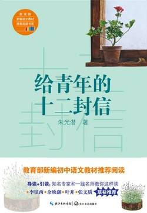

# 《给青年的十二封信》

作者：朱光潜

## 【文摘】

> 试就学校教育的现状看罢：坏的呢，教师目的但在地位、薪水，学生目的但在文凭资格；较好的呢，教师想把学生嵌入某种预定的铸型去，学生想怎样揣摩毕业后去问世谋事。在真正的教育面前，总之都免不掉浅薄粗疏。效率原是要顾的，但只顾效率，究竟是蠢事。青年为国家社会的生力军，如果不从根本上培养能力，凡事近视，贪浮浅的近利，一味袭蹈时下陋习，结果纵不至于“一蟹不如一蟹”，亦只是一蟹仍如一蟹而已。国家社会还有什么希望可说。
> “太贪容易，太浮浅粗疏，太不能深入，太不能耐苦”，作者对于现代青年的毛病，曾这样慨乎言之。征之现状，不禁同感。作者去国已好几年了，依据消息，尚能分明地记得起青年的病象，则青年的受病之重，也就可知

### 一、谈读书

> 你能否在课外读书，不是你有没有时间的问题，是你有没有决心的问题。

> 十五六岁以后的教育宜注重发达理解，十五六岁以前的教育宜注重发达想象。所以初中的学生们宜多读想象的文字，高中的学生才应该读含有学理的文字。

> 关于读书方法。我不能多说，只有两点须在此约略提起。第一，凡值得读的书至少须读两遍。第一遍须快读，着眼在醒豁全篇大旨与特色。第二遍须慢读，须以批评态度衡量书的内容。第二，读过一本书，须笔记纲要和精彩的地方和你自己的意见。记笔记不特可以帮助你记忆，而且可以逼得你仔细，刺激你思考。

`席不暇暖：席子还没有坐暖就离开了。形容忙着奔走，坐不下来。`

积少成多； 所谓的必读书籍，因人而异，可根据自己要研习的方向向专业人士求教要读的书籍。

### 二、谈动

> 愁生于郁，解愁的方法在泄；郁由于静止，求泄的方法在动。

可以是运动、可以是活动（陶侃搬砖）

### 三、 谈静

> 前信谈动，只说出一面真理。人生乐趣一半得之于活动，也还有一半得之于感受。所谓“感受”是被动的，是容许自然界事物感动我的感官和心灵。

> 能处处领略到趣味的人决不至于岑寂，也决不至于烦闷。

> “万物静观皆自得，四时佳兴与人同”。

`静趣`

感知能力：审美、欣赏等等

### 四、谈中学生与社会运动

> 蔡孑民先生说：“读书不忘救国，救国不忘读书。”这两句话是青年人最稳妥的座右铭。

> 国家是人民组合体，在学者能言学，在工者能言工，在什么者能言什么，合而言之，就是在国言国。

### 五、谈十字街头

因缘 `岁暮天寒，得暇便围炉嘘烟遐想。今日偶然想到日本厨川白村的《出了象牙之塔》和《走向十字街头》两部书，觉得命名大可玩味。玩味之余，不觉发生一种反感。`

>所谓“走向十字街头”有两种解释:
>
>1、闭户读书的成就总难免空疏虚伪。近代哲学与文艺都逐渐趋向写实，于是大家都极力提倡与现实生活接触。
>
>2、学术思想是天下公物，须得流布人间，以求雅俗共赏。威廉·莫里斯和托尔斯泰所主张的艺术民众化，叔琴先生在《一般》诞生号中所主张的特殊的一般化，爱迪生所谓把哲学从课室图书馆搬到茶寮客座，这是“走向十字街头”的另一意义。

> 十字街头的空气中究竟含有许多腐败剂，学术思想出了象牙之塔到了十字街头以后，一般化的结果常不免流为俗化（vulgarized）。

作者举例子：老庄思想 -> 静坐以骗铜子的道士，易经 -> 街头摆摊卖卜的江湖科， 佛学 -> 祁财求子的三姑六婆。一些伟大的思想留宿化之后，成了骗术等等。

> 站在十字街头的人们——尤其是你我青年——要时时戒备十字街头的危险，要时时回首瞻顾象牙之塔。

>  十字街头上握有最大权威的是习俗。习俗有两种，一为传说（Tradition），一为时尚（Fashion）。

> 习俗的背叛者比习俗的顺从者较为难能可贵，从历史看社会进化，都是靠着几个站在十字街头而能向十字街头宣战的人。

> 我们要能于叫嚣扰攘中：以冷静态度，灼见世弊；以深沉思考，规划方略；以坚强意志，征服障碍。总而言之，我们要自由伸张自我，不要汩没在十字街头的影响里去。

### 六、谈多元宇宙
