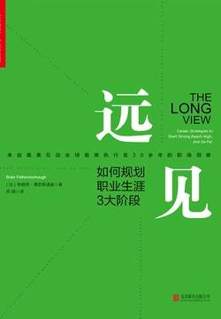

# 《远见》

作者：布赖恩·费瑟斯通豪

## 【文摘】

### 01 远见思维：多行动，少忧虑

远见思维：多行动，少忧虑

打造职业规划要知道的5件事

1．职业生涯的持续时间长得惊人，包括了三个截然不同的阶段。

第一阶段是强势开局的时候。

第二阶段是聚焦长板的时候。

第三阶段致力于实现持续的影响力，以及寻找一条可以稳定延续到60多岁甚至70多岁的新的可持续职业道路。

2．职场燃料很重要，因为职业生涯的基础决定结果。

这种燃料有三个主要来源：可迁移技能、有意义的经验和持久的关系。

3．职业生涯需要通过对时间的巧妙投资来构建。

4．职业生涯并不是以线性或者可预测的方式发展的。

5．职业生涯远不止于一份工作，而是生活的一大部分。

实现职业规划要做到的5件事

1．学习职场数学，树立正确的长期思维方式。

2．盘点职场清单，梳理你最有用处的技能、经验和关系。

3．进行“100小时测试”并完成一份“个人时间档案”，从而了解你目前的时间投资状况。

4．在尝试建立新的职场路径或者在多个选项中抉择时，运用“职场路径向导”（Career Path Navigator）。

5．时刻更新你的职业生涯

### 02 3大阶段，聚焦45年职业生涯

第一阶段：加添燃料，强势开局；●第二阶段：聚焦长板，达到高点；●第三阶段：优化长尾，持续发挥影响力。

### 03 储备3大职场燃料

你的领导力是由你的学习意愿助燃前行的。伊斯雷尔莫尔·艾瓦（Israelmore Ayivor）

●可迁移技能；●有意义的经验；●持久的关系。

解决问题的能力

说服式沟通技巧

完成任务的能力

帮助和求助的能力

1．如何与别人进行眼神交流和握手

2．如何搜索信息

3．如何呼吸。

2号燃料：有意义的经验

3号燃料：持久的关系

### 04 5个数字，树立正确的职场思维

有了技能和规划，才有资格碰到好运气

### 07 职场路径向导，做出正确的职业决策

回归生

情商（EQ）

### 08 第一阶段：加添燃料，强势开局

第一阶段：加添燃料，强势开局

有的人对自己想做的事情一清二楚，一走出校门就很快置身于令人满意的岗位上。他们是稀有的“独角兽”，但大部分人并不是。很少有人能确切地知道自己想要干什么，尤其是在刚刚起步的时候。

整个第一阶段往往长达15年，是一个学习和探索的过程，充满了尝试和错误。这时并不是为了找到一份你每天都津津乐道的神话般的工作，而是要找出你擅长什么、不擅长什么、喜欢做什么，以及不喜欢做什么。

第一阶段的策略很简单：步入职场、迎接新发现，并为前方的漫长旅程储备职场燃料。

尽管家长都愿意提供职业生涯方面的帮助，但是上一代的求职智慧已经越来越难以适用于新的时代了。

微小的成功对于培养动力和信心能起到很大的作用

如果你认真对待自己的职业生涯，那就需要了解更多的情况，搞清楚公司是怎么运转的：它怎么建立的，它的理念是什么，它如何赢利，它的关键人物有哪些，以及它的愿景如何。

●首先，话题是什么？我们的听众的注意力正在不同的电子邮件和会议之间快速切换，有一半的时间他们完全不知道我们到底在说什么，所以每一次你都要说得一清二楚。●其次，写下你的三个重点，加上用于佐证的事实和原因加强说服力。这意味着你既有观点，又有支撑它的证据。●最后，直白地说出你希望听众接下来怎么做。这样一来，你的沟通至少是有力和清楚的。这能让你领先于世界上80%左右的人。

面对面的会议依然是所有沟通方式中最宝贵和有价值的

### 09 第二阶段：锚定甜蜜区，聚焦长板

第二阶段：锚定甜蜜区，聚焦长板

罗伯特·格林在他的著作中有力地讲述过精通的意义和它在职业生涯中段所起到的作用。在20多岁，甚至可能30多岁的时候，不管我们对工作是否有热情和兴趣，我们都可以把工作做得非常好。因为我们年轻、充满活力，我们的满足感主要来源于工作之外。但是到最后，由于与这一领域缺乏深度的联系，各种困扰就会出现，这往往会发生在我们40多岁的时候。我们会感到越来越无法投入工作，竞争力不断下降。我们天生的创造力已经快耗尽了。我们无法关注所在领域发生的变化，因为我们已经脱轨。更年轻、更有创造力，而且更廉价的人很快就会取代我们。

给初任管理者的6条建议

1．你的仪容、态度和举止正受到高度的关注和广泛的效仿。

2．一旦你确定了某个愿景，就应该简洁地表达出来，并且不停地重复重复再重复。

3．早早决定让谁上船。

4．每一个有意义的商业问题都是少数人在一间安静的小会议室里解决的。

你要表现得像个被人信赖的解答者，而不是高高在上的老板。

6．你并不是无所不知。

初任管理者的建议1：时刻注意你的仪容、态度和举止。初任管理者的建议2：简洁地表达你的愿景，并且不停地重复。初任管理者的建议3：尽快选好团队成员。初任管理者的建议4：每一个有意义的商业问题最好能在较小的团队中解决。初任管理者的建议5：表现得像个被人信赖的解答者。初任管理者的建议6：你并不需要无所不知，而是应该多多找人咨询。

席执行官的特质1：诚实，与公司的文化契合度。首席执行官的特质2：智力上的好奇和敏捷。首席执行官的特质3：有提升业务业绩的经验。首席执行官的特质4：真实、自我意识以及平衡。首席执行官的特质5：活力和热情。

### 10 第三阶段：优化长尾，发挥持续影响力

第三阶段：优化长尾，发挥持续影响力

有时，当我们自己的火焰熄灭，会有人用他们的火花将其重新点燃。每个人都应该对那些点燃我们内心之火的人满怀谢意。阿尔贝特·施韦泽（Albert Schweitzer）

### 11 如何做好职场父母

职业生涯与为人父母共存之道1：不要让职业生涯和为人父母成为非此即彼的选项。职业生涯与为人父母共存之道2：找到一个热爱家庭的雇主。职业生涯与为人父母共存之道3：找到后方的恰当支持。职业生涯与为人父母共存之道4：设立现实的期望和严格的界限。职业生涯与为人父母共存之道5：管理你的时间和精力。

回归正轨之法1：重新组织你的经验。回归正轨之法2：重新包装你的技能。回归正轨之法3：重新连接职业生态系统。回归正轨之法4：重新建立自信。

### 13 如何应对职场危机

对于面临严重危机的人，无论处于何种年龄，他的建议都是改变态度，最好还要脱离原来的位置。你可以离开舒适圈，到镇上不常去的地方逛逛，去不同的地方旅游，突破那些时常拖累你的习惯，就算是在流动厨房里干一天活儿也会对你大有裨益。让自己置身于更广阔的环境中，接触那些真正重要的东西，从而重新发现自己的人性，让你想起自己受到的恩惠，并知道如何让自己与众不同。

### 尾声 工作的未来

《幸福有方法》大致描绘了12种“基于证据、得到科学研究支持的提高幸福感的策略”。其中包括：●表达感恩；●培养乐观的心态；●避免思虑过度和社会攀比；●多行善事；●维护人际关系；●发展合作的策略；●学会原谅；●增加心流体验；●享受生活的乐趣；●努力实现目标；●信仰宗教，寻找精神寄托；●关注身体健康。

“心流”（flow）