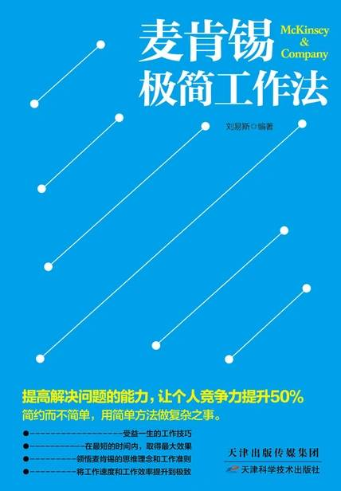

# 《麦肯锡极简工作法》

作者：刘易斯

## 【文摘】
### 前言

就像世界上有了锁，就必然会有钥匙一样，问题与解决问题的方法也是共同存在的。我们的工作，就是通过使用各种相同或不同的方法，达到解决各种问题的目的。而如何找到最适合、最高效的工作方法，提升自己的工作能力，对所有人来说都是非常重要的。

### 第一章 如何快速而正确地分析问题

分析指的是针对分析对象的状态与现象，进行追根究底式的归类。换句话说，分析是把比较混沌的现实，分成有意义的群组，然后再阐明其相互关系的一种脑力劳动。

#### 分析问题应从零开始

以旁观者的立场“批判思考”

#### 以事实为基础进行分析

在麦肯锡公司，解决问题的思路有三个：以事实为基础、严格的结构化、以假设作为导向。

分析问题，应以事实为基础

1．“事实”能够弥补团队成员在内在直觉方面的缺乏。

#### 逻辑树分析法

在麦肯锡公司，“逻辑树”是咨询顾问分析问题时最常使用的工具。逻辑树分析法是将问题中涵盖的所有子问题，没有疏忽和遗漏地进行分层罗列，从最高层开始逐步向下扩展，并逐渐细化，直到最终找出解决问题的方法。

具体来说，使用逻辑树分析法有以下7个优点。1．可以界定问题与议题之间的因果关系，找出“问题到底出在哪里”。2．假设各种可能的解决方案，以便可以尽快验证其可行性。3．将现有资料进行分析，再进行合理地推论，并找出最终的答案。4．打破旧框架，既可发散又可收敛，有利于消除思考的盲点。5．不仅有利于培养洞见问题的能力，而且还可以对问题进行抽象归纳和具体分析。6．确保解决问题过程的完整性。7．把工作进行细分，可分成利于单个人执行的多个子部分。

在使用逻辑树时有哪些注意事项呢？

1．不能偏离问题的目标。

2．在垂直的表格与表格之间，不能有重复或遗漏的问题

“MECE”方法

使用逻辑树应遵循的原则

使用逻辑树来分析问题通常要遵循下列原则。1．我们在给一个问题找到解决方案以前，可以先将一个已知问题当成树干。2．考虑已知问题与哪些相关问题或子问题有关，然后再把问题的所有子问题进行分层罗列，要从最上层开始，并且逐渐向下扩展，注意不能有遗漏或者重复。3．在向下扩展的过程中，每当我们想到一个已知问题，也就是树干，即可再添加“树枝”，并注明“树枝”代表的具体问题。通常在一个大的“树枝”上，还能够再扩展出很多小的“树枝”。以此类推，尽可能找出主要问题以及所有相关联的问题。4．对问题不断进行分解的过程，也就是一个不断思考解决问题的方法的过程。我们分得越细，考虑的解决方法就越准确。只要把问题分解到足够细，答案自然就会非常清楚了。

使用逻辑树可以获得解决问题的不同方案。它有以下5个步骤。1．有没有问题？2．问题在哪里？3．为什么存在？4．我们能做什么？5．我们应该做什么？

#### 麦肯锡的新创公司分析法

明确新创公司的市场

分析影响市场的各种因素

寻找市场的需求点

分析市场的供应特征

找到新创企业的空间和机遇

细分创业模式

### 第二章 如何收集信息并进行高效沟通

#### 收集信息，应有序、高效和准确

麦肯锡收集信息的基本流程1．掌握收集信息的目的与背景。这有助于我们在工作中不犯以下一些方向性的错误。具体来说，我们在收集信息前，要思考以下问题。（1）列出数据和信息收集的目的。（2）清楚收集到的信息是给公司内部汇报还是为客户汇报使用。（3）弄清楚调研结果的形式，是只有数据或资料，还是数据与资料相结合。（4）收集信息所需要的时间。2．在明确收集信息的背景的基础上，列出一些关键点并向受访者详细了解。3．信息的具体来源必须要明确。如果我们对信息的来源非常熟悉，就能够大大提高收集信息的质量和效率。那么，如何明确信息的来源呢？麦肯锡的做法如下。（1）先从对方提供的刊登信息的表格入手。（2）判断所需的信息和数据可能会出现在哪些资料上。（3）查阅不清楚的资料时，可以同原资料的编辑者联系，以明确资料的准确性。4．在收集信息的整个过程中，要掌握总体状况。只有这样才不至于在细节方面出现失误。5．从细微之处收集数据和信息。有时候，问题可能不是出在大方向上，而可能出在细微之处，如有些不为人知的缺陷或问题。因此，我们在收集信息时，还要注重细节。

麦肯锡高效收集信息的技巧1．制定收集信息的工作步骤。主要步骤包括以下3步。（1）制定一个高效的工作流程。也就是说，信息收集要在规定的时间内完成，并按照信息制作出相关的分析报告。（2）对于定量信息与定性信息要灵活掌握。定量信息是指用具体的数据表现内容的信息；而定性信息是指单纯用文字表现内容的信息。只有灵活掌握这两种方式，才能让信息变得更有说服力。（3）从一些公开信息中挖掘出对解决问题有效的信息。2．找准搜索的关键词。使用关键词收集信息往往一两次并不一定能够成功，这就需要我们多尝试一些关键词，以便最终找到我们所需要的信息。3．养成平时收集信息的好习惯。比如经常做笔记、与不同行业的人多沟通等，这些都有利于培养收集信息的能力。

麦肯锡高效记笔记的方法

通常记笔记要注意以下5点。1．首先要把对自己在解决问题中，最有用的信息记录下来。2．在记笔记的同时，还要进行框架性的思考。3．对受访者的一些具有创造性成果的论据，要进行仔细的加工和整理。4．把事实和意见分成两段来记录。5．对于访谈中的疑问之处，要随时记录下来，以便进行更深层次的信息整理。

#### 通过客户访谈，收集有效信息

麦肯锡公司访谈的基本流程

麦肯锡公司的标准访谈流程如下所示。1．访谈前，先准备一份客户访谈提纲。如果客户的级别不同，那么就要针对不同的客户，准备不同的访谈提纲。针对提纲的内容，要记录好准备提出的问题，并整理好它们之间的先后顺序。2．提前了解受访者的相关信息。很多麦肯锡的客户都是世界“500强”或是很多知名企业的高管，假如我们访问的是一位非常挑剔的首席执行官（CEO），那么就不要准备一些特别敏感的问题，否则可能会影响访谈效果。3．访谈要先从一般性的问题开始问起，切忌一开口就针对具体问题进行提问。这样做有助于受访者进入访谈的状态，相互之间也可以建立起一种非常和谐的关系。但也要参考具体情况，如果受访者此刻非常忙碌，那么就不适合采用这种方式了。4．适当加入一些已经知道答案的问题。这似乎有悖常理，但对我们判断受访者提供信息的真实性，却是非常有必要的。另外，一些复杂的问题的答案可能会有很多种，如果我们能够得出问题的多种“答案”，那么对我们开阔思路是很有好处的。

麦肯锡成功访谈的7个策略

1．让受访者的上司，安排你与受访者的访谈。

2．两个人一组，相互配合。

3．多倾听、少引导。

4．对于一些关键的问题，要多做“复述”。

5．多采用“旁敲侧击”的方式。

6．不要一次问得太多。

7．采用考伦波策略。

#### 运用“30秒电梯法则”，进行简洁、有效的沟通

“30秒电梯法则”的来源

“30秒电梯法则”的3个主要用法

1．高度总结法。

2．激发思考法。

3．语出惊人法。

应用“30秒电梯法则”对我们的基本要求

1．前期准备要充分。

#### 运用“知、感、行”进行高效沟通

知”“感”“行”——简洁、高效的沟通模式

“知、感、行”的训练方法

1．在清晰地表达自己的要点前，首先要明白对方的需求点，这样才能让对方能够立即明白我们所表达的观点就是对方想搞清楚的事情。

2．等到我们表达结束以后，必须让对方有表达自己想法的意愿，让对方尽量用一句话表达清楚，然后我们把它记录下来。值得注意的是，我们绝对不能命令对方表达感受，但可以通过改变自己的表达方式，影响对方的情绪。

3．当我们做出表达后，应该让对方有所行动，或者要求对方只用一句话就明确表达自己的态度，并把它记录下来。

### 第三章 如何提高逻辑思维能力

#### 逻辑思考：分析、解决问题的基础

逻辑思考指的是对事物进行观察、比较、分析、综合、抽象、概括、判断和推理，并采取科学的逻辑方法，准确且富有条理地表达出整个思维的过程。

要进行“逻辑思考”，而不能只凭“一时的想法”

商界精英，普遍都具有“逻辑思考”的能力

#### 逻辑思考，要始终保持客观、理性

要理智、客观地进行逻辑思考

保持怀疑态度，也是一种理性思维的表现

#### 假设与结论，千万不能混为一谈

提出假设后，要通过调查和分析进行验证

#### 通过逻辑思考的训练，产生解决问题的新思维

摆脱陈旧的思维

发掘可能性，训练独特的思维方式

#### 以对方的立场，验证自己的逻辑

对于如何检验逻辑思考的正确性，麦肯锡公司的做法是，当我们用逻辑思考提出假设之后，必须要客观地审视自己的假设，也就是站在对方的立场上或者是从对方的角度上思考问题，以确定自己的论述和观点被对方所理解和接受。具体来说，可以按照下列方法验证逻辑思考的正确性

采用“后设认知”的方法审视自己的逻辑

什么是“后设认知”？简单地说，后设认知就是对自己的认知过程进行自我反省以及自我调适。而在心理学的领域，“后设认知”指的是从高处向下俯视自己逻辑思考的方式。

树立精益求精、永无止境的逻辑思考意识

逻辑分析过程主要包含如下3个步骤。1．提出假设。收集信息之后提出假设。2．精益求精。审查假设与结论之间是否有正确的关联。3．反复论证。对自己的假设，要从不同的角度反复进行验证。

#### 如何拓展自己的逻辑思维

麦肯锡公司经常通过训练，拓展员工的逻辑思维。

区分出谈话的事实和意见

一边听对方讲述，一边把对方的话分解成事实和意见。

获得准确判断的关键是要从“疑问”出发

找到疑问的核心

怎样做才能抓住疑问的核心

找到抓住疑问核心的高质量问题

#### 培养逻辑思考的能力

下面为大家介绍的“A4纸笔记法”，就是类似于大纲类的一种思维导图法，可以培养、加强我们的逻辑思考的能力。

A4纸笔记法的具体做法

1．把A4纸横放，在每张纸上面都要写一个主题，每页写4～6行即可，每行20～30字。2．每张纸的书写速度要控制在1分钟以内，以每天写10页为宜。也就是，每天要花费10分钟左右的时间，手写工作笔记。

A4纸笔记法的作用和效果

1．在每天做笔记的过程中，可快速地整理自己的大脑和情感，并理清比较杂乱的头绪。

2．只要坚持每天记笔记1个月，就会感觉语言越来越丰富，想法也会不断涌现，而且在做笔记前，就会想好应该如何表达，甚至动笔的速度都已经没有大脑的运转速度快了。

3．坚持每天记笔记几个月后，我们不但可做到在宏观上瞬间客观地看待问题，而且逐渐接近“零秒思考”的能力，甚至还能根据不同情况瞬间抓住问题的本质和关键，并进行整理。

A4纸笔记法的书写原则

1．在写标题及正文时，先不要思考过多。只要是想到的事，无论是什么就都先写下来。

2．严格坚持每页1分钟的书写习惯，这样做会让你养成不拖延的习惯。

3．用A4纸记笔记，是最快、最方便的方法，因此千万不要用笔记本、日记本、电脑等工具。

4．A4纸要随身准备好，以便自己可以在任何地方写。为了节省纸张，我们也可以把一页纸折成3段。

5．如果有时间，则可以把写好的4～6行的笔记内容作为正文的标题，然后再继续深入，而且同一标题还能够以不同的角度来写，以便扩展自己处理问题的视野。

6．笔记完成以后，还可以将其像扑克牌一样摆弄，有了新想法时还可以继续补充、整理。

7．对于内容，可以随便写，但要把最原始的感受写下来。另外，也不要想得过于复杂，而且笔记的构成、格式、遣词造句等也不需要过多考虑。

A4纸笔记的整理

1．可以用透明的文件夹统一整理，并按照不同的分类标记。通常每隔3个月就整理1次，然后再重读1次笔记。

2．也可以使用印象笔记、有道笔记等电子方式存储笔记，可用手机直接拍照，然后再为笔记添加相关的标签，这样在使用时搜索一下即可，不但便于我们随时查阅，而且效率会很高。

### 第四章 如何推介解决方案

#### 金字塔原理概述

金字塔原理，强调的是一种突出重点、思维清晰、主次分明的逻辑思考能力。基本结构是结论先行、以上统下、归类分组、逻辑递进，而且中心思想明确。

金字塔原理的原则

1．结论先行，且上一层观点应是对下一层观点的简单概括

2．纵向逻辑，既是一个疑问，又是一个解答的过程。

3．前面提到的竞争对手、公司本身、销售渠道和客户，就是我们所说的横向逻辑的4种观点，每组观点必须具有相同的属性，且要保持“完全穷尽，相互独立”的原则。

金字塔原理的作用

1．有效解决问题。

2．有效管理下属员工。

3．与客户交流成果。

构建金字塔结构的自上而下法1．画出主题方框，然后在方框内写出主题。2．确定主题涉及的主要问题。3．写出这些主要问题的解答内容。4．说明这些问题涉及的“情境”。5．说明这些问题涉及的“冲突”。6．要仔细检查主要问题与解答。

构建金字塔结构的自下而上法我们通常可以按照下列3个主要的过程，“自下而上”地组织我们的思想。1．列出我们想要表达的所有思想的要点。2．找出各个要点之间的逻辑关系。3．得出最终的结论。

#### 金字塔原理之MECE分析法

MECE分析法指所有重大议题都可以进行不重叠、不遗漏的拆解，然后再按照各个组成结构仔细推敲，最终找到解决问题的方法。——麦肯锡首位女性咨询顾问 芭芭拉·明托

MECE，翻译成中文是“相互独立，完全穷尽”。

MECE是麦肯锡思维过程的一条基本准则

1．各个部分之间要保证相互独立，即独立性。

2．所有部分必须完全穷尽，即完整性。

MECE的实施方法

MECE分析法的做法通常有两种。

1．在确立问题时，可以采用类似鱼骨图的方法，而且要在确立主要问题的基础上，逐级向下进行层层分解，直到找出所有疑问，然后再通过对问题的层层分解，分析出关键问题以及解决问题的初步思路。

2．结合头脑风暴法，找到项目面临的主要问题，然后在不考虑现有资源有哪些限制条件的基础上，考虑解决该问题的所有可能的方法。但是应注意，在整个过程中，多种方法的相互结合有可能是一个被忽略的新的解决方法。接下来，我们分析各种解决方法所需要的各种资源，再通过分析、比较，从列出的多种方案中找到最现实、最令人满意的一种答案。

#### 如何写出金字塔式的文案

金字塔式文案的主要特点是：先重要，后次要；先全局，后细节；先结论，后原因；先结果，后过程。——麦肯锡首位女性咨询顾问 芭芭拉·明托

金字塔式文案的优点

金字塔结构的种类

在结构划分上，金字塔结构有并列型和直列型两种形式。

金字塔文案的具体写法

#### 实施头脑风暴法，产生新思维、新方法

头脑风暴法的基本操作程序

头脑风暴的练习

#### 头脑风暴法的实施准则

头脑风暴前的准备工作

头脑风暴法应遵守的原则

#### 让头脑风暴更为有效的方法

头脑风暴会议使用的工具

头脑风暴需要一位出色的舵手

### 第五章 如何带领团队完成合作

#### 优秀团队的基本要素

优秀团队基本要素之一：成员为数不多

一个成员为数不多的优秀团队应该具备如下特征。1．是否经常召开所有团队成员都参加的会议。2．所有团队成员是否都能很容易而且频繁地进行交流、沟通。3．所有团队成员是否都能以诚相待，并且喜欢一起配合做事情。4．所有团队成员是否都非常清楚其他人的作用与具有的技能。

优秀团队基本要素之二：互补技能

这些技能通常被分成以下3种类型。1．专家建议或意见，比如，技术性或职能性的专家建议或意见。2．解决问题的技能或决策能力。3．善于交往的技能。

优秀团队基本要素之三：拥有共同的目标

优秀团队基本要素之四：共同的工作方法

优秀团队基本要素之五：相互承担责任

#### 合理选拔团队成员

合理选拔团队成员的方法

如何增强团队的凝聚力

保持团队士气旺盛的秘诀

#### 团队的内部沟通

让有效信息流动起来

如何确保团队信息通畅

传递信息的关键因素

1．简洁。

2．完整。

无论是向领导还是客户汇报工作，都要清楚地告诉对方，我们目前面临的主要问题有哪些，对此有哪些想法，解决的方案有哪些。千万不能这样说：“我现在正在做这件事，正在做那件事。”没有告诉对方正在做什么、看法是什么、打算怎么做，就等于在浪费对方和你的时间。如果暂时没有有价值的事情，那么就先不说。

3．有一定的结构。

注意重要信息的保密

#### 麦肯锡的层级管理

麦肯锡公司的员工，从上到下可以分成4种职位，即合伙人、项目经理、咨询顾问和分析师。

### 第七章 如何高效地解决问题

工作内容要简单明了

保持多样化的工作方法

解决多个问题的基本方法

一些效率比较低的工作顺序

空·雨·伞的思维框架

#### 解决问题的七步成诗法

第一步：描述问题

第二步：分解问题

第三步：去掉非关键问题

第四步：整理信息

第五步：分析和论证，深入分析关键因素

第六步：提出建议，导出总结性的结论

第七步：表达方案，得到客户的认可

### 第八章 如何提升个人能力

建立一个好的工作环境和秩序，即可提高工作效率；如果工作无序也毫无条理，经常在杂乱无章的环境中寻找文件、工具，就会在无形中浪费很多时间和精力。——麦肯锡公司咨询顾问 艾森·拉塞尔

#### 不要杂乱无章的工作 

杂乱无章的工作习惯，是一种坏习惯

不可忽视的废纸篓

#### 提高工作效率，每天制作一个表格

每天制作一个表格的好处

如何制作一个简单的表格

制作图表的基本原则

#### 培养分析及解决问题的能力

要多读书、多学习

我们在读逻辑学方面的书时，对概念、词项、判断、命题、推理、论证与证明等思维方面的论述要特别注意，掌握好这些内容对我们日后的学习有很大帮助。

要多思考、多实践

“冥想”是理清思路的好方法

#### 从简单到复杂，先摘好摘的果子

先易后难，短时间内做更多容易的工作

成功都是逐步积累的结果

一次只做一件事

#### 高效管理时间的技巧

麦肯锡高效管理时间的技巧

1．紧急任务，进行专制管理

2．“做正确的事情”远比“把事情做得正确”更重要。

3．不能忽视目标，而重视过程

4．时间预算不切实际。

5．有选择性地忽略一些可以自行解决的问题。

6．合理安排时间。

7．做出决策时，要坚决、果断

8．学会合理授权。

9．不必汇报无关大局的事情

严格执行“二八法则”

##### 优秀员工必备的良好工作习惯

养成良好的工作习惯

1．为了提高工作效率，我们要养成下列良好习惯。（1）不要乱放东西，使用完毕之后要物归原处。（2）将所有整理好的东西编号，然后再贴上标签，并按照计划好的顺序来做。（3）做好记录，因为“好记性不如烂笔头”。

2．处理文件的3个注意事项如下。（1）要迅速回复。（2）把文件迅速归档，以避免丢失。（3）对那些没有用的文件要及时清理，以免浪费空间和时间。

“间作套种”用脑法

培养自己思考没有标准答案的问题的习惯

既要学会读书，又要学会思考

通过关注新闻培养市场感

培养逻辑推理的习惯

借助纸和笔来思考

良好的着装习惯

管理时间的习惯

拥有良好的沟通效率

### 第九章 如何防范危机

使用SCQA分析法发现问题

SCQA中的“S”为“Situation”，指情景或者场景。

SCQA中的“C”为“Complication”，指冲突的意思。

SCQA中的“Q”为“Question”，指的是引出问题。

SCQA中的A是“Answer”，指的是答案或观点。

SCQA分析法的具体步骤

课题的本质

如何更加理性地评价各种替代方案

防范显在或潜在型

规划性思考通常分为如下4个步骤。1．期限。首先要设定实现理想的具体期限。2．必要条件。实现理想有哪些必要条件，这些条件需要一一列出。3．技能。要掌握实现理想所必备的技能。4．计划。最后要制订实现理想的具体实施计划。

危机管理，需要防范潜在问题

危机管理的概念危机管理指的是，公司在发生危机时为了消除或降低危机所带来的损失，而采取的规划、调整、化解、处理等活动的过程。

危机管理的防范措施

1．产品不可能永远不出现问题，因此要树立危机防范的意识，这通常需要从企业的领导人开始做起。

2．建立危机管理的机构。

3．建立危机的检测系统。

4．设想企业可控的受损程度，并制定危机管理的具体方案

5．建立企业内部的媒体公关培训，以便在危机发生时，企业可以冷静、坦然地面对媒体，并解答媒体提出的各种问题，这也是化解危机的一个关键步骤。

6．建立并维护一个长期的、良好的媒体合作平台，并经常与其沟通，以便能够得到媒体的支持。

7．企业的各个部门要学会对风险进行分类，加强企业内部的流程管理，并提前进行一些危机演练，使得各个部门可以熟悉危机发生时自己的相应职责。

问题防范的自下而上和自上而下法

自下而上法通常有以下4个步骤。

自上而下法的步骤

自上而下法指的是，先假定最后一定会发生某种不良的状态，然后再考虑所有引发不良状态的诱因。也就是说，首先要假设不希望发生的结果，并且从最终的不良状态着手，然后再找出相应的诱因。