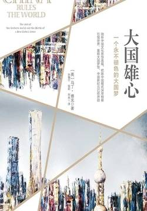

# 《大国雄心》

作者：马丁·雅克

## 【文摘】

### 前言 中国：正在改变世界

1997年，迪克·切尼（Dick Cheney）、唐纳德·拉姆斯菲尔德（Donald Rumsfeld）、保罗·沃尔福威茨（Paul Wolfowitz）等人创建了著名的新保守主义智库“新美国世纪计划”（Project for the New American Century，简称PNAC）。

要称霸全球，打造一个正式或非正式的帝国，前提条件就是雄厚的经济实力。至少从长远来看，这是一个客观的尺度。尽管如此，那些江河日下的霸主似乎总是对此视而不见。1918年后英国如此，从小布什政府的所作所为来看，美国恐怕亦将如此，而且错误的性质可能更严重。很明显，小布什政府没能看清形势，没有看到美国正在走向衰落、在世界舞台上的权力正在大大缩水的事实，而是一厢情愿地认为在一个新美国世纪，美国将会主导整个世界。直至金融危机的爆发，美国的一些精英（尽管数量不断增长，但仍处于少数地位）才意识到美国可能处于衰退之中。

我们早已习惯了现在这个世界处理问题的范式与套路，从骨子里认定它们都是理所当然的，都是活生生的现实，而非变化的历史长河中的一部分。考虑到美国的全球霸权延续了几十年，西方的霸权地位更是历史悠久，这种想法不足为奇。我们习惯称当今世界是“西方的”，甚至是“美国的”，却很少设想世界是否还会呈现另外的模样。而且，在现有的、以西方理念打造的世界中，西方有很强大的既得利益，可以从中获益颇丰。霸权国家力图将自己的价值观和打造的体系灌输给附属国，后者也会因地制宜地进行调整和变革；如果后者没有做出令其满意的回应，霸权国家就会将价值观和条约强加在附属国身上，必要时甚至采用武力等极端方式。这种情况似乎是历史的必然。因此，无论从心态上还是利益上，美国乃至整个西方都很难设想或接受一个自身影响力不断削弱和缩减的世界。

我们早已习惯了现在这个世界处理问题的范式与套路，从骨子里认定它们都是理所当然的，都是活生生的现实，而非变化的历史长河中的一部分。考虑到美国的全球霸权延续了几十年，西方的霸权地位更是历史悠久，这种想法不足为奇。我们习惯称当今世界是“西方的”，甚至是“美国的”，却很少设想世界是否还会呈现另外的模样。而且，在现有的、以西方理念打造的世界中，西方有很强大的既得利益，可以从中获益颇丰。霸权国家力图将自己的价值观和打造的体系灌输给附属国，后者也会因地制宜地进行调整和变革；如果后者没有做出令其满意的回应，霸权国家就会将价值观和条约强加在附属国身上，必要时甚至采用武力等极端方式。这种情况似乎是历史的必然。因此，无论从心态上还是利益上，美国乃至整个西方都很难设想或接受一个自身影响力不断削弱和缩减的世界。

通过不断地提及自己拥有五千年的悠久历史，中国人深知界定自己身份的不是国家意识而是文明意识。

### 第1章 西方的兴起

尽管有大量的中国人移民到东南亚，但是与欧洲不同，中国无意为其子民的海外扩张提供军事和政治支持，相反，清王朝非常关注中国北部和西部的内陆地区。这些都反映出一个事实，中国认为自己是大陆文明而非海洋文明。有趣的一点是，率先对东南亚进行殖民统治的恰恰是欧洲列强，尤其是在19世纪中叶以后。

尽管欧洲国家在彼此之间的战争中耗费了大量的时间和精力，但16世纪中叶以后，欧洲在实现现代性的过程中几乎没有受到过持续的外部威胁，除了东南方向的奥斯曼帝国。然而到了17世纪，奥斯曼帝国就已被击退，到了19世纪，更是被彻底排除出了巴尔干地区。纵观各大洲，唯有欧洲才享有这种优势。此后的亚洲、非洲、拉丁美洲和中东在追求现代性的过程中，都面临和遭受过现代欧洲国家的入侵。甚至北美的欧洲移民也通过独立战争的形式与英国进行斗争以建立自己的主权国家，为美国的经济腾飞创造了条件。由此导致的结果是，欧洲很久以来很少设身处地为其他国家着想，只会考虑自己的利益，按自己的意愿（通常是殖民者的思维）行事。直到最近，这种情形才开始有所改变。

西欧的转型历时弥久，如英国经历了两个多世纪才具备了今天的面貌。由此导致的一个结果是，西欧国家的现代性与其传统之间的冲突一直相对比较缓和。欧洲城市就是将现代性与传统结合起来的完美例证：它像是一种地质遗迹，不同时代的建筑风格和谐共存，宛若一个经历数百年风雨的活的博物馆；相比之下，北美的城市都是新建的，东亚国家更甚，在东京、首尔、新加坡、上海、吉隆坡和香港等城市，几乎找不到历史的印记。

历史学家和人类学家艾伦·麦克法兰（Alan Macfarlane）对个人主义进行了这样的描述：“（个人主义认为）社会是由自主、平等的单位即独立的个人构成的，个人终将比任何团体都更为重要。”

### 第2章 日本：现代国家但非西方国家

贱民与华裔和韩裔一道，都被排除在日本的主流社会之外，这也算是上文所提及的日本包容性的例外情况。

### 第3章 中国：动荡的历史与翻天覆地的变化

强加给中国的主要不平等条约与英国签订的《南京条约》（1842年）与英国签订的《虎门条约》（1843年）与美国签订的《望厦条约》（1844年）与法国签订的《黄埔条约》（1844年）与俄国签订的《瑷珲条约》（1858年）与英国、法国、俄国、美国签订的《天津条约》（1858年）与英国、法国、俄国签订的《北京条约》（1860年）与普鲁士、德国海关联盟签订的《中德通商条约》（1861年）与英国签订的《烟台条约》（1876年）与葡萄牙签订的《中葡和好通商条约》（1887年）与日本签订的《马关条约》（1895年）与俄国签订的《中俄密约》（1896年）与英国签订的《展拓香港界址专条》（1898年）与英国、美国、日本、俄国、法国、德国、意大利、奥匈、比利时、西班牙和荷兰签订的《辛丑条约》（1901年）与日本签订的“二十一条”（1915年）

1949年，毛泽东领导的共产党最终夺取全国政权。新中国的成立与1911年的辛亥革命的意义截然不同。辛亥革命实际上只是历史进程中的一个逗号，是此后近40年的权力分散和外国占领的前奏。事实证明，1949年才是具有决定性的历史转折点。

为什么外国占领给世界其他地方，特别是非洲和中东地区，带来了深远的影响，而在中国，这种影响却相对有限呢？

1949年，中国共产党打败了国民党，取得了解放战争的胜利，中国终于重获统一（除了台湾、香港和澳门等“失地”外）。中国共产党所建立的新中国之所以能够获得广泛的支持（实际上，至今仍然如此），其关键也是最为重要的一点就在于它恢复了国家的独立和统一。这也是毛泽东最伟大的成就。

共产党是新执政体系的核心力量。在很多方面，共产党都证明了其拥有一种高效的管理机制，特别是相对于晚清政府和国民党而言。其中，毛泽东是关键人物。尽管其在执政的过程中也犯了一定的错误，但作为革命的设计师和独立、完整的新中国的缔造者，毛泽东在赢得民心和新政权合法性等方面发挥了主要作用。即使到了今天，毛泽东仍然是许多中国人崇拜的对象，人们对他的感情甚至要胜于改革开放的总设计师邓小平。

国家必须为人民负责，这是中国的一项古老传统，只不过共产党用一种独特的方式延续了这个传统

无论是在儒家传统还是在共产主义的理念之中，统治精英都被视为从属于国家的一部分，而非具有自己的组织和权力的独立集团。因此，在社会主义的中国没有市民社会和自治的公共领域并不是什么新问题：中国自古以来就没有。

历史学家王赓武指出，新的社会主义国家是“对旧皇朝国家的取代”，而且“毛泽东有效地恢复了关于领导人魅力的观念”。国际关系专家赵穗生提出了与此类似但略有不同的论断：中国作为一个民族国家，是在共产党的领导下，以马克思主义为指导建立起来的。然而，与共产主义的普遍原则相比，它与中国民族主义，与中华民族的复兴，与中国未来的现代化更为相关。

1950~1980年，中国大力发展教育、扫除文盲、促进平等（包括男女平等）和改善医疗，人类发展指数提高了3.5倍，同期的印度只提高了2.75倍。中国所实行的政策还成功地规避了不少困扰其他许多亚、非、拉国家的难题，如农村地区的贫穷、巨大的贫富差距、男女不平等、城市失业人员形成的贫民区、教育和卫生基础设施薄弱等。虽然中国为此也付出了巨大的代价，但这些成就毫无疑问地巩固了民众对政府的支持与拥护。

中国共产党在执政的第一阶段，彻底扭转了中国的国家命运。这一时期取得的成就，为中国的工业化和现代化奠定了良好的基础——工业化和现代化的失败已经困扰中国近百年之久。新中国成立的第一阶段成功地扭转了中国一个世纪以来的衰败局面，重新实现了国家的统一与稳定，实现了此前的中国政权无法创造的经济腾飞。尽管毛泽东在执政过程中出现过这样或那样的错误，但实现中国伟大转折的基础正是在毛泽东时代所奠定的。

### 第4章 中国与西方：相互融合，还是相互竞争？

但是，就像理解西方现代性一样，要真正理解亚洲的现代性，不在于它的“硬件”而要看它的“软件”，即处理人际关系的方式、价值观与信仰、风俗习惯、社会机制、语言、礼节与节日，以及家庭在社会中的地位等。这些现象既难以看透，又难以引起人们足够的重视。

政治根源于文化，特定的文化孕育出特定的政治。

商人可以超越许多不同国家的地理界限，去经营自己的生意或展示自己的手腕，知名学者可以在全世界各个大学里举办学术讲座；而政治家的才能，即获取民众的广泛支持和权力的运用，却仅限于特定的国家里：这样的才能和魅力是无法环游世界的，它们都是为当地民众精心打造和刻意雕琢的，源于深刻的民族文化。

20世纪的特点是社会主义与资本主义之间的意识形态分歧，这种分歧始于1917年的十月革命，在1945年之后的冷战中得到了明确的体现，最终随着1989~1991年的苏联解体而结束。

美国的新保守主义者认为，反恐战争——即他们所描述的第四次世界大战（第三次世界大战是冷战），是新的全球分野，但这是对历史的根本性误读。事实上，我们现在正在进入的这个时代，最确切的表述应该是现代性竞争的时代。与冷战时期不同，其本质并非政治或意识形态的分野，而是文化的竞争。新型现代性的出现，不仅意味着在现代性的问题上，西方不再享有实质性的垄断地位，而且意味着这些社会的历史、文化和价值观，也应该得到某种全新的肯定，再也不能被视为“落后”或“失败”的代名词。相反，这些社会和文化应重新获得认可，不再对西方俯首称臣、毕恭毕敬，而是享有越来越多的自信。

### 第5章 中国：超级经济大国

### 第6章 文明国家

简言之，中国万物孕育于中华文明之中。与西方人不同，西方人的认同源于民族国家的历史，中国人的认同则是其文明史的产物。中国人并没有将中国视为民族国家，而更多地看作文明国家。或者我们可以说，中华文明像一个古老的地质构造，文明国家是深厚的底层，而民族国家的意识则是浅显的表层。西方社会由民族组成，而中国由文明构成，这种差异的影响是极为深远的

中国只是在19世纪末由于实力的差距不得不加入由西方霸权主导的世界体系，因而才被迫成为一个民族国家。此后的100多年来，中国一直将自己描述为民族国家而非文明国家，尽管其首要的身份和主要特征明显如此。现在，中国的身份同时具有民族国家和文明国家的双重属性。从历史和建构的角度来看，中国无疑是一个文明国家；而作为积贫积弱的后果，它又被迫成为一个民族国家。或者，正如白鲁恂凭借敏锐的观察力所得出的结论一样：“中国是一个伪装成民族国家的文明帝国。”然而，未来这两种身份将如何演进、互动乃至冲突，至今仍无定论。

就此而言，中国文化就是一个有趣的例子。所谓的中国文化，是指构成、渗透于中国社会之中的社会关系、习俗、价值观、规范、机制的总称。

文明国家这一概念对于中国而言至关重要。其不仅是理解中国的基础，更是在很多不同的方面对中国产生了深远的影响。首先，中国的身份认同基本上就是从文化因素，如语言、家庭规范、社会关系结构等衍生而来的，而非近代民族国家的产物。其次，文明的统一性是中国政治毋庸置疑的第一要务。第三，维护、保持这种文明的统一性，被视为国家的神圣职责，因此国家被赋予了远超传统民族国家的权威和合法性。第四，中国的文明史以一种极为不同的方式塑造、定义了中华民族的本质，这一点我们将在下一章中有所论述。其中人口众多的汉族，无疑是占据绝对主导地位的民族。第五，尽管鲜为人知，但中国作为一个大陆性的文明国家，接受了并且需要一种基于地区多样性的多元化。对于香港回归的宪法中所规定的解决办法就是典型的例子：基于“一国两制”原则的这样一种解决方案，与主权国家的“一国一制”截然不同（1990年德国统一时正是采取的此种解决方式）。第六，文明国家这一特征对中国的影响绝非仅限于近现代，而是至少有两千年之久。这的确令人称奇。历史一直在对当下产生重要的影响，成为当下行事的指南和标尺。“文明”一词通常情况下指的就是遥远、间接的影响和消极、被动的存在。然而，在中国，历史和文明均是鲜活地持续至今：中华文明这一理念，并非一个静止的、毫无生气的客观存在，而是一个鲜活的、动态的有机体，为中国人界定国家和自我认知提供了最主要的认同与认知背景。第七，文明国家的属性与概念不断提醒中国人，中国是一个中央王国，作为世界的中心，中国的地位自然与其他国家不同。中国人的优越意识直接来源于中国文明的伟大

作为一个文明国家，中国具有三个典型的特征。此前，我们已经就其中两个进行了探讨：历史的悠久及文明和国家的统一。第三个特征则与其规模有关。

如果民主只是外来的移植物——比如像伊拉克的情况，民主是由英美联军荷枪实弹地强加而来的——那么这强加的民主所造成的代价比它带来的好处就会高昂得多，不论这代价是反抗、民族冲突还是其他任何形式。民主不应是抽象的概念，不能脱离历史和文化，也不是放之四海而皆准。因为如果缺乏相应的环境，民主不但不会奏效，甚至还会带来灾难。民主必须自己慢慢地成长，而不应是强加的。民主也不是衡量一个国家治理水平的最为重要的标准。尤其对发展中国家而言，同民主建设相比，发展经济、维持民族和睦（对于多民族国家来说）、减少腐败、维护社会秩序和稳定的能力，至少应被放在同等重要的地位。不同的社会所处的环境和发展水平各有差异，都有各自的轻重缓急，因此，民主也应放在恰当的历史和发展大环境中来考量。

威斯特伐利亚体系

### 第9章 中国：正在崛起的世界强国

## 【想法】

作者对中国是有深入研究的，所以不会一味地用西方的那套价值体系来评判中国。 作者在书中多次说到中国没有西方的民主问责，很难理解得到，当下疫情肆虐，西方国家防疫不力，数百万人死去，有谁受到问责吗？或者在他们的观念中，防疫不是国家的事？ 西方的政治制度有很大的问题，一切都是为了选票，为国家负责反倒在其次，西方的政策注定是短视的。 有人说本书是在棒杀中国，也未免太小看中国人了？