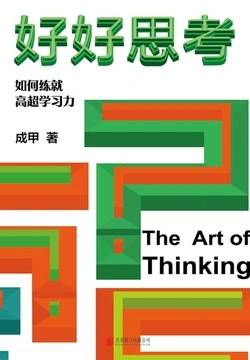
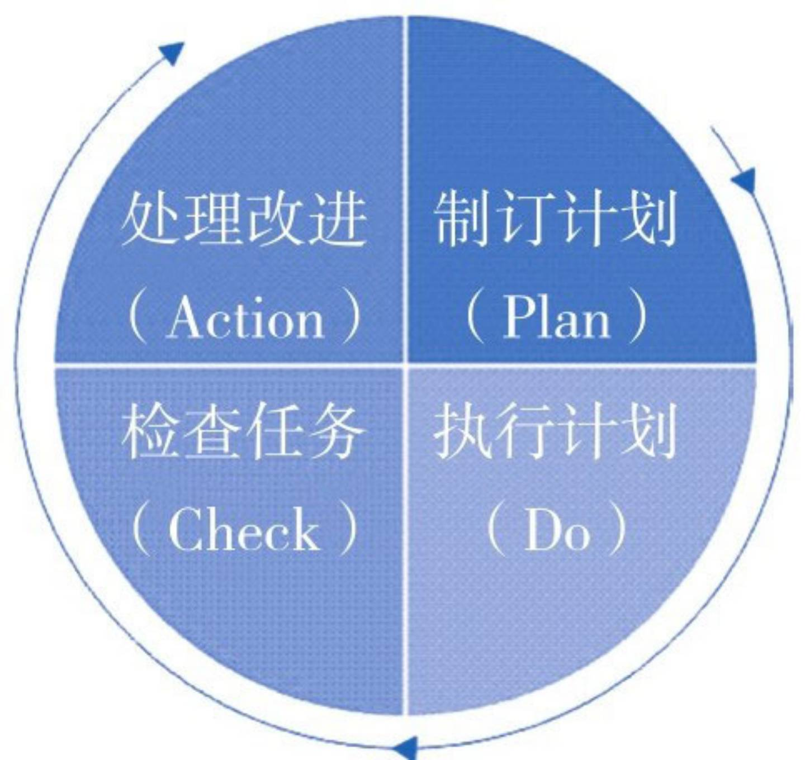
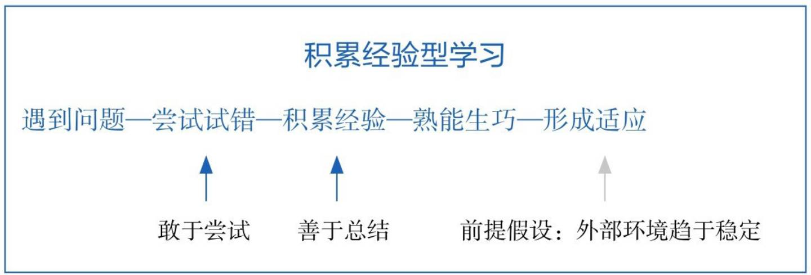
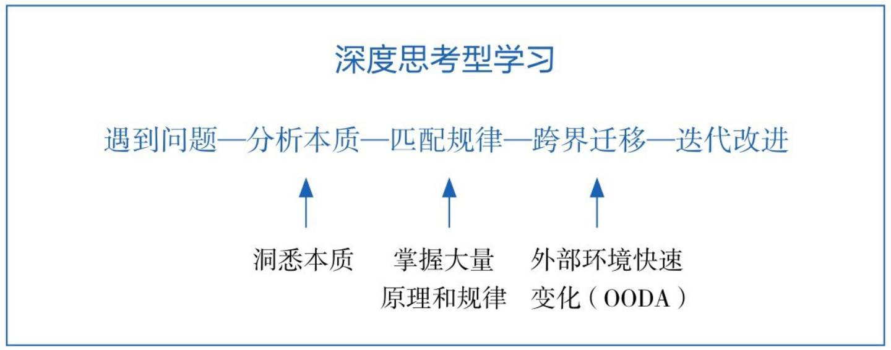

# 《好好思考》

## 【文摘】

### Chapter 01 引言

#### 我们最熟悉的决策方式

> 我们可以发现，虽然大家解决问题的具体方案不尽相同，但是，答案的来源非常相似：源于个人的过往经验。
>
> 也就是说，我们做决策的依据，主要是个人的过往经验。

#### 这个时代最厉害的决策方式

> 用那些超越了个人有限经验，被人类严谨、反复验证的跨学科原理和规律做决策依据，我们做出正确决策的概率就会大幅提升。

#### 打破学科间的壁垒

> 跨学科学习的关键根本不是学习更多的知识，而是找到不同领域间面临的共同问题。

### Chapter 02 多元思维模型：终身学习者的利器

#### 构建深度思考力的底层逻辑

> 思考力水平＝{你做出的假设}与{事物发展规律}的重合度

> 过去仅靠积累经验和知识点的学习方法之所以落后，不是因为它不能学习更多的知识，而是因为这种方法在“知识量”的积累上花了太多的时间，而很少触及问题背后的规律和原理，所以就无法大幅度突破自我认知的边界。

#### 什么是多元思维模型

> 长久以来，我坚信存在某个系统——几乎所有聪明人都能掌握的系统，它比绝大多数人用的系统管用。你需要的是在你的头脑里形成一种思维模型的复式框架。有了那个系统之后，你就能逐渐提高对事物的认识。然而，我这种特殊的方法似乎很少得到认可，甚至对那些非常有才能的人来说也是如此。人们要是觉得一件事情“太难”，往往就会放弃去做它。——查理·芒格

> 作为思维模板的思维模型为什么很重要呢？
>
> 对于这个问题，或许美国著名心理学家阿尔伯特·艾利斯提出的ABC理论可以解释。ABC理论认为，我们对外界问题（A）会做出何种反应（C），本质上不取决于我们遇到的问题（A），而是取决于我们的信念、看法和解释（B）。
>
> A（Activating events）-B（Beliefs）－C（Consequences）诱发刺激（A）—信念反应（B）—行动结果（C）

###### 查理·芒格眼中的多元思维模型

> 查理·芒格说，如果我们掌握了多元思维模型体系，就能逐渐提高对事物的认识。具体该怎么做呢？芒格在一次演讲中提到，要做到这一点，“你必须知道重要学科的重要原理，并经常使用它们——要全部都用上，而不是只用几种。大多数人只使用学过的一门学科的思维模型，比如说经济学，试图用一种方法来解决所有问题”。
>
> 在这段话里，芒格对如何洞察事物本质，给出了以下两个建议：
>
> （1）我们应当构建一个基于思维模型的知识体系。
>
> （2）这些思维模型应当是来自多个重要学科的重要原理。

> 对查理·芒格而言，所有能够持续有效解决问题的策略，都可以称为思维模型。对我们而言，只有那些在遇到问题时能真正用到的策略，才是属于自己的思维模型。否则，记住了很多思维模型，却不知道能解决什么问题，就是舍本逐末。

#### 多元思维模型建立认知竞争力的底层逻辑

###### 积累经验型学习

> 通过在实践中不断试错，逐步优化改进解决方案，从而提升自身决策能力。这个过程可以用管理学上一个重要概念“PDCA”解释。

> 所谓“PDCA”，又称戴明环，是管理学中的重要理论。它认为我们可以通过制订计划（Plan）、执行计划（Do）、检查任务（Check）、处理改进（Action）来不断改善结果。

PDCA起作用需要一个前提：外部环境相对稳定；PDCA在应对环境快速变化时面临窘境；缩短PDCA周期、加速反馈的思想成果之一就是这些年企业管理中流行的“精益思想”：

> 所谓“精益思想”，本质就是在更短的时间内，用更小的成本积累更多的经验，从而快速优化和改进方案。这种方法虽然现在看起来挺有效，但是它的本质还是用“水多加面，面多加水”的方式来缓解PDCA局限性带来的问题。

###### 深度思考型学习

> 简言之，深度思考型学习是在快速变化的环境中，通过洞悉问题本质，利用已有规律（思维模型），直击问题要害的成长模式。它的本质是站在巨人的肩膀上继续前进。

> 在这个成长逻辑下，成功的要点是：
>
> （1）洞悉问题的本质。要做到这一点，就需要积累跨学科的知识和经验，能够准确地看到问题的本质。
>
> （2）掌握大量原理和规律。不是靠自己一个人实践摸索，而是花时间学习全人类的最佳实践或规律和原理，站在巨人的肩膀上思考和解决问题。

> 在这种思考模式下，高质量的思维模型起着关键的作用。、

> OODA代表着决策流程的四个英文单词的首字母：观察（Observe）、调整（Orient）、决策（Decide）以及行动（Action）。

> PDCA的决策机制是默认外部环境相对稳定，因此我们决策的第一步是对环境做出“计划”。而OODA完全不同，它的思想基础是默认外部环境随时在发生变化，所以决策的前提不是计划，而是动态的“观察”与“调整”。换句话说，OODA把核心精力放在系统地、动态地判断问题的本质上，有了这个前提，调用恰当的策略采取行动就相对简单了。

#### 多元思维模型解决问题的四个层次

###### 追问有效策略背后的原理

砍价： “锚定效应”

有效砍价策略的不同层次：

> 有深度的思想就意味着我们不仅能看到问题的具体现象和解决方案，还能看到解决方案背后的更底层的规律；不仅能够理解问题表面的原因，还能洞察原因背后深层的原理，甚至能够看到在一层次思考时是成功有效策略的方法，在另一层次思考时可能反而是负面、有害的策略。

###### 思维模型的四个层次

芒格：全归因治学法

###### 棱镜法分解问题层次

追问总结答案背后不同层次的思维模型：

#### 超越答案寻找更底层的思维模型

> 如果一件事虽然成功的概率不高，可是失败了也没大损失，而万一成功了收益就很大，那这件事情也是值得投入的。