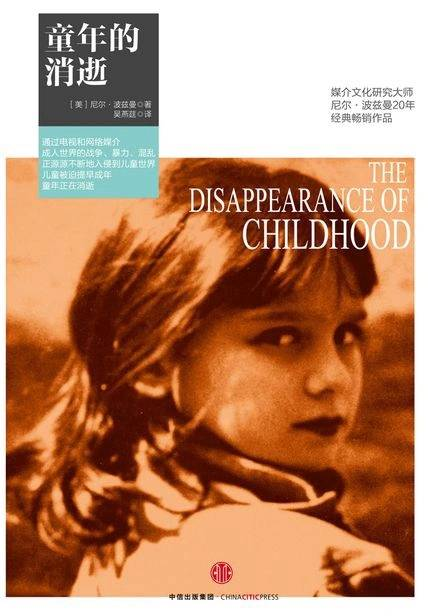

# 《童年的消逝》

作者：[美]尼尔·波兹曼

## 【文摘】
### 第一部分 童年的发明

就像形式各异的服装，过去在城镇的大街小巷上随处可见的儿童游戏也正在消失。就连“儿童游戏”这个想法也似乎正从我们的股掌之中流失。我们过去习惯于认为儿童游戏并不需要教练、裁判或观众，只要有空间和器材，儿童就可以开始玩了；游戏的目的不为别的，只图快活。

儿童游戏，言简意赅地说，已成为濒于灭绝的事物。

此外，罗马人开始把成长中的孩子同羞耻的观念联系起来，尽管这在现代人看来是理所应当的事。

其目的，说实在话，就是没有高度发展的羞耻心，童年便不可能存在。

在《爱弥儿》（Emile）一书中，卢梭告诉我们：“阅读是童年的祸害，因为书本教我们谈论那些我们一无所知的东西。”

至少有一点就是。现在所谓的童书，基本都是成人作家写的

阅读是童年的祸害，因为在某种意义上，它创造了成年。

#### 第1章 一个没有儿童的时代

历史学家通常不是来歌功颂德，而是来埋葬历史的。

#### 第2章 印刷术和新成人

印刷给予我们自我，使我们以独特的个体来思索和谈话。
 
#### 第4章 童年的旅程

拿洛克来说，在1693年出版的优秀著作《教育漫话》（Some Thoughts Concerning Education）中，他对童年概念的成长施加了巨大的影响。

洛克有一句至理名言：人类的头脑生来是一张空白的刻写板（a blank tablet）、一张空白的书写板（a tabula rasa）

关于童年的概念，18世纪出现的第二个重要的知识性影响人物，当然非卢梭莫属。

首先，他坚持儿童自身的重要性，儿童不只是达到目的的方法。

弗里德里希·福禄培尔（Friedrich Froebel, 1782—1852），德国学前教育家。认为儿童具有活动、认识、艺术和宗教的本能，教育就是促进这种本能发展的过程。——译者注

弗里德里希·福禄培尔

约翰·裴斯泰洛齐（Johann Pestalozzi, 1746—1827），瑞士教育家。认为教育的目的在于促进人的天赋力量的和谐发展。——译者注

玛丽亚·蒙台梭利（Maria Montessori, 1870—1952），意大利女教育家和医生。她把教育看作促使儿童内在力量自我发展的过程，强调让儿童自由活动，认为让儿童进行各种感官练习是儿童获得知识的基础。——译者注

让·皮亚杰（Jean Piaget, 1896—1980），瑞士心理学家，发生认识论和日内瓦学派的创始人。主张通过对结构整体的研究来了解儿童的智力发展，认为儿童的认知发展经过感知运动、前运算、具体运算和形式运算四个阶段。——译者注

阿诺德·格塞尔（Arnold Gesell, 1880—1961），美国儿童心理学家。认为发展是内部因素起主导作用，从胚胎期到青年期的行为模式的变化与成熟都按一定顺序进行，可以预测。——译者注

A·S·尼尔（A.S.Neill, 1883—1973），英国教育家。深信儿童生来具有无限潜在的力量，“自由”为儿童所必需，认为学校的纪律、指导、暗示和道德训练都应放弃。——译者注

卢梭的第二个思想是，儿童的知识和情感生活之所以重要，并不是因为我们必须了解它，才能教育和培养儿童，而是因为童年是人类最接近“自然状态”的人生阶段。

西格蒙德·弗洛伊德（Sigmund Freud）的《梦的解析》（The Interpretation of Dreams）和约翰·杜威（John Dewey）的《学校与社会》（The School and Society）

从一个科学的框架里出发，弗洛伊德声称，首先，儿童的头脑里有一个无可否认的结构和特殊的内容，例如，儿童具有性能力，富有各种情结和本能的心理冲动。他还声称，在努力达到成熟的成年的同时，儿童必须战胜、抛弃和升华他们本能的热情。因此，弗洛伊德驳斥洛克的论调，赞同卢梭的观点：头脑不是一张空白的书写板；儿童的头脑的确最接近“自然状态”；天性的要求必须考虑在内，否则就会造成永久的人格错乱。与此同时，弗洛伊德又驳斥了卢梭的观点，赞同洛克的说法：儿童和家长之间早期的相互影响，对于决定儿童将来成为何种成人起着决定性的作用；通过理性教育，头脑的热情可以得到控制；没有压抑和升华，文明是不可能实现的。

同样地——虽然是从哲学的框架出发的——杜威论证说，儿童的需求必须根据孩子是什么，而不是将是什么来决定。无论在家里还是学校，成人必须问自己：这孩子现在需要什么？他或她现在必须解决什么问题？杜威相信，只有这样，儿童才会成为社区中对社会生活有建设意义的参与者。“假如我们认同童年真正的本能和需求，”他写道，“只需（要求他们）有最全面的主张和成长……待时机一到，成人生活的纪律和文化自然会出现在成长起来的儿童身上。”

### 第二部分 童年的消逝

达尔文提出的观点，影响的大多是学者和神学家。

综上所述，我们可以断定，电视侵蚀了童年和成年的分界线。这表现在三个方面，而它们都跟电视无法区分信息使用权密切相关：第一，理解电视的形式不需要任何训练；第二，无论对头脑还是行为，电视都没有复杂的要求；第三，电视不能分离观众。

#### 第6章 一览无余的媒介

如果对各种冲动没有控制，尤其是对意在侵犯和即时满足的冲动没有控制，文明是不可能存在的。

我们经常处在被原始的冲动所控制的危险中，包括暴力、兽欲、本能和自我。

#### 第7章 成人化的儿童

成人化的儿童可以定义为一个在知识和情感能力上还没有完全发育成熟的成年人，尤其在特征上跟儿童没有显著的区别

#### 第8章 正在消逝的儿童

儿童犯罪的频率、残忍程度，以及立法机构对这种情况做出的反应，都发生了前所未有的变化。这些无疑是有多种起因的，但没有一个能够像童年的概念正在我们手中迅速滑落这个事实更切中要害。我们的孩子生活在这个社会，它的心理环境和社会环境并不强调成人和儿童的区别。当成人世界以一切可以想象的方式向儿童开放时，他们必然效仿成人的犯罪活动。

#### 第9章 六个问题

童年是被发现的，还是被发明的

童年的衰落预示着美国文化的普遍衰落吗？

“第一次伟大实验”是托马斯·潘恩称作“政府的原则和实践的革命”。它起源于18世纪后期，提出了这样一个问题：“思想和表达的自由是建筑政治结构的可靠想法吗？”“第二次伟大实验”起源于19世纪中期，属于社会性质的，它提出了这样一个问题：一个由来自世界各地、不同民族组成的人口，他们有自己的语言、传统和习惯，文化能从这样的人口中造就出来吗？在实验过程中允许某些失败，但我们可以说，这两个实验都相当成功，在很大程度上是世界的奇迹，令人羡慕。

“第三次伟大实验”始于20世纪初，提出了这样一个问题：一个文化如果允许现代科技全面主宰它的命运，那么它能保留原有的人道价值，同时创造新的价值吗？

道德多数组织和其他宗教激进组织在保存童年方面究竟出了多少力？

有没有一种传播技术具备某种潜能，足以保持童年存在的需要？

有没有任何社会机构足够强大，并全心全意地抵制童年消亡的现象？

在抵制时下所发生的一切时，个人完全无能为力吗？