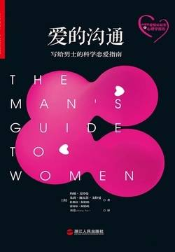

# 《爱的沟通》

作者：[美]约翰·戈特曼

## 【文摘】
###  01 女人究竟要什么？ 理解女人心

让女人心动的法宝：信任   

女人常见的两种抱怨   

第一种抱怨是：“当我有困难或者有需要的时候，他从来不能及时帮助我。”第二种抱怨是：“我们之间还不够亲密，没有建立足够的联结。”   

情绪协调为信任热身   

女人最看重的特质是值得信任，信任是通过情感上的联结建立的，情感上的联结是通过情绪协调达到的；因此，情绪协调意味着信任。   

情绪协调可以用一组首字母缩略词来表示：A-TT-U-N-E。   

关注（ATTEND）。   

转向（TURN TOWARD）。

理解（UNDERSTAND）。   

非防御性倾听（NONDEFENSIVELY LISTEN）。    

共情（EMPATHIZE）。   

不要等到结婚后才变得靠谱   

向孩子学习   

伴侣关系中总是或多或少会产生一些问题。两个人不可能在每一件事情上都达成一致。你的目标是不要让对方和你形成对立。   

> |好男人备忘录|
>
> ★ 女人最想要什么：信任。女人第一想要的就是信任。言出必行、表里如一，是男性获取女人信任的方法。
>
> ★ 信任的秘密：情绪协调。女人需要在情感上和男人产生联结，如此才能获得情绪安全。当女人想要和你建立这种联系时，尤其当她沮丧的时候，你要运用以下的情绪协调技巧：关注她的情绪；身体转向她；向她询问以寻求理解；非防御性倾听；接受和确认她的情绪。
>
> ★ 不要使用蛮力。女人也需要身体上的安全。好男人从来不应当用他魁梧的身材和响亮的声音来羞辱女人或者强调一个观点。引起生理上的不安全感是和女性交往的大忌。
>
> ★ 信任会带来更少的争吵和更多的性爱。当女人觉得在情绪上和男人产生联结，并觉得男人值得信赖时，与其交往便会有更少的争吵和更多的性爱。这是双赢。THE MAN'S GUIDE TO WOMEN

### 02 女人独特的思维 理解女人大脑的艺术

理解女人大脑的艺术   

虽然女性的大脑和男性的大脑由同样的元素组成，但是两者在运行模式上却有所区别，尤其是在生理节奏和对恐惧的感受上。   

关注她的周期情绪   

三种激素决定了女人每一天的生理心理活动：雌激素、孕酮和睾酮。   

在整个生理周期的头两周，雌激素水平会逐步上升，女性会更加友好、健谈，更加放松、镇静，但情绪上也会更加敏感。在生理周期的后两周，孕酮水平会逐渐上升，女性会变得更加易怒、更有压力、更不镇静，也会更想要独处。在这个时期，女性也会更加关注内心世界、更加有创造力。这就是女性生理周期的基本规律。然而，这个基本规律也因人而异。随着女性年龄的增长，这个规律也会发生变化，因为女性会逐渐经历更年期和绝经期。   

大部分女人到了四十几岁至五十几岁时会经历更年期，此时，她们会变得更加易怒、更容易失眠。   

在排卵期，女性会更加情绪化，性需求也会更强烈。   

在月经期前一周，女性的孕酮水平下降，她们会更容易变得情绪敏感、易怒、有压力或者伤感。这就是我们常说的经前综合征（PMS）。经前综合征可能持续一天，也有可能持续整整两周。   

经前综合征的症状还包括从轻度到非常重度的焦虑和抑郁。它也可能导致女性在生理上的不适，包括头痛、背痛、抽筋、胀气和浮肿。女性可以采取以下措施缓解经前综合征的不适：运动、减少咖啡因摄入量、服用B族维生素或者草药。如要彻底治愈抑郁症状，也可以遵医嘱服用孕酮。   

在月经到来之前，女人会更加想要独处。   

并不是所有女性的生理周期都是28天，一个完整的生理周期短则20天，长则40天。同时，也不是所有女人的经前综合征症状都完全相同。女性本人的整体健康状况、压力水平、服用的药物，如避孕药等，都会影响到女性生理周期的长短和情绪波动的水平。也就是说，没有一个可以适用于所有女人的普适规则。    

配合她的生物节律   

激素对女性的性欲有极大的影响。这一点超出很多男人的认知。激素水平的周期性波动会影响女性的情绪状态，更会改变她的性欲和对性行为的接受度。当女人处在排卵期时，她更加偏好具有进攻性的男人；当她处在非排卵期时，她更加偏好温和的男人。   

到了更年期，女性的激素水平下降，性欲也会降低。好消息是，一点局部雌激素就可以帮助更年期女性缓解阴道干燥的状况，也可以帮助她们在更年期前后都更加享受性爱。   

无论男女，睾酮都可以促进性欲。但是男性的睾酮水平平均来说是女性的10~100倍    

男性的下丘脑负责管理性欲。而男性大脑中掌管性的部分的体积是女性的2倍，然而，男性关于性行为的想法却是女性的6倍。   

在青少年时期，男性的睾酮水平相对较高，性欲水平也会达到巅峰。而女人的性欲水平直到30多岁时才会到达巅峰。这就给长期亲密关系带来了有趣的挑战与机会。只有当伴侣四五十岁时，双方的性欲水平才会更为接近。   

女人与恐惧   

女人对恐惧的感受和男人完全不同。   

对于初学者来说，当女人感到恐惧时，请握住她的手。而更好的办法是，在一开始就帮助她避免恐惧。   

> |好男人备忘录|
>
> ★ 生理节奏。理解激素对女性日常情绪的影响，明白每个女性受到的影响都是不同的。另外，激素带来的影响也会随着女性年龄的变化而变化，女性的激素周期会影响到她的性欲和对你的需求。
>
> ★ 恐惧。女性对恐惧的感受和男人完全不同，女性更加容易对恐惧产生条件反射。当男女共同经历一次恐怖事件后，女性对此产生条件反射的可能性会高出男性1倍。当女性感到恐惧时，立刻给她安慰可以迅速让她的恐惧感消失。当然，前提条件是她和你在一起能感到很开心。如果你们的关系不是那么好，那么你的安慰就不会有效。

### 03 男士魅力法则 理解女人和吸引力

理解女人和吸引力   

使用非语言性小技巧    

研究表明，无论男人是否主动采取行动，最终还是会由女人来控制一切的节奏。没错。或许你觉得你有很棒的搭讪话术，即使这些话术在原始男人不再使用木棒作为武器的时候就开始流行了，但是这些话术，就像原始人的木棒一样，通常并没有什么用。   

像超人一样自信   

研究中，只要男人没有被女人打一巴掌、直接回避或者以任何一种方式被公开地拒绝，那么就可以认为该男性搭讪成功了。   

韦伯斯特大学（Webster University）的心理学家莫妮卡·摩尔（Monica Moore）在酒吧、餐馆、派对等各种场景下观察了200名单身女性。她发现了女性调情时的52个举动。这些举动其中就包括：女性会轻轻抬起头部，冲一个特别的男人轻轻一瞥。如果这个男人看了过来，那么女人也会直视回去，并用手指轻轻撩拨头发，她会轻舔嘴唇，还会露出脖颈。这些女性还会把手掌给男士看，还会把裙子拉高一点，露出更多的腿部。她们会在椅子上转动身体，轻轻抚摸身边的一个物体，有时甚至带有一点暗示的、肉欲的感觉。女人们会穿过整个房间，和男士不经意地擦身而过，飞速地用身体碰触一下男性。这些举动都非常细微，但都是确定无疑的信号，表明了女人对你有意思，你可以主动接近她。并且这些举动常常是下意识的，她们自己可能都没有意识到。   

如果她想要认识你，她会朝你的方向释发出明显的信号。最常用的信号就是直接的眼神接触、微笑或者目光反复地看向你又飞快地闪开。这些都是信号，你要如何对待这些信号就随你了。   

如果她不想要和你交往，那么你也不要和她交往。吸引是双方的，只有这种吸引才有意义。你的生理特征和人生经验让你对特定的女性感兴趣，但是你也要记住，你并不能够控制全部的过程。   

> |好男人备忘录|
>
> 女人被男性较高的社会地位和自信所吸引。你要不断优化自己，展现出最好的一面，释放出足够的非语言性信号来展示你占据了社交的主导地位，比如占据最大的社交空间、同性之间的碰触、放松、直视女性的眼睛以及微笑。避免紧张不安和不恰当的姿势，如环抱双臂或翘二郎腿。当男人试图接近一个女人的时候，女人实际上占据了主导的地位。她们会释放出一些非语言信号。你要了解那些表明她对你感兴趣的信号：
>
> ★ 她反复地看向你却又不断闪开目光。
>
> ★ 和你谈话时，她的身体主动靠向你。
>
> ★ 她的腿、脚或者肩膀的方向是朝向你的。
>
> ★ 她一直在撩头发。
>
> ★ 她摆弄身上的首饰如耳环，或者轻轻敲击酒杯的杯梗。

### 04 成功约会守则 约会注意事项

开放性的问题没法简单地用“是”或者“不是”来回答，所以它们会提供给你更多的信息。开放性问题的回答意味着会有较长的描述性信息和解释，或者还会有一些跳跃的想法。问题是确定的，但答案却不是。开放性问题更像是一个邀请。   

对话是一门艺术，这门艺术的核心就是，要把另外一个人放在舞台的中心。   

在第一次谈话以及在未来所有的谈话中，你都要在她讲话时直视她的眼睛。   

但不要过分变态，你也不要一直瞪着对方看，也要时不时地眨眨眼睛。这可不是一个瞪眼睛比赛。眼神交流能使她产生亲密感，而毫不间断地盯着对方只会让她怀疑你是个连环杀手。   

尝试用你的基音[插图]说话。怎样才能找到基音呢？你可以站在淋浴花洒下，用拇指和中指轻轻地捏住鼻梁。然后轻哼，调整你的声音频率。当你使用基音时，你的鼻骨振动幅度最大。   

> |好男人备忘录|
>
> ★ 提出开放式问题。
>
> ★ 真实地展现你自己，但如果你的声音天生就比较细，那么请你用低沉一些的声音说话。
>
> ★ 认真倾听，通过对话制造安全感。
>
> ★ 把女人放在对话或者约会的核心位置。
>
> ★ 看着她的眼睛，并且轻松自然地模仿她的姿势。
>
> ★ 当你试图约她一起跳舞，问她要电话，或者约她出来的时候，你可以轻触她的前臂。
>
> ★ 第一次约会要有创意。计划一些冒险、有趣或者令人兴奋的活动。
>
> ★要有绅士风度，比如为她开门或拉椅子。
>
> ★ 充满自信，展现出能够保护她的态度。

### 05 吸引的科学原理 诱惑的秘密

> |好男人备忘录|
>
> ★ 信息素是一种产生吸引力的化学物质，会让某些人闻起来就是你想要的。
>
> ★ 女性的嗅觉比男性更加灵敏。你的信息素对某些女人来说很有吸引力，但是对其他女人则不然。这并不针对你个人。
>
> ★ 你可以控制除了信息素以外的其他体味。因此，请保持个人卫生清洁。
>
> ★ 糟糕的初次亲吻会毁了你们的关系。
>
> ★ 女人对初吻的记忆，胜过其他任何人生中的重大事件。确保你们的第一次亲吻给她留下美好印象。
>
> ★ 亲吻会释放出大量让你们感觉良好的激素。
>
> ★ 你可以学会如何让第一次亲吻更加美妙。

### 06 看清对方的真心 理解女人的真实需求

理解女人的真实需求   

迷恋期（limerence）   

童年印记与伴侣关系   

一项长达20年的追踪研究显示，在出生后18个月内，如果婴儿和养育者建立起了亲密和充满爱的关系，那么他们长大成人后，就更容易处理好伴侣之间的冲突。研究者将这些婴儿归为“安全型”。如果婴儿在这个关键的时期没有建立好安全的依恋关系，那么未来他们在伴侣关系中就会遇到更多的困难，也更难以像成人一样投入一段关系。   

如何了解最真实的她？   

心灵。你要观察清楚她是一个善良的人还是一个会常常抱怨家人和朋友的人。   

美好的伴侣关系是身、心、灵的高度统一。   

你要对以下人格特征时刻注意并且保持警醒。   

落难女子。    

公主病。      

竞争者。    

作女。   

> |好男人备忘录|
>
> ★ 催产素会模糊你的判断，并弱化你的恐惧反应。在你高潮和感到喜悦时，你都会分泌催产素，这也能够促进双方的联结。因此，“柏拉图式的性爱”这个词本身就是矛盾的。
>
> ★ 迷恋是双方互相吸引或者产生爱情的第一个阶段。在这个阶段，你会无休止地想着对方，无法入眠，多愁善感，对爱情兴奋不已。在迷恋期，你会被大量的激素所笼罩，以至于忽视了双方交往中的一些值得警惕的信号。
>
> ★ 你会因为激素或者婴儿期的童年印记而迷恋上某些人。你要反思自己是否总会被同样的女人所吸引。要对有意识或者潜意识的动机保持警惕。★ 如果你感到和一个女人有身、心、灵的联结，那么你们的关系就不仅止于一夜风流。
>
> ★ 如果一开始双方不来电，那么你们永远都不会来电。

### 07 想象就是一切 理解女人如何看待她们的身体

幽默专栏作家戴夫·巴里（Dave Barry）说过，当女性问你，“我穿这个是不是显胖时”，唯一标准的答案就是假装自己心脏病发作，继而昏倒在地。但问题是，你没法儿年复一年地上演心脏病突发的戏码。聪明的男人应该这样回答：“不论你穿什么，你都非常美丽。”这才是唯一正确的回答。就这样回答，你别无选择。这个答案甚至应该被规定成法律，如果你不照着答，就会被判处刑罚和罚金。你一定要相信我们这个答案。   

 

心理学家、作家约尼·约翰斯顿（Joni Johnston）在其著作中提到，当黑死病席卷欧洲并导致1/3的人口死亡的时候，当时社会对女性美丽的标准是希望她们看起来胖胖的，像怀孕了一样。即使是单身女人，人们也希望她会看上去“更好生养”。人们只要看一看从文艺复兴到维多利亚时期的油画，就会发现过去的女人曲线玲珑，可比现在的女人丰满多了。这就是最原始的修片技术。只不过现在我们会将女人PS得更加苗条，而当年的画家选择把女人画得更加丰满，以展现出女人的性感和生命力。直到20世纪20年代，骨感苗条的女性形象才开始出现。这是因为女权运动兴起，女人主观上开始拒绝传统的女性形象。自此开始，女人就应该骨感苗条这一概念便深入人心，进而导致年轻女性开始出现各种饮食紊乱和失调的问题。与此同时，当一个社会物质极大丰富的时候，苗条更意味着有极强的自控力，或象征着一种仙气飘飘的禁欲感，看上去非常圣洁。所以工业革命以后，当中产阶级兴起，物质开始丰富以后，苗条便成了潮流。   

> |好男人备忘录|
>
> ★ 女人一天会接触上百条广告，这些广告都在不停告诉她们，女人的身体应该长成什么样。女人很难达到这些由时尚娱乐产业创造的理想身体标准，而你的责任是告诉她，她本来就很美。
>
> ★ 女人和她自己身体的关系极其脆弱。即使是关于她的体重、衣服尺寸和个人魅力的小小玩笑，都会深深地伤害她。好男人从来不会批评女人的身体。
>
> ★ 男人永远无法扭转社会对女人的刻板印象，即更瘦才更美。但是男人可以让女人感受到自己的美丽。
>
> ★ 恭维她。让她知道你多么热爱和迷恋她本来的样子。
>
> ★ 如果女人对自己的身体不满意，或者觉得你认为她没有吸引力，她就无法在性关系上和你建立安全的联结。

### 08 奇妙的女性身体 一堂解剖课

> |好男人备忘录|
>
> ★ 女人的大脑是她最重要的性敏感区。她需要在肉体上和情绪上和你建立安全的联结，如此才能够感受到性兴奋和愉悦。
>
> ★ 女人的性器官非常复杂。你要探索什么会给她带来愉悦，并且帮助她一起发现。
>
> ★ 找到阴蒂。如果找不到，你要问。
>
> ★ 女人有很多性敏感的“点”，包括G点、A点和U点。只要你正确地抚摸刺激，这些“点”可以给她带来高度的性愉悦。开发这些“点”，让她获得更好的感受。但是不要让她感受到压力，不要让她觉得自己必须要对特定的“点”感受到特定的愉悦。每个女人，以及每个女人的身体都是完全不同的。
>
> ★ 女人的性敏感区不仅限于她的阴道。男人也一样。只要正确地抚摸，她身体的任何一个部分都可以给她带来极度的愉悦。她的皮肤、颈部、耳朵、嘴唇、肩膀、胸部、背部和大腿都可以成为她的性敏感区。
>
> ★ 她的愉悦可以增加你的愉悦。

### 09 变成她最棒的伴侣 激情性爱的通识读本

真正的微笑体现在你的眼角，而非嘴角。真正的微笑又叫作迪歇恩微笑，是由法国解剖学家首先发现的。   

在色情电影里，人们可不会深情地注视对方，因为他们只是相互帮对方自慰而已。   

握住她的手。在做爱前、做爱时和做爱后都握住她的手。约会时，要握住她的手；结婚后，也要握住她的手。无论她感到悲伤、快乐、恐惧还是疯狂，都握住她的手。即使她觉得她配不上你的爱，你也要握住她的手。每次当她需要时，都去握住她的手，你就会成为她最棒的爱人。   

> |好男人备忘录|
>
> ★ 忘记你在色情电影中看到的一切。
>
> ★ 做爱开始于你们实际上床之前。你可以通过建立预期、创造无限可能性来让她无法抗拒。在抚摸她前，用微信、调情、性暗示来创造激情。
>
> ★ 当你每次感到有性欲的时候，你就试着讲一个故事。故事是关于你是谁、她是谁以及你们在一起之后你会变成什么样。故事要非常有吸引力。
>
> ★ 大部分男人的性爱流程非常常规，但有技巧的男人从来不会遵循任何常规流程。你可以用你的话语、嘴唇、舌头和双手与她身体的每一寸肌肤做爱。好男人不会仅仅关注女人的乳房和生殖器。
>
> ★ 做爱后，好男人会握住女人的手，这是女人巨大愉悦的来源。即使你很想要睡觉，也要握住她的手。这样并不费事，但是却有很大的作用，会让你成为她最棒的爱人。

### 10 学着像女孩一样争吵 理解女人和冲突的关系

理解女人和冲突的关系   

田纳西大学的桑德拉·托马斯（Sandra Thomas）领导了第一个测量普通女人日常愤怒的大规模综合性实证研究，即“女性愤怒研究”。研究表明，女人的愤怒来源可以分为三类：感到无能为力、感到不公，以及感到他人的不负责任。    

深呼吸和数数是抑制中枢神经反应或者进行自我舒缓的有效手段。深呼吸可以刺激迷走神经，进而降低心率和血压。   

> |好男人备忘录|
>
> ★ 冲突总是会发生，即使你们的关系非常完美。
>
> ★ 男人和女人生气的频率相同，但是处理愤怒的方法不同。
>
> ★ 女人会因为3种原因而生气：无力、不公或者他人的不负责任。
>
> ★ 冲突发生时，男人比女人更容易处在生理唤醒状态。这导致男人不太能够用幽默、共情或者理解的方式来解决冲突。
>
> ★ 男人天生进化出以下特质：高度警觉、有攻击性、面对挑衅时容易采取反击模式。
>
> ★ 你可以通过3种方式抑制愤怒：深呼吸、从1数到10、休息放松。
>
> ★ 如果你的伴侣批评你，她实际上也非常痛苦。你的任务是通过以下3个问题，找到她痛苦的根源：你的需求是什么？你担心什么？你的感受如何？

### 11 为什么买一双鞋要花这么长时间？ 理解购物的进化重要性

> |好男人备忘录|
>
> ★ 逛街植根于女人的基因里。自从远古时代开始，女人就需要成为采集好手，生命也因此得以延续。
>
> ★ 大部分（并非所有）女人喜欢逛街。逛街是展示她们创造性和积极性的一种方式，更是一种社交体验。
>
> ★ 女人负责一个家庭里85%的采购决定。
>
> ★ 逛街需要敏锐的记忆力。女人的记忆力比男人的要好。
>
> ★ 男人逛街的方式和他们祖先狩猎的方式一样。他们靠近猎物，一击即中，然后带着猎物离开。而女人通过逛街与他人建立联结，并建立人际关系。
>
> ★ 如果你讨厌逛街，那就不要去。
>
> ★ 研究表明，女人的衣品是预测婚姻成功与否的长期指标。
>
> ★ 如果她花很长时间买鞋子，特别是高跟鞋，你也不要抱怨。在这一点上，你要相信我们。

### 12 永远的好朋友 理解女人和闺蜜的友谊

> |好男人备忘录|
>
> ★ 相比男性而言，女性之间的社交联结更加紧密。
>
> ★ 女性都有自己的社交团体，用以保证自己和后代的生存。
>
> ★ “关爱与协助”模式会促进催产素分泌，降低压力水平。
>
> ★ 女性的朋友越多，她就越健康，也会活得更久。
>
> ★ 没有朋友的女性早逝的可能性会增加66%。
>
> ★ 男人主要寻求妻子的社会支持，女人则会寻求闺蜜的社会支持。
>
> ★ 有家庭暴力倾向的男子会试图控制或者限制伴侣的社会联络。
>
> ★ 伴侣的闺蜜既是在支持她，也是在支持你。
>
> ★ 如果你的伴侣没有什么女性朋友，那么你要鼓励她开拓朋友圈。
>
> ★ 女性能维系很多友谊，并建立联结。她们有无限的能力去爱。

### 13 她是不是你的唯一？ 理解女人和承诺

 然而，当你们都处在迷恋期的时候，并不适合决定你们是否可以在未来长相厮守。你也不要因为觉得她是你此生的唯一，就冲动地去拉斯维加斯随便找个教堂结婚。这并不是一个好时机。爱情确实很美妙，可催产素减弱了你的恐惧反应。这时，即使有闪烁的红灯警报响起，或者有大霓虹灯写着“前方弯道危险”，催产素也会让你盲目地相信对方。   

承诺就是渴望一段长期关系，并且会为该关系而付出努力。当你承诺时，你会说：“这就是我要找的女人，这是我的旅程，这也是我的路径。”当你找到那个人，你会珍惜她，感谢她带给你的不同。你不会将你和她的关系与你所失去的做比较。你们的关系不仅仅在于信任和忠诚，这更是一段英勇的旅程、成功者的旅程。   

> |好男人备忘录|
>
> ★ 男人和女人一样渴望承诺。
>
> ★ 大部分男人知道什么样的女人才是他的此生挚爱。这个女人必须天生就适合你。她闻起来很适合，感觉上很适合，并且看上去也很适合。
>
> ★ 爱情有3个阶段，每个阶段都具有选择性。你无法与所有人都坠入爱河，也无法适应所有人。★ 爱情的第一阶段，也就是迷恋期，会持续好几个月。这个时候你不适合作出厮守终身的决定。
>
> ★ 爱情第二阶段的重点在于信任。你也需要知道，当问题发生时，你们是否会准备好支持对方。
>
> ★ 爱情的第三阶段是忠诚和承诺。
>
> ★ 已婚男人活得更长，可以赚更多的钱，并且比选择同居而不结婚的男人要更加健康。
>
> ★ 你不需要和你的伴侣有一样的喜好。但是，在处理冲突和表达感情和爱意的方式上你们必须能够兼容。
>
> ★ 如果她让你自我感觉良好，那么她可能就是那个适合你的人。当你和她在一起的时候，你会感到更有活力、更勇于冒险，并且更愉悦。
>
> ★ 找到合适的人，作出承诺，这要求你尽一切力量维护一段关系。

### 14 天生的母亲 理解女人和孩子

研究显示，婴儿出生时在场的男人，当他们和妻子产生冲突时，会比其他男人对妻子更好一些。   

> |好男人备忘录|
>
> ★ 如果你想要真正理解一个女人，那么你需要理解和支持她成为一个母亲。她的生理需要会自然地驱使她更多地和孩子建立紧密的联结，从而确保孩子的生存。这并不意味着她不再爱你，也不意味着你不再重要。
>
> ★ 当女人成为母亲之后，她会比以往任何时刻都更加需要你。在这个转变时期，你的支持对你们关系的健康发展尤为重要。
>
> ★ 男人在孩子的成长过程中扮演着十分重要的角色。父亲和孩子的玩耍，有助于孩子的智力发育，而且在成年后，孩子也会变得更容易有同情心，未来也更有可能获得快乐健康的伴侣关系。父亲很重要。
>
> ★ 无论你是亲生父亲还是继父，对于孩子的健康成长而言都十分重要。
>
> ★ 如果在新生儿出生后，你觉得自己被抛弃了，那你需要和你的伴侣好好谈谈。
>
> ★ 你有责任确保家庭生活中的责任得到平等分配。你要把家庭生活当作一段伟大的旅程，一段会让你的伴侣关系更好发展的旅程。你可以成为家庭和伴侣关系中平等的一份子，你可以通过分担家庭责任，来维系伴侣关系中的浪漫、激情、乐趣和冒险，并且减少冲突。你要培养你的友谊，并且持续在情绪上和伴侣协调。

### 15 共度一生 一生一世的爱情

只有让她感受到你的理解、尊重和爱，你们的关系和爱情才会长久。女人的爱、需要和接受，这难道不正是你想要的吗？从初次的尴尬见面和约会到共同生活，最终，男人想要知道的不就是如何才能好好爱一个女人，如何才能让这个女人也同样爱自己吗？    

