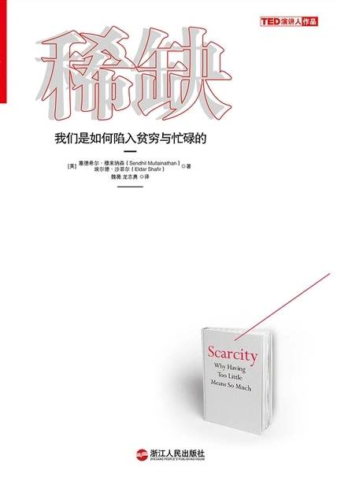

# 《稀缺：我们是如何陷入贫穷与忙碌的》

作者：[美]塞德希尔·穆来纳森（Sendhil Mullainathan）　埃尔德·沙菲尔（Eldar Shafir）   

## 【文摘】

经济学家穆来纳森和心理学家沙菲尔用心理学的实证研究重新解读了经济学的核心概念“资源稀缺”，发现贫穷和忙碌并不是简单地因为缺少金钱和时间，而是一种心态和能力的匮乏。

### 引言 资源稀缺不可怕，就怕有稀缺心态

稀缺，是“拥有”少于“需要”的感觉

#### 稀缺俘获大脑

稀缺俘获大脑（scarcity captures the mind） 稀缺造成的后果不仅仅是因为我们会因拥有的太少而感到不悦，而是因为它会改变我们的思维方式，会强行侵入我们的思想之中。

稀缺造成的后果不仅仅是因为我们会因拥有的太少而感到不悦，而是因为它会改变我们的思维方式，会强行侵入我们的思想之中。

稀缺对人类大脑产生的影响，存在于潜意识之中。

无论大脑的主人是否愿意，稀缺都会牢牢地俘获他的注意力。

稀缺对注意力的俘获，不仅会影响我们的所见和所见的速度，而且也会影响我们对周遭世界的认识。

孤独者非常善于记住与他人互动等社交内容的细节。

#### 经济学研究稀缺，但不触及心态。

稀缺的感觉来自哪里？实质性的限制起到了一定的作用——有限的存款、欠下的债务、等待我们去完成的工作等。而同时，我们对事物重要性的主观理解也发挥了作用——我们需要完成多少工作？购买某件东西的意愿究竟有多急切？诸如此类的愿望，是由我们所处的文化环境、成长环境甚至遗传基因所决定的：我们可能会非常渴望得到某样东西，也许是出于生理原因，也许是因为看到了邻居的炫耀；我们对寒冷的感知，不仅取决于绝对温度，而且也与我们自身的新陈代谢有关。同样，对稀缺的感觉，取决于可用的资源和我们自身的体验。

拥有的比需要的少，结果很简单：人们会变得不幸福。

稀缺不仅仅是实质上的约束，也是一种心态。

稀缺心态（scarcity mindset） 稀缺是一种心态。当它俘获我们的注意力时，就会改变我们的思维方式，影响我们的决策和行为方式。

带宽（bandwidth） 就是心智的容量，包括两种能力，分别为认知能力和执行控制力。稀缺会降低所有这些带宽的容量，致使我们缺乏洞察力和前瞻性，还会减弱我们的执行控制力。

在稀缺所引发的后果中，有一项尤为重要——稀缺会进一步延续并加剧稀缺。

稀缺会俘获我们的注意力，并带来一点点好处：我们能够在应对迫切需求时，做得更好。但从长远的角度来看，我们的损失更大：我们会忽视其他需要关注的事项，在生活的其他方面变得不那么有成效。

#### 正在发展中的稀缺科学

### 第一部分 稀缺心态是一切稀缺的根源

#### 第1章 专注的“得”与管窥的“失”

当稀缺俘获大脑时，人们的注意力会集中在紧急的事情上，并将其他事物排除在外。这种专注会让人们从稀缺中获益，让人们获得“专注红利”。由于“目标抑制”的作用，人们在专注于某项重要事物的同时，就不容易想到其他重要事物。因此，专注也会导致管窥，让人们的视野变窄，从而付出沉重代价。

###### 资源稀缺换来了专注与回报

稀缺，会迫使人做出选择。所有抽象的事物都会变得具体起来。

当稀缺俘获大脑时，人们的注意力会集中在如何以最有成效的方式去利用自身资源上。

一旦时间不够用的现实变得无法逃避，我们就会开始集中精力。

截止日期是一种很有效的手段，之所以这么说，是因为产生了时间稀缺，而它可以让人集中精力去做事。

无论是有关工作还是娱乐，只要时间有限，我们都会尽量将其利用得淋漓尽致。我们将这种现象称为“专注红利”（focus dividend），也就是稀缺俘获大脑时所产生的积极成果。

###### 专注红利

专注红利（focus dividend） 稀缺会自动将干扰和诱惑等因素推至一旁，让我们做到凭一己之力很难做成的事情。

用心理学家丹尼尔·卡尼曼（Daniel Kahneman）的话说就是，“在思考快与慢的两个节奏上，稀缺都会俘获大脑”。

###### 管窥

管窥（tunneling） 专注于某一事物就意味着我们会忽略其他事物，也叫“隧道视野”。

专注具有积极意义：稀缺会迫使我们专注在迫近的重要事情上；管窥则是消极的：稀缺导致我们有了管窥之见，让我们忽略了其他可能更重要的事情。

###### 管窥所导致的忽视

专注于某项重要事物会令你不那么容易想到其他你所关注的事物。心理学家们将这种现象称为“目标抑制”（goal inhibition）。

管窥负担（tunneling tax）因没有对管窥心态的成本与收益进行评估而产生的心智负担与不利影响。

当稀缺将我们的大脑俘获时，我们不会通过对得失利弊的谨慎思考来进行权衡。可见，我们用管窥的方式来应对稀缺，既有利，又有弊。

###### 管窥负担

稀缺会改变我们看待事物的眼光，让我们做出不同选择。这种现象会让我们变得更有成效；但同时也会让我们为此付出代价：这种“专心致志”会令我们忽略原本很重要的其他事物。

#### 第2章 带宽负担会降低人的智商

钱的问题会永远纠缠着穷人，而时间问题则会永远烦扰着忙碌之人。若仅仅把稀缺现象视作压力和忧虑的结果，那就是忽视了深层次的影响因素。一方面，稀缺会导致人们的认知能力下降，削弱人们的分析、判断和逻辑推理能力；另一方面，稀缺也会导致人们的执行控制力下降，削弱他们抑制行为和控制冲动的能力。

###### “噪声”干扰了我们的思想

就算我们想要试着做点别的事情，稀缺的“管子”还是会将我们的目光吸引进来。稀缺意味着在人生的另一个角度上，我们的注意力更少，投入于此的心思也更少。

那些干扰我们、占据我们思想的事物，不一定来自外界，反而常常是我们自己产生的，而它们往往比真正的火车更能打乱我们的思绪。思想中轰隆驶过的“火车”，都带有个人特色。

持续的关注对我们的思想产生了影响，将我们吸入“管子”之内。正如外部噪声会干扰我们进行清晰而有序的思考一样，稀缺也会让我们产生内部干扰。

内源性思考（internal thought） 即便在大脑中重复一连串数字这种小事也会对人的总体认知能力产生深远影响。

“自上而下”处理指的是思想会对所关注的事物进行有意识的选择；而“自下而上”处理则指的是注意力会被很难为我们所控制的刺激所俘获。

 前摄干扰（Proactive interference） 当我们心里想着其他事物时，就会将其置于思想的中心，而产生忽略行为。

稀缺会直接减少带宽——不是减少某人与生俱来的带宽容量，而是减少其当下能用得上的容量。

认知能力（cognitive capacity）它是我们解决问题、获得信息、进行逻辑推理等能力背后的心理学机制。认知能力中最突出的就是“流体智力”，即在进行抽象思维和推理时，在无须特定学习或体验的情况下解决问题的能力。

第一类元素可以被宽泛地称为“认知能力”，它是我们解决问题、获得信息、进行逻辑推理等能力背后的心理学机制。认知能力中最突出的就是“流体智力”，即在进行抽象思维和推理时，在无须特定学习或体验的情况下解决问题的能力。第二类元素是“执行控制力”，其作用存在于我们管理自身认知能力的过程中，包括计划、关注、发起并抑制行为和控制冲动等。执行控制力就像中央处理器一样，是我们进行日常活动的必要能力，可以决定我们的专注力和转移注意力的能力、从记忆中提取信息的能力、同时处理多项任务的能力以及自我监督的能力。认知能力和执行控制力拥有多个层面和丰富的细节。稀缺对以上两者都会产生影响。

执行控制力（executive control）其作用存在于我们管理自身认知能力的过程中，包括计划、关注、发起并抑制行为和控制冲动等 

###### 带宽负担1——认知能力

认知能力的一个核心特性就是流体智力

流体智力最显著也是普遍为学界所接纳的衡量标准——瑞文推理测验（Raven's Progressive Matrices test）。

###### 带宽负担2——执行控制力

带宽的第二类元素是执行控制力。执行控制力拥有多个层面，自我控制是其中的一个重要方面。

自我控制力对执行控制力有很强的依赖性。我们利用执行控制力来引导注意力、发起行动、避免直觉反应或抵御冲动。

稀缺会形成带宽负担，而这就意味着，稀缺不仅会降低流体智力，而且会降低自我控制力。

###### 收割前后的印度农民

###### 其他形式的稀缺

###### 稀缺，完全不同于压力和忧虑

###### 稀缺让人变笨和更加冲动

稀缺，不仅仅会令我们入不敷出，不知如何分配资源，而且还会让我们在生活的其他方面手足无措。稀缺会使人变笨，变得更加冲动。我们不得不在流体智力和执行控制力被减弱的情况下，依靠更为有限的脑力去勉强度日。生活，就这样变得举步维艰起来。   

### 第二部分 贫穷和忙碌如何让“带宽”变窄的

#### 第3章 装箱、余闲和权衡式思维

###### 权衡式思维

用大行李箱收拾行李时，人们总是十分随意；而用小行李箱收拾行李时，人们便会变得小心翼翼，思索再三。

稀缺会改变我们花每一分钱、度过每一个小时、吃掉每一份食物的方式。稀缺会给我们一个不同的结果，装出一个内容不一样的行李箱：大行李箱总是装得随心所欲，还剩下不少空间；而小行李箱却总是装得十分谨慎，满满当当。

权衡式思维（trade-off thinking）它是由稀缺所引发的一种思维方式。在稀缺状态下，因为所有没有被满足的需要俘获了我们的大脑，以致我们开始对之念念不忘，开始产生决策难题。

稀缺迫使我们产生了权衡式思维。所有那些没有被满足的需要俘获了我们的大脑，成了我们时时刻刻念念不忘的事情。   

###### 余闲

余闲（slack） 就是我们在拥有很大空间，不存在稀缺心态时的产物，也是我们在资源丰富时进行资源管理的特定方式。

余闲可以将我们从做权衡的苦差事中解脱出来。

比如，MSN公司的理查德·詹金斯（Richard Jenkins）就建议将资产的10%留置一旁，作为“乐趣资金”。这就是可支配金钱的余闲，即用来休闲与享受的钱。

我们所谓的余闲不是刻意预留的空间，而是因为装箱时空间充裕而产生的“副产品”。

###### 穷蜜蜂与富泥蜂

经济学家们称这种现象为边际效用递减，即你拥有的越多，对你而言，每一样额外增加的物品的价值就会越低。

###### 余闲心态下的购买行为

“橱柜遗弃品”（cabinet castaways）

余闲能让我们轻松地避免选择负担。

###### 没有余闲时犯错，后果很严重

正如经济学家阿比吉特·班纳吉（Abhijit Banerjee）所说的，“诱惑负担是递减的，对于资产较少的人来说更为沉重”。

稀缺不仅意味着人们没有失误的空间，也意味着人们更有可能会出现失误。

稀缺不仅提高了失误的成本，也为人们创造了更多机会去犯下错误、做出不明智的选择。

###### 稀缺的本质就是没有余闲

就像亨利·大卫·梭罗曾说过的那样，“一个人的富有程度，与他所能舍弃之物的数量成正比”。

#### 第4章 行为经济学告诉我们的道理

###### 50美元，在穷人和富人眼中的价值不一

我们在小物件上连几毛几分钱都会计较，而在大物件上却挥金如土。  

虽然相对性认知是大脑处理信息时的固有特征，但经验与专业技能还是能让我们摆脱这一限制。

专业技能，也就是对某一领域知识的深度理解，能够对认知形成改变。

需求的压力始终存在于穷人心中，挥之不去，从而造就了他们自身的内化尺度。

研究中，穷人表现得更加“理性”。从这些案例中可以看出，穷人更贴近于理性的经济学理想，更接近于“经济人”。

节俭之人并不需要进行真正的权衡，他们与所有生活在资源充裕条件下的人一样，很难体会到1元钱的真正意义。

缺乏清晰价值观会导致可以预见的失误：同样的情况下，富人会犯错误，而穷人却能够避免。

###### 识解

识解（Construal） 在认知过程中，大脑会利用大量的环境线索去理解视觉数据。

感知颜色与感知距离一样，取决于背景环境。感知价值也是同理。

###### 机会成本

身陷贫穷会让人比职业经济学家更懂经济学。

因为专注，所以拥有专业技能；因为专业，所以有了管窥之见；因为管窥，所以产生了一系列负面后果。

#### 第5章 借用与短视

在稀缺状态下，我们会产生管窥心态。当稀缺成为带宽负担时，我们会对当下更加关注，从而导致我们产生借用行为。而当我们借用时，就是给自己的将来挖下了更深的坑。今天的稀缺，将造成明天更大的稀缺。当我们为了解决眼下的难题而极度专注时，就无法有效地规划未来，这样一来，向前看的能力就很可能会因管窥负担而丧失。 

###### 管窥与借用

为讨得生活必需品而不停地艰苦奋战，这样的日子毫无希望可言。若鼓起勇气展望未来，我们能想到的每一件事情都会让自己气馁。——雅各布·里斯（Jacob Riis）《另一半人怎样生活》（How the Other Half Lives）作者。

借用（Borrowing） 当人们面临资源稀缺时，就会通过借用相应的时间或金钱来应对突发事件。从长远来看，借用会进一步加剧稀缺。 

借用与稀缺同时存在。 

明天的稀缺注定无法像今天的稀缺一样俘获你的注意力。

当今天的资源，无论是时间还是金钱，能在当下为你带来比未来更大的利益时，借用就是行得通的做法。而当我们有了管窥之见时，借用就会超越得失均衡的限度。当面临稀缺状况时，我们的借用，从长期来看通常是不合理的。 

###### 《家庭问答》的启示

无论稀缺以什么形式呈现，都会导致借用。

现时偏见（present bias） 我们会将未来的利益作为代价，过高地估计即刻的利益。

稀缺，尤其是管窥心态，会让你搁置那些重要但不紧急的事务，比如整理办公室、做结肠镜检查、写遗嘱等，这些都是很容易为我们所忽略的事情。 

将重要却不紧急的事务搁置，这种倾向不仅有关于时间，也有关于金钱。

###### 无力规划

所有这些不同行为都有着同样的明显特征：短视。这就引出了管窥心态最基本的含义：当我们为了解决眼下的难题而极度专注时，就无法有效地规划未来。

俘获我们的稀缺，就存在于当下，它所产生的管窥负担，令我们带着短视的眼光做人做事。

#### 第6章 稀缺陷阱

稀缺陷阱就如同“杂耍”，太多的“最后关头”让人们持续从一项紧要任务转移到另一项紧要任务。这是管窥所引发的后果。我们可以在当下尽己所能，但这样的做法会给未来带来新问题。稀缺陷阱源于人们将可预期事件当作突如其来的事件处理。避免落入稀缺陷阱的唯一方法就是要拥有余闲，尤其是要建立起应对突发事件的缓冲机制。改变心态，才是人们逃离稀缺陷阱的唯一希望。

###### 停不下来的杂耍

> 如果你有时间，每个地方就都会在步行距离之内。——史蒂夫·赖特（Steven Wright） 

稀缺陷阱（scarcity trap） 就是某人的行为有助于稀缺形成的一种情况。 

稀缺并不仅仅有关于实物资源。

对稀缺进行放大的行为，就像复利一样，会使最初的稀缺变本加厉。  

一直靠借贷维生的人，并没有在他想要的东西上花什么钱，许多收入都用在了偿还贷款上；工作一直赶不上进度的人，并没有用足够的时间来完成需要完成的工作，而是将许多时间用来追赶早就应该完成的工作。

当有了管窥心态时，我们就只能局部地、暂时性地解决问题。

生活在稀缺陷阱之中，你所拥有的就会比实际应拥有的更少。

###### 逃离

逃离稀缺陷阱，首先就需要制订计划，而在稀缺心态的控制之下，我们很难集中精力去做到这一点.

制订计划很重要，但并不紧急，而这类事情正是管窥心态导致我们所忽略的事情。

###### 问题的根源

稀缺陷阱尤其会令人感到辛酸的就是，它会让人产生一种感觉：只要再多一点资源，就能摆脱欠下的所有债务，就能逃脱这个恶性循环。

###### 余闲，应对突发事件的利器

任何一点小小的不稳定都会威胁到生存于稀缺陷阱边缘的人，因为他们没有足够的余闲去吸收这些不稳定因素，只能任由其影响自己的生活。   

阶段性的稀缺会引发一些行为，而这些行为最终会将我们拖回稀缺陷阱之中。

###### 贫穷始于富足

所有这些可能都会让人认为，在资源充裕阶段，我们会精打细算，充满远见卓识。事实当然并非如此。数十年的研究显示，在资源最为充裕的时期，而且特别是在这样的时期，我们尤其容易犯下拖延的毛病。拖延，就是对眼下之事的过分关注，是阵发性的盲目乐观。我们将需要去做的事情搁置起来；我们将本应存下的金钱挥霍出去。 

###### 孤独就是社交稀缺

心理学家们在研究各类任务的过程中发现，表现与关注度或称“觉醒”是相互关联的，其关联性呈现为倒转的U型弧线——如果关注度过低，表现就会变弱；而若关注度过高，表现同样会被消弱.   

你越是尽力不去想一件事情，就越是会想到它。心理学家们将这种现象称为“矛盾历程”（ironic process）    

对于人们之间的对话效果，同样存在一条倒转的U型弧线。心不在焉、注意力不集中地与人对话，肯定会让你显得很无趣；太过专注地与人对话，又会让人觉得你特别黏人、特别不独立。    

###### 改变心态，逃离稀缺陷阱的唯一希望

穷人会一直贫穷下去，而孤独者也注定会继续形单影只；繁忙之人永远会日理万机，而节食者的计划也总是会以失败告终。稀缺造就了一种心态，而这种心态会令稀缺长存。   

稀缺心态是环境造就的结果，更有可能通过一些措施来加以改变。稀缺并非个人特质，而是自身创造的环境条件所引发的结果，而这些条件是可以进行管理的。我们越是深入了解稀缺在大脑中的发展历程，就越有可能找到办法去避免稀缺陷阱，或至少去减轻稀缺陷阱的影响程度。     

#### 第7章 穷人为什么穷

###### “最后一公里”问题

各种类型的稀缺都有着相同的元素：管窥、借用、余闲缺乏、带宽负担。   

自由裁定能力的缺乏会导致一种极端形式的稀缺。   

我们利用稀缺心理架起了一座共情之桥，即用一种稀缺形式的体验（比如时间）来与另一种形式的稀缺（比如金钱）体验相连。    

穷人最不能持之以恒地服药。    

经过数十年的研究，专家们发现了一个普遍现象：穷人做家长时更加不称职。他们对孩子更严厉，更无法从一而终，而且情感上也会更加疏离，因此也就显得没那么富有爱心。另外，穷人更容易将自身的怒气发泄在孩子身上，前一天还在因一件事情而训斥孩子，第二天又会因相反的另一件事而责备他们。穷人无法充分地与孩子们进行互动。他们也不会经常辅导孩子们做功课。他们还会放任孩子们看电视，而不会给他们念故事书。我们现在已知的良好的家庭环境所需要的组成部分，都是贫穷的父母没有能力为孩子们提供的。    

###### 无能可以导致贫穷，贫穷也可以导致无能

###### 大脑自由才能成为合格家长

在对父母养育子女的建议中，最重要的就是始终如一。    

良好的教养水平需要足够的带宽、复杂的决策能力和自我牺牲精神。    

###### 穷人缺钱又缺带宽

当大脑中装满了稀缺时，就没有那么多心思去想其他事情了。    

这一点之所以重要，是因为我们的许多行为都依赖于带宽，不仅限于为人父母。举例来说，带宽负担过重会让人更容易忘事。也就是说，你不太会忘记那些自己知道的事情（心理学家所称的“陈述性记忆”[declarative memory]），比如你第一辆车的品牌，而是会忘记心理学家所称的“前瞻记忆”（prospective memory），即那些你计划要记住的事情，比如给医生打电话或者在截止日期之前还账单。    

研究显示，如果每晚仅睡4～6个小时，这样持续两周时间后，工作表现就会受到影响——相当于连续两天晚上不睡觉。睡眠不足会进一步危及带宽。     

###### 带宽负担导致智力下降

任何形式的技能习得，无论是去学习社交技巧还是养成良好的消费习惯，都需要带宽。如果穷人缺乏带宽，那么他们就无法很好地掌握这些实用技能。    

为了加深对贫困人群的了解，我们必须认识到：他们会专注于自身的问题，会形成管窥心态，会犯错误；他们缺乏的不仅是金钱，还有带宽。     

### 第三部分 如何从稀缺走向富足

#### 第8章 如何让穷人摆脱贫穷

###### 包容穷人的不当行为

###### 让“警报”来得更早些 

若想让限制手段影响人们的行为，就必须令其进入人们的“管子”视野之内。其中一种方法是，定期发送剩余月份的提醒。通过唤起人们的关注，我们可以试图将这个遥远的问题主动推入“管子”视野之中。另一种方法是，改变限制的结构。   

为了让激励机制发生作用，人们必须在“管子”视野中看到它的存在。而大多数激励机制都有落在“管子”视野之外的危险，这就等于是无形而无效的。可见，我们需要对激励机制进行精心的设计。    

###### 节省带宽的方法才是好方法

###### 带宽可以构建

###### 扶贫是个长期项目

#### 第9章 如何解决组织中的时间稀缺

时间表排得最满的计划，不是好计划。如果没有构建起余闲，我们就会专注于当下必须完成的工作，预测不到未来可能发生的所有事情。当然，余闲不能太多也不能太少：太多是浪费，太少又不能应对突发事件。只有存在余闲，人们才不会全神贯注在迫近的截止日期上，也会去关注那些重要但并不紧急的任务。   

###### 余闲的重要作用

我们之所以没有能力构建起余闲，是因为专注于当下必须完成的工作，预测不到未来可能发生的所有事情。   

###### 余闲，不能太多也不能太少

###### 用余闲对抗救火陷阱

组织学专家罗格·博恩（Roger Bohn）和拉姆钱德拉·贾库玛（Ramchandran Jaikumar）认为，救火型组织有几条共同特征：第一，这种组织“问题太多，时间不够”；第二，这种组织会解决紧迫问题，但对于非紧急事务，无论其重要性有多高，都会被搁置；第三，这种行为会导致层叠效应，致使要去完成的工作量变得越来越大。    

对组织而言，有一种解决办法就是，对余闲进行明确的管理，确保余闲的存在。   

###### 亨利·福特的时间管理智慧

> 真正有效率的劳动者，不会整天马不停蹄地工作，而是闲庭信步般轻松愉悦地处理事务。——亨利·戴维·梭罗

虽然稀缺会给我们带来很大压力，但我们依然需要专注于能量管理和带宽培养。   

因为真正重要的是，将有效的带宽最大化，而非将工作的小时数最大化。    

###### “红花”日本料理的启示

###### “舍维斯”的餐桌管理经验

#### 第10章 如何应对日常生活中的稀缺

通过外力将人们所处的环境进行小小的改变，把重要的事情拉入“管子”视野，就能缓解稀缺带来的不良后果。当带宽有限时，让“疏忽”等同于“默许”就是一个不错的办法。稀缺会产生带宽负担，因此节约利用带宽是对稀缺进行管理的重要内容。应对稀缺，要在富足和带宽充裕时开始行动。更重要的是，要留有应对突发事件的余闲。    

###### 把重要事情拉入“管子”视野中

助理去敲门，并非什么特别有创意的干预方法，但我们却能从中体会到某些深刻的意义。对某人所处的环境进行小小的改变，就能缓解稀缺所带来的不良后果。稀缺心理是原生的，若想从“内在”进行改变，难度很大。但我们若想获得更大的成效，其实并不需要对这种心理进行改变。    

同样，我们也能对自身所处的环境进行“稀缺防御”。我们可以引入类似于减速带或助理这样的工具，利用我们对事情本身的洞察力，来构建出更为理想的成果。关键在于你所采用手段的内在逻辑，在于你是否真正理解了稀缺能帮助我们用不同的方式进行思考，以及帮助我们管理长久以来得不到解决的问题。   

###### 把重要事情拉入“管子”视野中

冲动而非提醒，也很容易将人带入“管子”视野之中。    

###### 让“疏忽”等同“默许”

当忽略问题存在时，改变行为的结果往往比直接与其对抗更有效。    

选择以两种形式存在，其中一种需要时刻保持警醒，而另一种则是一次性的。   

只要有可能，就要将警醒型行为转变成一次性行动。    

稀缺虽然会使你选择权宜之计，但同样也会提高你因这些权宜之计而受到伤害的可能性。    

###### 找准关联行动时机

一言以蔽之，你打算在之后日子好过一点时再去做的那些明智决策很有可能不会兑现，因为随着未来一天天临近，你会发现，现在也不比以前好过多少。因此，我们需要先发制人，做好过度工作。

###### 节约利用带宽

利用带宽，就是要去分配我们有限的信息处理能力。     

###### 在带宽充裕时行动

带宽变化时机的重要性，在于能让人们将计划与更为理想的带宽变化时机联系起来。    

###### 为带宽不足的人提供便利

当我们的带宽承受负担时，最简单的障碍也会造成巨大的损失。    

###### 从富足起步

在充满稀缺的世界中，漫长的截止日期就是酿造麻烦的问题所在。    

打破“充裕—稀缺”循环的一种办法，就是将资源均摊，从而创造出长期的节制状态，而非突如其来的资源充裕，然后紧跟着阶段性的稀缺。    

###### 以余闲应对突发事件

冲机制的构建需要在资源充裕时进行。    

#### 结语 规划和管理好“带宽”，稀缺问题就会迎刃而解

> 随着知识之岛的开拓，无知的海岸线也将蔓延。——约翰·惠勒（John A. Wheeler）

###### 带宽负担人人都有

###### 带宽和稀缺心理，解决稀缺问题的关键

###### 解决稀缺问题要从富足着手

沿着稀缺的线索向上追溯，我们就能看到充裕：萧条，是由我们在繁荣阶段的行为所导致的；最后一刻的拼凑，是由我们之前几周的不作为所造成的。    
