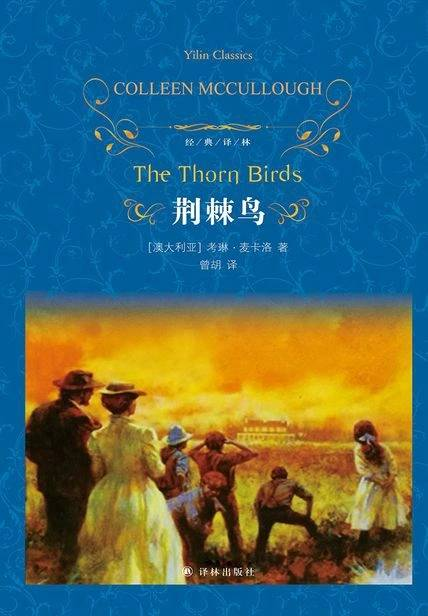

# 《荆棘鸟》

作者：[澳大利亚]考琳·麦卡洛

## 【文摘】
 
“梅吉，你该睡觉去了。你最好在妈妈查铺以前回去。快走吧，赶快！”这个提醒把她脑子里的事全赶跑了。她赶紧低下脸，提起了睡衣的后摆，把它从两腿之间抽了过来。她跑着的时候就像提着一条翻到了前面的尾巴，赤裸的双脚踩着木条和尖利的木片。

自从那天以后，除了普通的客套以外，帕迪不和弗兰克多说一句话。但是，弗兰克觉得最难堪的莫过于面对那帮孩子了。他感到羞愧和窘迫，生气勃勃的鸟被从广阔无垠的天空赶了回来，翅膀被剪去，歌声被茫茫的沉寂吞没。

### 第二部 1921—1928 拉尔夫

驶进悉尼海域后三个钟头，海面变得一平如镜，雾气悄悄地从南极飘来，团团地围住了这艘旧船。梅吉的精神稍微恢复了一些。她想象着可怕的浪击已经过去，但海洋仍在有节奏地、痛苦地狂吼着。他们缓缓地穿过浓重的灰雾，像一只被追赶的猎物那样胆战心惊地潜行着，直到那深沉而单调的浪吼声又从船的上部传来，这是一种茫茫然然、凄凄切切的难以形容的悲苦之声。

坐火车比坐船舒服多了。谛听两个火车头所发出的“喀嚓、喀嚓”和“呼哧、呼哧”的有节奏的响声，谛听风吹动电线的声音，以及钢车轮在倾斜的钢轨上滑行，猛烈地牵动列车时发出的阵阵铿锵声，梅吉沉沉地入睡了。

那年一月，暴风云遮盖了天空，又被风撕成了饱含着雨水的碎块。天开始下雨了，那可不是一场平平常常的大雨，而是一场连绵不断、经久不息的狂风暴雨。

但是，骑马跑进正在聚集的云海还是有几分新奇刺激的，就连迎风弯腰、噼啪作响的树木也像是在带着一种稀奇古怪的喜悦狂舞着。

她头发的颜色使他心旷神怡，她眼睛的色彩和样子像她的母亲，非常美丽，但却更加可爱，更加传神。至于她的性格，他认为那是完美无瑕的女性的性格，温良内向而又极其坚强。梅吉不是一个叛逆者。相反，她将毕生顺从，不越女性命运雷池一步。

我不明白你为什么如此牵动我那像一潭死水般的感情？”他若有所思地说道，尽管他相信她吐得很厉害，伤心得无心去听他说话，但他却需要像许多生活孤独的人那样，大声地说出自己的思想。

渐渐地，有关他的回忆变得十分淡漠了。回忆就是这样的，即使是那些充满深情厚爱的回忆也概莫能外，好像脑子里有一种无意识的愈合过程，尽管我们曾痛下决心永勿忘，但它依然能使创伤弥合。

### 第三部 1929—1932 帕迪

回忆起梦境中他的亲吻，是如此珍贵，不由人不千百次地重温着。但是，回忆无补于现实，它就像是一个徘徊不去的幽灵，现实的感觉是无法用魔法将其召来的。她千方百计地想这样做，但这幽灵却像是一片凄怆、缥缈的行云。

他想错了。痛苦并没有渐渐消失，似乎愈来愈厉害，并且来得更无情、更不祥。以前，他的孤独感只是一种不受个人情感影响的东西，根本谈不上在他生活中的任何一个人能弥补这孤独感。但是现在，这孤独之中出现了一个名字：梅吉。梅吉，梅吉，梅吉……

### 第四部 1933—1938 卢克

后来，在战争结束的时候，女人们发现说起这些时，情况总是这样的。参加过激烈战斗的男人们总是绝口不提这些战斗，拒绝参加退役军人俱乐部和社团，根本不想和那些使人永远无法忘记这场战争的团体打任何交道。

墓场应该没入大地母亲的胸膛中去，随着时光的流逝而退出人类的生活，直到完全消失，只有清风才记得它们，为它们而叹息。

她来了。跨过了白栏杆，越走越近，他已经清楚地看到了她的眼睛，那双仍然十分美丽、紧紧抓住了他的心的、秋水一般的灰眼睛。她的双臂搂住了他的脖子，他的冤家就在他的怀抱里，就好像他未曾离开过她似的，那生气盎然的嘴就在他的嘴下，不是在做梦。长相思啊，长相思。这是另一种神圣的东西，像大地一样神秘而不可测，和上天毫不相干。

她的手偷偷地摸着他裸露着的胳臂，非常轻地摸着。“亲爱的拉尔夫，我是明白这一点的。我明白，我明白……我们各自的心中都有某些不愿摒弃的东西，即使这东西使我们痛苦得要死。我们就是我们，就是这样。就像古老的凯尔特传说中那胸前带着棘刺的鸟，泣血而啼，呕出了血淋淋的心而死去。因为它不得不如此，它是被迫的。有些事明知道行不通，可是咱们还是要做。但是，有自知之明并不能影响或改变事情的结局，对吗？每个人都在唱着自己那支小小的曲子，相信这是世界从未聆听过的最动听的声音。难道你不明白吗？咱们制造了自己的荆棘丛，而且从不停下来计算其代价。我们所做的一切就是忍受痛苦的煎熬，并且告诉自己，这是非常值得的。”

### 第六部 1954—1965 戴恩

她的天性倾向于为其他人的弱点而感痛惜，但看不到自己身上的弱点。他的天性倾向于理解和宽恕其他人身上的弱点，并且无情地看到自己身上的弱点。她认为自己强大无比，他觉得自己软弱至极。

“不，妈。”她说道，泪水扑簌簌地落在了身上，就像熔化的金属一样滚烫。到底是谁曾说过大部分人是不会采取哭泣的行动的？他们根本就不懂得哭泣。“我将留在这里工作。我会和戴恩一起回家的，但随后我将回来。我不能生活在德罗海达。”

### 第七部 1965—1969 朱丝婷

“我从来没想到你肚子里还有这么多弯。为什么你不直截了当地说你爱我？我希望你这样说的！”“不。爱的迹象就摆在那里，要你自己看出它是给你的，如果它是给你的，你一定会明白的。”