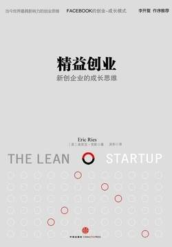

# 《精益创业》

作者：埃里克·莱斯

## 【文摘】
### 序

如何做？埃里克的《精益创业》作了一个优秀的提炼：目标顾客—小范围实验—反馈修改—产品迭代—获得核心认知—高速增长。

创业的第一阶段是把想法变成产品。这时开发的产品是精简的原型，投入最少的金钱和精力开发出体现核心价值的产品。

创业的第二阶段，新创企业要对正确的产品形态进行重点投入，做好做细，做“最了解用户的人”，做到极致。这个阶段，必须用最小的成本、在最短时间里找到最有价值的认知。

创业的第三阶段，成功者往往伴随着爆发式的增长，全面的扩张。企业开始与传统的、陈旧的市场势力展开阵地战。

### 引言

它建立在过去很多管理和产品开发的理念之上，包括精益制造、设计思维、客户开发和敏捷开发。它代表了一种不断形成创新的新方法，称为“精益创业”（the Lean Startup）。

“开发—测量—认知”（Build-Measure-Learn）反馈循环

### 第二章 定义

### 第三章 学习

### 第四章 实验

“价值假设”（value hypothesis）衡量的是当顾客使用某种产品或服务时，它是不是真的实现了其价值。

“增长假设”（growth hypothesis）是用来测试新顾客如何发现一种产品或服务的。

称之为“贵宾式最小化可行产品”（concierge minimum viable product，

柯达的历史与相机和胶卷紧密相连，不过今天它也经营着一项重要的网上业务，称为“柯达影廊”（Kodak Gallery）。马克·库克（Mark Cook）是柯达影廊的产品副总裁，他正致力于改善柯达影廊的产品开发文化，为其注入实验的概念。马克说，“过去，产品经理说‘我就是要这个。’工程师会回复，‘我会把它开发出来。’而现在，我会要求团队成员先提出以下4个问题：1.顾客认同你正在解决的问题就是他们面对的问题吗？2.如果有解决问题的方法，顾客会为之埋单吗？3.他们会向我们购买吗？4.我们能够开发出解决问题的方法吗？”

开发—测量—认知反馈循环

### 第六章 测试

一个最小化可行产品（MVP）有助创业者尽早开启学习认知的历程。3它并不一定是想象中的最小型产品；它是用最快的方式，以最少精力完成“开发—测量—认知”的反馈循环。

### 第八章 转型还是坚持

还记得开发低质量最小化可行产品的初衷吗？那是因为开发任何非早期使用者需要的功能都是一种浪费。但这个理由只能言尽于此。一旦你在早期使用者中取得成功，就会想要把产品推向主流客户群。可是主流顾客有不同需求，要求也严格得多。这时我们需要的转型称为顾客细分市场转型。在这类转型中，公司认识到开发的产品可以解决真实顾客的真实问题，但此顾客非彼顾客，他们不是公司原来计划服务的目标。换言之，产品的前提假设只得到了部分确认。

转型有各种各样的形式。“转型”这个词有时候被错误地当做“改变”的同义词。其实，转型是一种特殊的改变，用于测试新的产品、商业模式和增长引擎的基本假设。

放大转型

在这种情况中，之前被视为产品中单独的一个功能特性，成为产品的全部。

缩小转型

在相反的情况中，有时候单独的一个功能不足以支持整个产品。这类转型就是把原来的整个产品转化为一个更大型产品中的一项单独的功能特性。

客户细分市场转型

客户需求转型

平台转型

商业架构转型

价值获取转型

增长引擎转型

带动新创企业成长的增长引擎主要有三种：病毒式、黏着式和付费式。

渠道转型

技术转型

熟悉理论家杰弗里·摩尔的技术产品生命周期定律的人，会从他起的那些名字里了解到一些转型的后期阶段：鸿沟阶段（Chasm）、龙卷风阶段（Tornado）和保龄球道阶段（Bowling Alley）。

一家新创企业成功快速增长的优势在于即便企业逐步走向成熟，还能保留其创业基因。今天的企业必须学会掌握持续式创新和颠覆式创新共存的组合管理。

### 第九章 批量

### 第十二章 创新

在我的经验中，不管是新创企业还是企业内部的新创团队，都要具备三种架构特征：稀少但稳定的资源，开发业务的独立权，以及与绩效挂钩的个人利益。

### 第十四章 参与精益创业运动

http://theleanstartup.com

http://lean-startup.meetup.com