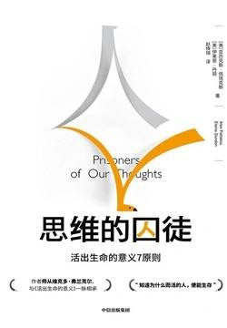

# 《思维的囚徒》

作者：[美]亚历克斯·佩塔克斯,伊莱恩·丹顿

## 【文摘】
### 序

伟大的人本主义心理学家亚伯拉罕·马斯洛在临终前也有类似的看法，他肯定了弗兰克尔“追寻意义的意志”的主张。他觉得自己的需求层次理论太过于依赖需求，自我实现也并不是人类的最高需求。最后，他得出的结论是，超越自我是人类灵魂的最高需求，这正好反映了弗兰克尔的理论精髓。马斯洛的妻子贝莎和马斯洛的研究助理把他最后的思想收集在一起，编入了《人性能达到的境界》一书中。

注意不到的东西制约着我们的视野和行为。因为我们未能注意到我们未能注意的事实，所以，等我们发现它对我们的思想和行为产生何等深远的影响时，我们才知道自己已经无法改变它。R.D.莱因（R.D.Laing）

七个原则：自由地选择你的态度，实现有意义的目标，发现生命瞬间的意义，千万不要违心做事，从远处审视自己，改变你的关注焦点和敢于超越自己。

### 第三版序

本书主要讨论的是人类对人生意义的追寻。本书的理论基础主要来自世界著名的精神病学家维克多·弗兰克尔的哲学思想和方法。维克多·弗兰克尔著有《活出生命的意义》一书，这本书被美国国会图书馆认定为美国十大最有影响力的书之一。

弗兰克尔是意义疗法（Logotherapy）的创始人。意义疗法是一种以意义为中心的人本主义心理治疗方法，它包含多种观点，其中包括“自由地选择你的态度”。

### 第一章 人生不是偶然

有人说，直觉本能是基因遗传，价值观是对传统的继承，但是因为意义是独一无二的，所以理所应当需要个人去发现。

原则1 自由地选择你的态度（第三章）无论发生什么，我们都可以自由地选择应对的态度。在[《活出生命的意义》](0226-活出生命的意义.md)中，弗兰克尔用一句名言对此概念进行了恰当的描述，“生活的艰难和困苦可以剥夺人类的其他一切，但唯独剥夺不了人类最后的一点儿自由，即人类无论在何种境况下都有选择处世态度的自由和选择自己行为方式的自由”。

原则2 实现有意义的目标（第四章）按照弗兰克尔的观点，意义疗法认为，“人存在的主要目的是做有意义的事，实现人生的价值，而不是仅仅满足本能需要和获取回报”。我们可以有意识地做出真实承诺，去实现有意义的价值观和目标，以此来实现意义意志，而不是为了获取金钱、影响、地位或声望去完成工作。

原则3 发现生命瞬间的意义（第五章）意义就在我们的日常生活和工作中，在所有的生命瞬间自我显现。我们的基本假设是，只有自己才能为自己的生活负责，才能发现自己生命中每一个瞬间的意义，编织出自己独特而丰富多彩的生活。

原则4 千万不要违心做事（第六章）有时候，我们的强烈愿望和意图会因为我们自己过度关注结果而遭受挫败。弗兰克尔称这种自我伤害形式为“过度意向”（hyperintention）。在有些情况下，我们实际得到的结果确实与最初的想法截然相反，这就是“矛盾意向”。我们可以学习并了解自己是如何对抗自己的，然后集中精力创造自己想要的生活和工作环境。

原则5 从远处审视自己（第七章）弗兰克尔说：“只有人类才能和自己保持距离，换个角度从远处审视自己。”这也就是我们所说的“自我分离”。这个概念可以帮助我们放松心情，不再为小事过度担心。这种“自我分离”能力包括人类独有的一种特质，即幽默感。弗兰克尔指出：“动物都不会笑，更不要说嘲笑自己或嘲笑别的动物了。”我们可以学习如何从远处审视自己，学会以全新的视角深入了解自己，包括嘲笑自己。

原则6 改变你的关注焦点（第八章）维克多·弗兰克尔被关押在纳粹集中营时，为了缓解压力、痛苦和矛盾，他学会了把注意力从痛苦转向其他更令人愉悦的事情上。所以，在我们面临困境时，我们也要学会如何转移关注焦点。

原则7 要敢于超越自己（第九章）弗兰克尔在书中这样写道：“爱是人类努力奋斗的最高终极目标……人类只有通过爱和被爱才能获得拯救。”不管境况如何，不管规模大小，走出去与别人建立联系，为别人提供帮助服务，你就能实现找到深层意义的目标。自我超越就是要与比自己更重要的崇高目标建立联系，并为之不懈奋斗，所以说它为我们提供了找到终极意义的途径。

在弗兰克尔的学说以及我们自己的相关研究工作基础上，我们还总结出了本书的另一个核心观点，那就是，意义必须是一个人生活的基础或核心，这里的生活当然也包括广义上的工作生活。如果不了解意义在我们生活和工作中的重要性，我们就像一艘在大海上漂泊的小船，无法与别人建立任何真正的联系，也没有明确的方向和目标引导我们走完生命的艰难航程。

如果我们的生活状态不能达到自己的预期，或者与我们经常在脸书和其他社交媒体看到的光鲜亮丽的生活相差甚远，那么追求“幸福”只会让我们更加沮丧。追求权力和影响力也是一种幻想。权力被视为强有力的主宰，人们可以控制或试图控制其他人或其他事物。追求财富可以看成追求权力的另一种形式。追求权力最终只能导致悲观绝望，因为我们无法真正对别人或事件进行控制。聪明的人都知道，人唯一拥有的真正权力来自自己，人只能对自己进行控制。

我们把意义定义为“与自己的本性或核心本质达成的共鸣”。

如果感觉某件事很重要，或者我们知道它很重要，这是因为它与我们的真实身份产生了共鸣。

通过研究和实践，我们发现了可以发现深层意义的三个要素，它们可被看作本书描述的七个意义疗法原则的综合、简化和拓展。这三个要素分别是：

- 与他人建立有意义的联系（O）
- 对从事的工作要有崇高的目标（P）
- 用积极的态度拥抱生活（A）

### 第二章 维克多·弗兰克尔
 
”意义疗法”（Logotherapy）

他用这个词来命名自己独特的人道主义心理治疗方法，也就是众所周知的“维也纳第三大精神治疗流派”（前两大流派分别是弗洛伊德流派和阿德勒流派）。

### 第三章 原则1 自由地选择你的态度

**生活的艰难和困苦可以剥夺人类的其他一切，但唯独剥夺不了人类最后的一点儿自由，即人类无论在何种境况下都有选择处世态度的自由和选择自己行为方式的自由。**

在饮水机旁抱怨工作太痛苦，或者在办公室开设一个“牢骚俱乐部”，只能让我们有暂时的志同道合之感，却不能促使我们或他人去发现意义。有人认为工作既没有意思又无法让人产生成就感。这种想法对我们影响很大，使我们无法找到工作的意义。一旦抱怨变成一种习惯，我们就会习惯性地认为工作毫无意义。要不了多久，我们就会更加怨天尤人，最终失去所有宝贵的机会，体会不到工作经历其实是生活中丰富多彩的一部分。我们不仅没能利用时间去发现意义，反而在工作和生活中频繁抱怨。抱怨时，我们切断了与别人的联系。抱怨时，无论我们抱怨的是什么事情，也不管我们抱怨的是谁，我们都会把抱怨对象当作自己的挡箭牌。这样一来，我们就会永远陷在受害无助的状态中不能自拔。

### 第四章 原则2 实现有意义的目标

一个人如果能意识到，他对深情等候他的人或一件未完成的工作负有不可推卸的责任，那么他就永远不会浪费自己的生命。他知道自己“为什么”而存在，因此为了知道“如何”更好地生存，他能承受一切。

阿尔弗雷德·阿德勒也是一位维也纳精神病学家，同时还是弗兰克尔的早期导师。阿德勒创建了一个精神治疗流派，该流派认为意义意志才是人类动机的主要驱动力。阿德勒还是个体心理学的创始人。他坚信，人们生来就有一种自卑感，所以会用一生的时间来获得优越感，以克服自卑感。

弗兰克尔认为，弗洛伊德的享乐意志和阿德勒的意义意志都表明，人们的某种东西已经缺失。弗洛伊德认为，人有追求享乐的需求或动机，阿德勒则认为人对权力有不懈的追求。

我们可以把生活比作迷宫。在这里，迷宫并不是指令人困惑或难解的问题，而是指体验意义的路径。这种路径一般呈环形，曲折盘旋，但没有死胡同。中心就在那里，但我们要走过无数的曲径才能到达。我们从未真正迷路，但却永远无法看清前进的方向。重要的是，我们必须相信自己选择的是正确的道路。的确，道路没有对错之分，因为我们走过的每一步，经历的每一段经历都能教会我们很多生活的道理，每一步都有意义。一路上，我们有时轻松自信地大胆前行，有时却小心谨慎地缓慢向前移动，有时候我们需要停下来反思，有时候我们甚至有后退的冲动。它是一条彰显个性的神圣之路，我们必须亲自前往，没有人能替代我们。

### 第五章 原则3 发现生命瞬间的意义

要像获得了第二次生命那样去生活，要像第一次犯错那样大胆去做。

生命的意义本身并不重要，重要的是在你的生活中去寻找意义。意义对每个人来说都不尽相同。不存在绝对的正确答案，只有适合你的答案。

如果我们每日忙于参加太多的活动，或者被动地沉迷于电视节目、智能手机或网络世界，我们就会与无处不在的意义失之交臂。我们必须有意识地去看、去听、去闻、去触摸和品味世界上的一切，才能在我们的生活中发现意义。

### 第六章 原则4 千万不要违心做事

极具讽刺意味的是，恐惧往往会使害怕的事情变成真的。同样，把自己的意图强加给别人，只会使美好的强烈愿望变成泡影。

疑病症也称“疾病焦虑障碍”，是患者的一种臆想，认为自己患了一种重大的或者危及生命的，但还未确诊的病症。这些人可能本身并没有病，但生病的想法和由此引发的预期焦虑促使其最后真的生病了。

让·弗朗索瓦·曼佐尼和让·路易斯·巴苏克斯合写的《注定失败综合征》。

对别人的工作无所不管的微管理做法会给员工造成很大的压力，带来业绩焦虑，甚至隐性或显性的破坏活动，最后有可能导致与管理者期望截然相反的结果（这种情况在父母教育孩子中也很常见。一些好心的父母，以父母教导为名，试图微管理自己的孩子，孩子最后反倒容易叛逆）。

因为人类的尊严不允许人们让自己成为一种手段，变成劳动过程中一种纯粹的工具，沦落为一种生产手段。工作能力不能说明一切，它既不是有意义的生活的充分条件，也不是必要条件。一种人可能有很强的工作能力，但不一定会过上有意义的生活。而另一种人则恰好相反，他们工作能力不强，但却找到了生命的意义。

矛盾意向法与劝说截然相反，因为它并不建议病人简单地抑制恐惧（理性认为，这种做法是毫无根据的），而是建议病人通过夸大恐惧来克服恐惧。

### 第七章 原则5 从远处审视自己

我们知道，幽默是使自己与困境保持距离的最好办法。或许还可以这样说，幽默能让人类以一种较为超脱的方式看待自己，从而超越困境。

### 八章 原则6 改变你的关注焦点

减反省法的唯一目的是把注意力转移到积极乐观的事情上。

### 第九章 原则7 要敢于超越自己

不要把成功作为自己的目标。你越把成功当作自己的人生目标，越想成功，往往越有可能与成功失之交臂。因为成功与幸福一样，可遇而不可求。成功必须而且也只能随着其他事情一起出现。成功是一个人献身于比自己更伟大的事业所产生的意想不到的结果，或者说是一个人服从自身之外的其他人时附带产生的结果。幸福一定会出现，成功也是如此。你要顺其自然，成功就会在你不在意它的时候出现。

生活会以某种方式回报你的所作所为。我们的生活就是我们思想、言语和行为的反映。

### 第十章 生活的核心意义

在柏拉图的《申辩篇》中，古希腊哲学家苏格拉底说：“不知反省的生活不值得过。”

要知道，我们的生活缺少系统安排，我们加入的机构组织和社会团体数目有限，得到的引导也很有限。所以，知道自己想从生活中得到什么（我们的目标），然后努力（我们的意志）去发现对我们来说真正有意义的事情，这一点就显得格外重要。

“OPA意义准则”：
- 与他人建立有意义的联系（O）
- 对从事的工作要有崇高的目标（P）
- 用积极的态度拥抱生活（A）

西班牙著名的艺术家巴勃罗·毕加索有一句名言说得好，“生命的意义就是找到你的天赋。生命的目标就是把你的天赋送给别人”。

### 第十一章 工作的核心意义

生存斗争是“为了”生存而进行的斗争，它的目的很明确。只有这样，斗争才有意义，才能赋予生活意义。

### 第十三章 维克多·弗兰克尔的遗产在延续

“维也纳第三大精神治疗流派”（前两大流派分别是弗洛伊德流派和阿德勒流派）。该流派由意义疗法和存在分析两门学科组成。意义疗法指以意义为中心的治疗方法。存在分析是意义疗法的哲学基础。

自由除非与责任相伴，否则只会退化为一种特别许可证，让人走向肆意妄为的危险境地。

为什么意义很重要？意义如何给我们的生活带来好处？我们应该怎么做才能发现意义？