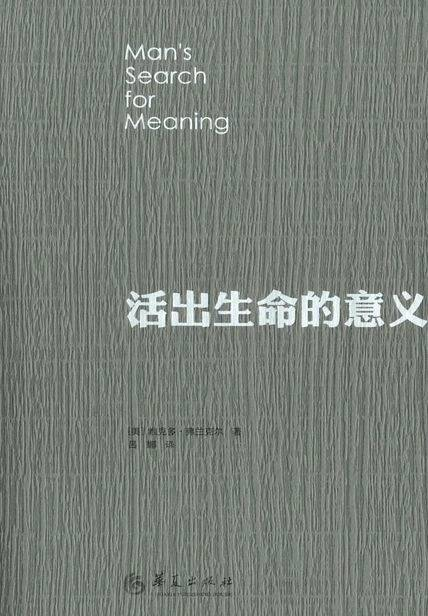

# 《活出生命的意义》

作者：[美]维克多·弗兰克尔

## 【文摘】
### 前言

“知道为什么而活的人，便能生存。”

可能找寻到生命意义的三个途径：工作（做有意义的事）、爱（关爱他人）以及拥有克服困难的勇气。

一些不可控的力量可能会拿走你很多东西，但它唯一无法剥夺的是你自主选择如何应对不同处境的自由。你无法控制生命中会发生什么，但你可以控制面对这些事情时自己的情绪与行动。

### 自序

太过于注重结果，反而事与愿违

“不要只想着成功——你越想成功，就越容易失败。成功就像幸福一样，可遇而不可求。它是一种自然而然的产物，是一个人无意识地投身于某一伟大的事业时产生的衍生品，或者是为他人奉献时的副产品。幸福总会降临的，成功也同样：常常是无心插柳柳成荫。我希望你们的一切行为服从良心，并用知识去实现它。总有一天你会发现，当然是相当长的时间之后——注意，我说的是很长一段时间后！——正是由于这种不关注，成功将降临于你。”

“不要只想着成功——你越想成功，就越容易失败。成功就像幸福一样，可遇而不可求。它是一种自然而然的产物，是一个人无意识地投身于某一伟大的事业时产生的衍生品，或者是为他人奉献时的副产品。幸福总会降临的，成功也同样：常常是无心插柳柳成荫。我希望你们的一切行为服从良心，并用知识去实现它。总有一天你会发现，当然是相当长的时间之后——注意，我说的是很长一段时间后！——正是由于这种不关注，成功将降临于你。”

### 第一部分 在集中营的经历

“我们不喜欢谈论我们的过去。对于经历过这场噩梦的人来说，所有的解释都是多余的，而对于没有这种经历的人来说，他们不会理解我们过去的感受，也不会理解我们现在的感觉。”

这种始于一战之后的心理学研究让我们知道了“铁丝网综合症”。我们还要感谢二战，它丰富了“大众心理学”的知识

我们有太多的苦难要经受，因此，必须直面所有的苦难，不能软弱，眼泪是无用的，但也不必讳言流泪，因为眼泪见证了人们承受痛苦的巨大勇气。

“你所经历的，世人夺不去。”

不光我们的经历，还有我们的行动和所有的想法、所有的苦难都不会消失。尽管它们已经成为过去，但我们可以使它们存留在世上。“曾经是”也是一种“是”，甚至更为确定。

### 第二部分 意义疗法

让我解释一下为什么我的理论要取“意义疗法”这个名字。Logos是个希腊语词，指的是“意义”。意义疗法，或者某些学者所谓的“心理疗法的第三个维也纳学派”，着眼于人类存在的意义以及对这种意义的追求。根据意义疗法，努力发现生命的意义正是人最主要的动力。这就是为什么我用“追求意义”一词，而不用弗洛伊德心理分析学说强调的快乐原则（我们也可以叫它“追求快乐”），也不用阿德勒心理学派的“追求权力”或者“追求优越”之说。

存在之挫折

人对意义的追求也会遇到挫折，这就是意义疗法所谓的“存在之挫折”。“存在”一词有三种含义：（1）存在本身，比如人特定模式的生存；（2）存在的意义；（3）对个体存在之意义的追求，即对意义的追求。

作为一项技术的意义疗法

运用矛盾意念法来对抗预期焦虑，用反应消除法对抗过度的意念及过度的反应

#### 写在后面的话

所谓“三重悲剧”在意义疗法中包括了以下三种因素：（1）痛苦；（2）内疚；（3）死亡。

人类总是有能力（1）将人生的苦难转化为成就；（2）从罪过中提炼改过自新的机会；（3）从短暂的生命中获取负责任的行动的动力。

在欧洲人看来，美国文化的典型特点是人们一次又一次地被命令“幸福起来”。但幸福也不是能够强求的，它只能是结果。人们一定要有理由才能幸福起来。一旦找到了那个理由，他自然而然会感到幸福。人类不是在追求幸福，而是通过实现内在潜藏于某种特定情况下的意义来追寻幸福的理由。

我对意义的认识——个人对特定情境的认识——介于卡尔·布勒尔概念中的“阿哈体验”与马克斯·维黑莫尔理论中“完形概念”的中间地带。对意义的认识与经典的“完形”不同，因为后者意味着某个“人”在“某个地方”的突然领悟。

而对意义的认识在我看来最实在不过，就是意识到了现实背景下的某种可能性，或者通俗地说，意识到在给定情境下“能够做些什么”。

