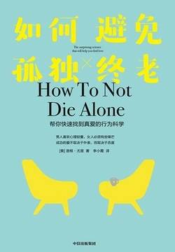

# 《如何避免孤独终老》

作者：洛根·尤里

## 【文摘】
### 引言

在亲密关系中没有一成不变的东西。但是，你可以借鉴那些揭示了我们大脑（以及心灵）优缺点的研究，采取更有策略的方式做出决定。在人际关系学（如何维持一段长久的关系）和行为科学（如何按照自己的意愿采取行动）的共同作用下，你可以获得足够的信息，追求“目标明确的爱情”。

### 第二章 三种婚恋倾向

浪漫主义倾向你要找的是灵魂伴侣，就像童话故事里说的那样——从此以后过上了幸福的生活。你钟爱的是爱情。你认为自己现在之所以单身，是因为还没有遇到对的人。你的座右铭是：该发生的注定会发生。完美主义倾向你喜欢做研究，不肯放过任何选项，恨不得把每块石头都翻过来查个清楚，直到你确信找到了正确答案。你做决定的时候总是很谨慎，在做决定之前，你都要100%的确定。你的座右铭是：为什么要降低标准呢？自我怀疑倾向你认为自己还没有为恋爱做好准备，因为你还没有成为理想中的自己。你对自己要求很高。在开始一项新计划之前，你总是希望自己完全准备好了，对恋爱也是如此。你的座右铭是：等到我成了他人眼中的理想对象时再说。

尽管这三种倾向看起来非常不同，但浪漫主义倾向、完美主义倾向以及自我怀疑倾向三者都有一个核心的共同点：不切实际的期望。浪漫主义倾向对亲密关系抱有不切实际的期望。完美主义倾向对伴侣抱有不切实际的期望。自我怀疑倾向对自己抱有不切实际的期望。

●浪漫主义倾向对亲密关系抱有不切实际的期望。他们希望找到灵魂伴侣，从此以后过上幸福的生活——这是彻头彻尾的童话。●完美主义倾向对伴侣抱有不切实际的期望。他们喜欢对所有的选项反复研究，希望在有绝对的把握后，做出正确的决定。●自我怀疑倾向对自己抱有不切实际的期望。他们觉得自己还没有准备好谈恋爱。

### 第三章 迪士尼骗了我们

找到正确的人可能很难，但真正的挑战往往在后面。真正难的是你每天为了培养和维持这段美好感情而付出的努力；真正难的是在结婚30年、有了两个孩子、蜜月期过去了很久以后，在一天的劳累过后，想到要见到你的伴侣时仍感到心情激荡；真正难的是在面对生活中所有家务、财务、情感以及精神上的挑战时，你仍记得当初为什么会爱上这个人。

一段感情的魅力并不在于一次偶然的、戏剧化的邂逅；它的魅力在于两个陌生人走到一起，从此创造出一段新的生活。至于他们在哪里相遇、如何相遇，并不重要。

你要知道，亲密关系从来都不会一帆风顺。如果你正在努力经营自己的感情生活，这是一个好兆头，而不是坏兆头！婚姻生活的很多时间都花在了日常琐事上，这些不能发在社交媒体上：换尿布、洗衣服、刷碗。而爱情就发生在这些时刻，而不是其他时刻。爱情可不仅仅是日落时一张经过修饰的照片，爱情意味着更多的东西。

### 第四章 不要让追求完美妨碍你成功

在婚恋关系上也是如此。当你在心里认定了某个人，你的大脑会竭尽全力说服你相信这是一个好的决定。知足常乐者天生就知道这点并从中受益。

### 第五章 不再等待，开始约会

约会也是一样。你需要练习如何提出一些有趣的问题，如何用令人信服的方式表达自己，如何把握时机过渡到初吻；这些都是你要练习的。如果你只是一个人坐在那里“做准备”，你是学不到这些技巧的。提高约会技巧的唯一方法，就是真正去约会。

### 第六章 了解你的依恋类型

焦虑型依恋的人，他们的大脑中充满“激活策略”，迫使他们忙不迭地重新恢复亲密感。例如，他们可能会一刻不停地想着自己的伴侣，或者，会一直想着伴侣的优点而看轻了自己的优点。这种扭曲导致了恐慌。如果没有立即得到伴侣的回复，他们就担心自己是不是被抛弃了。只有当他们一刻不停地与伴侣联系时，才能摆脱焦虑。这也导致他们会一头扎进某一段感情中，并在这段感情逝去后，依然不肯放手。因为他们害怕孤独，担心这是他们唯一得到爱情的机会。

焦虑型依恋的人的行为通常是为了吸引伴侣的注意。他们可能会过于频繁地打电话或者发短信；或者以离开为威胁，意图引起对方妒忌；或者通过挂断电话、不接电话来引起对方关注。

那些回避型依恋的婴儿，即使感到同样的不安，但在母亲回到房间时表现得漠不关心。他们觉得不能依赖照顾他们的人，因为这些人只能满足他们的部分需求。他们长大后会变成回避型依恋的成年人：他们装作不想和别人发生联系，尽可能减少被拒绝后的痛苦。他们不相信可以依靠别人来满足他们在感情上的需求，所以他们总是避免与任何人走得太近。当关系越来越亲密时，他们就试图离开。这些离开的尝试叫作“去激活策略”。如果你听到有人说，“我还没有准备好和你明确关系”，或者“我只是需要一些空间”，或者“我的工作太忙了，所以我现在还不想深入”，那么你就是遇到了回避型依恋的行为了。这种依恋类型的人往往会仔细琢磨伴侣不如人意的地方，并以此为借口离开，重获自由。他们幻想着如果单身了或者和另外的人在一起会更快乐。

“焦虑-回避循环”

焦虑型依恋的人预料到他们的伴侣试图离开，所以反过来追得更紧。

### 第七章 寻找终身伴侣而不是舞伴

当你考虑和谁结婚的时候，不要问自己：和这个人谈恋爱是什么感觉？相反，要问自己：我能和这个人共度一生吗？

其他同道中人

如果你想找一个终身伴侣，你要找的应该是具有下面这些品质的人：
1. 情绪稳定、心地善良
2. 忠诚
3. 成长型心态
4. 能够把你最好的一面激发出来
5. 懂得合理争吵
6. 和你一起做出艰难决定的能力

### 第八章 你其实并不知道自己想要什么

当我们对某人只有粗略的认识时，为了能得出一个好结果，我们的大脑会用正面的东西填补所有的空白。那个人比他实际的样子看上去更有魅力。直到他们变成活生生的人站在我们面前时，我们才能看出他们的缺点。

### 第九章 在现实生活中结识伴侣

### 第十章 你是去约会，不是去找工作

学会给出支持性回应而不是转移性回应，这样你可以成为一个更健谈的人。

峰终定律造成的现象：当人们评估一种体验时，他们在很大程度上是根据他们在感受最强烈的时刻以及最后时刻的感受来判断的。他们的记忆并不是每分钟体验的平均值

### 第十一章 去他的一见钟情

“多看效应”

### 第十二章 开始第二次约会

“负面偏见”

“基本归因错误”

看到生活中积极的一面是一种可以培养出来的技能。这就像肌肉训练一样，需要练习。心理学家肖恩·阿克尔通过研究感恩日记后发现，每天晚上写下三件新的、让你心存感激的事情，持续三周就会开始改变你的大脑感知世界的方式。

### 第十三章 主动决策，不要顺其自然

路易斯维尔大学和丹佛大学的研究人员发现，那些在亲密关系中不愿干预、顺其自然的人，往往对伴侣不够专一，发生婚外情的可能性也更大。

皮尤研究中心随机挑选了一批具有代表性的美国成年人进行调查，在18至29岁的受访者中，2/3的人认为婚前同居的情侣更有可能获得成功的婚姻。然而，对于婚前同居的研究却讲述了另一个不同的故事：在已婚夫妇中，婚前同居的人往往对婚姻不满意，而且，比起婚前没有同居的夫妇更容易离婚。这种关联被称为“同居效应”。

既然同居让你们更有可能结婚，那就把这一刻当作婚恋关系中的里程碑和决策点来对待吧。主动决定同居的情侣中有42%的人最终婚姻幸福；相比之下，顺其自然进入同居生活的情侣中只有28%的人婚姻幸福（如果这些数字看起来较低，那是因为对大多数夫妻来说，长期婚姻的满意度就这么低。

总结1. 决策点是你决定某件事是继续做还是选择另一条道路的时刻。在这个时刻，你的大脑从无意识的思考转变为仔细考虑后的决策。亲密关系中充满了决策点。它们为我们提供机会，让我们停下来、喘口气，好好反思一下。2. 心理学家描述了情侣们进入亲密关系下一个阶段的两种方式：主动决策或顺其自然。主动决策意味着对亲密关系的变化做出目标明确的选择。顺其自然的人，对亲密关系下一步怎么走不做过多思考。主动决策的情侣之间的亲密关系更健康。3. 当你开始和某人约会时，不要假设你们已经处于亲密关系中。你需要明确关系，以确保你们对感情的现状以及未来的发展看法一致。4. 同居更容易让人们因为惯性而走向婚姻，所以要认真对待这个决策点，和对方谈谈这对于你们的未来意味着什么，这非常重要。

### 第十四章 既不能患得患失，也不能说走就走

假如你和别人有过100次首次约会，你可能培养出了顶级的首次约会技巧。你总能找到完美、舒适的酒吧；总能完美地讲述自己在尼泊尔背包旅行时迷路的故事。但是，从第5次约会到第7次约会之间会发生什么？到第25次约会时会发生什么？第55次呢？你不会知道，因为你根本没经历过。如果你每次都和别人约会3个月然后分手，你永远得不到实践的机会。你不知道如何真正了解一个人，看不到恋人的脸被生日蜡烛照亮，或者因为父母抱病而垂泪的模样；在这方面，你永远缺乏经验。对于亲密关系的感觉如何随时间变化，你会一直抱着错误的期望。你不会知道第一天的感觉和第1000天的感觉有何不一样。

如果你希望的是一段长久的亲密关系，你最终必须对某人做出承诺，并尝试一直走下去。

所谓沉没成本谬误，是一种执念般的感觉：一旦对某件事投入了成本，就要坚持到底。

当最初的迷恋消退后，你可能会陷入低谷。在亲密关系的头几年，我们就像喝了爱情的迷魂汤一样。而再往下走，彼此的亲情更多，激情更少。

1. 当人们在决定是结束一段感情还是修补它的时候，他们通常分为两类：说走就走的人和患得患失的人。
2. 说走就走的人放手得太快，没有给这段感情一个发展的机会。他们混淆了迷恋和爱恋的区别，以为在亲密关系中，从头到尾都是最初那种迷恋的感觉。他们低估了离开的机会成本，不知道如何建立良好的亲密关系。
3. 患得患失的人困在一段感情里的时间太长了。患得患失的人受到了认知偏差的影响，比如，沉没成本谬误（因为已经在某件事上投入了很多资源，所以继续投入）和损失厌恶（我们往往会避免损失，因为损失会让我们特别痛苦）。患得患失的人放弃了寻找更满意的伴侣的机会。
4. 在决定是离开还是留下的时候，考虑一下你以前的倾向性，然后看看你是否已经给了这段感情一个公平的机会。从你信得过的人那里获取建议，帮助你做出决定。对自己做衣柜测试：如果我的伴侣是我衣柜里的一件衣服，他是哪件？

### 第十五章 制订一个分手计划

“叙事谬误”

不要在分手后当老好人。你这么做并不是真的为对方好。很多情况下，你的行为更多是为了自己，而不是在帮助对方。

1. 当你下定决心和某人分手时，是时候制订一个计划了。仔细考虑好你在谈话时要说什么，什么时候、在什么地方说。既要友善，又要坚定。
2. 建立并利用外部问责体系，适当加入激励机制，确保自己执行分手计划。
3. 邀请对方共同制订分手计划。将对方的需求纳入考虑。千万不要在分手后还发生关系。
4. 为自己制订一个分手后的计划，包括分手后要去哪里、要做什么，以及想给前任发短信时该采取什么措施。
5. 分手后，要给对方空间。不要试图当个老好人。你只顾着让自己感觉好受，就会让对方更加难以向前看。

### 第十六章 把分手看成是收获而不是损失

当你光靠意志无法摆脱痛苦时，你可以为自己编一个不那么痛苦的故事。记住，你的大脑就是你的朋友，它特别擅长帮助你合理化一些事情，帮助你熬过难关。

1. 我们会根据描述事物的框架评价事物——我们往往根据事物的呈现方式对事物有不同的评价。你可以用新框架描述分手的经历，把它从一次损失变成一次成长和学习的机会，从而加速分手后的恢复过程。
2. 分手会严重破坏你的身心健康。但我们比自己想象的更容易恢复。分手时的感觉只是暂时的。
3. 记笔记很有帮助。写下分手后的积极方面和这段亲密关系中的消极方面，帮助自己继续往前走。
4. 分手经常会破坏自己的身份认同。你可以进行一些“重新发现自己”的活动——也就是你以前喜欢，但在亲密关系中放弃的那些活动——来重新获得身份认同。
5. 你要反思从中吸取的经验教训，以及将来要做出的改变，从这次经历中成长起来。从“时间会治愈一切创伤”升级为“意义会治愈一切创伤”。

### 第十七章 喜结连理之前要做的事

在《婚姻的真相》（The Case for Marriage）一书中，记者玛吉·加拉格尔以及社会学家琳达·J.韦特发现，婚姻美满对人生的幸福、自己的身心健康、寿命、财富以及子女的幸福都有着巨大的影响。

爱情这碗迷魂汤加上错误共识效应，导致许多情侣在没有进行关键的婚前谈话的情况下就匆匆步入婚姻殿堂。

1. 爱情是一碗让我们沉迷其中的迷魂汤。
2. 我们经常认为，别人看待事物的方式与我们相同，这就是错误共识效应。在亲密关系早期，当爱情和错误共识效应结合在一起时，情侣们在决定是否结婚之前往往不会讨论一些事关未来的重大问题。他们认为彼此想要的东西是一样的，却从来没有确认过这一点，这可能会导致不幸的结局。
3. 在决定结婚之前，你可以通过一系列的自我反思以及和对方的一系列互动，克服错误共识效应。我称这些活动为“是时候了：我们的过去、现在和未来”。你们应该深入谈话，说说过去（你从哪里来）、现在（你们如今在哪里）以及未来（你们要往哪里去）。特别要留出时间讨论金钱、性、宗教和孩子等话题。

### 第十八章 目标明确的爱情

还记得“从此以后过上了幸福的生活”谬误吗？这种错误观念认为，在亲密关系中，最难的一步就是找到合适的伴侣。但这其实只是你爱情生活的开端。如何让这段亲密关系长久地持续下去，同样很难。

不管怎样，生活都是一次探索之旅，而不是一次意外事件。

1. 过去四十年来，能找到长期美满的亲密关系的人越来越少。好消息是，美满的亲密关系是营造出来的，不是碰运气碰来的。你可以创造出你梦想中的亲密关系。
2. 建立一种适应变化、不断发展的亲密关系，这是它能够持久的关键。我们低估了自己在未来可能的成长和变化，我们应该寻找的是一种可以和我们的伴侣一起学习和成长的亲密关系。
3. 写一份亲密关系契约，为你们的感情发展设定方向，并随时修改你们的愿景。每周的例行检查可以帮助你们处理出现的问题。
4. 在一个目标明确的爱的世界里，设计自己的生活，对自己负责。你要对自己诚实，知道你是谁，你想要什么，最重要的是，必要时勇于做出改变。你不是按照别人的想法生活，而是按照自己的想法生活。现在就行动起来，从此以后目标明确地生活下去。

亲密关系契约

人际关系研究专家约翰·戈特曼和朱莉·戈特曼告诉我们，“承诺”是“情感交流的基本单位”。承诺可大可小，可以是口头的，也可以是书面的。这些承诺的核心就是维系关系。这些承诺采用的方式多种多样，可能是口头表达，可能是提问，还可能是肢体接触。它们可能是风趣的、严肃的，甚至是带有性意味的。每次你的伴侣提出一个承诺，你都有一个选择。你可以实现这个承诺，迎合伴侣的需求；或者“甩开”这个承诺，忽略维系关系的请求。那些和睦的亲密关系中，伴侣双方86%的时间都会实现彼此的承诺。那些岌岌可危的亲密关系中，伴侣双方只有33%的时间会实现彼此的承诺。经常实现彼此承诺的伴侣享受着一种充满信任、激情和满意性生活的亲密关系。

我们同意，共同遵循丹·萨维奇（Dan Savage）的GGG政策：当涉及我们的性生活时，我们倡导“好（good）、给予（give）和游戏（game）”。