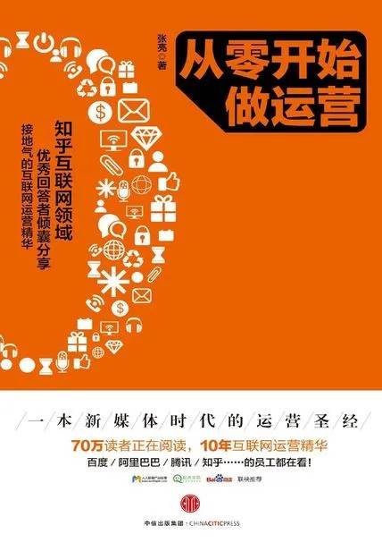

# 《从零开始做运营》

作者： 张亮

## 【文摘】
### 内容运营的核心

友善度系统

### 让内容健康地流转

用户研究

对于内容运营者来说，如果要让内容到达消费者，最重要的就是搞清楚几个问题：
- 内容消费者是谁？
- 他们通常在什么地方活跃？
- 他们的习惯是怎样的？
- 最近他们在关注什么热点？
- 我需要提供什么内容才能让他们注意到我、爱上我？

### 活动设计与成本预算

活动规则的设计准则就一句话：流程简单少思考，文案清晰无歧义 
### 以系统的观念对待活动策划

### 分级管理，用户运营的必备手段

RFM模型是一种工具和手段。R是Recency，最近一次消费；F是Frequency，消费频率；M是Monetary，消费金额。这三个要素，可以简单有效地反馈客户的价值。

### 如何获取种子用户

### 数据分析的方法、误区与数据说谎的手法

UV（Unique Visitors）：独立访客数

PV（Page Views）：页面访问量

RV（Repeat Visitors）：重复访客

TP（Time On Page）：页面停留时间

Traffic Sources：流量来源渠道