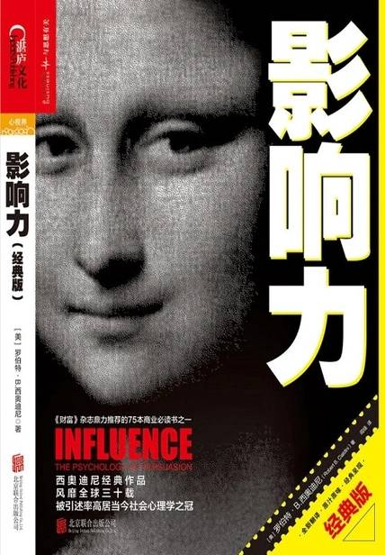

### **《影响力（湛庐经典）》**

作者：[美]罗伯特·西奥迪尼（Robert B. Cialdini） 

## 【文摘】
### 第1章 影响力的武器

固定行为模式

### 第2章 互惠

赠送免费样品

互惠原理适用于强加的恩惠

一个人靠着硬塞给我们一些好处，就能触发我们的亏欠感。

互惠原理可触发不对等交换

亏欠感让人觉得很不舒服

互惠式让步

互惠原理通过两条途径来实现相互让步。头一条很明显：它迫使接受了对方让步的人以同样的方式回应；第二条尽管不那么明显，但更为关键：由于接受了让步的人有回报的义务，人们就乐意率先让步，从而启动有益的交换过程。

### 第3章 承诺和一致

一开始就拒绝，比最后反悔要容易。——达芬奇

显然，一旦作出艰难的选择，人就很乐意相信自己选对了。不光赌马客们是这样，事实上，我们所有人都会一次次地欺骗自己，以便在作出选择之后，坚信自己做得没错。

信仰、言语和行为前后不一的人，会被看成是脑筋混乱、表里不一，甚至精神有毛病的。另一方面，言行高度一致大多跟个性坚强、智力出众挂钩，它是逻辑性、稳定性和诚实感的核心。

首先，和大多数其他自动响应方式一样，它为穿越复杂的现代生活提供了一条捷径。

只要我们对事情拿定了主意，死脑筋地坚持到底就能给我们带来一种分外难得的好处：我们再不用苦苦地思考这件事了。

其次，机械地保持一致还有第二点吸引力，它更容易令人避免误入歧途。

在接受琐碎请求时务必小心谨慎，因为一旦同意了，它就有可能影响我们的自我认知。它不光能提高我们对分量更大的类似请求的顺从度，还能使我们更乐意去做一些跟先前答应的小要求毫不相关的事情

行为是确定一个人自身信仰、价值观和态度的主要信息源

第一，它成了一个行为业已发生的物证

第二，书面自白可以拿给其他人看。

周围的人认为我们什么样，对我们的自我认知起着十分重要的决定作用。

一旦主动作出了承诺，自我形象就要承受来自内外两方面的一致性压力。一方面，是人们内心里有压力要把自我形象调整得与行为一致；另一方面，外部还存在一种更为鬼祟的压力，人们会按照他人对自己的感知来调整形象

每当一个人当众选择了一种立场，他便会产生维持它的动机，因为这样才能显得前后一致。

只有当我们认为外界不存在强大的压力时，我们才会为自己的行为发自内心地负起责任。

强大的威胁也一样：它能叫人当场顺从，但却不大可能带来长期的承诺感。

这些认识对教育孩子具有重要意义。它表明，对于我们希望孩子真心相信的事情，绝不能靠贿赂或威胁让他们去做，贿赂和威胁的压力只会让孩子暂时顺从我们的愿望。倘若我们不光希望他们暂时顺从，还希望他们相信自己做的事情是正确的，就算我们不在现场提供外部压力，他们也会继续照着我们乐于见到的方式去做，那么，我们就得做一些安排，让他们为自己的行为负起责任来。

出于上文探讨过的种种原因，顺从专家们超喜欢能带来内心变化的承诺。一来，内心变化一旦出现，就跟当前的环境不挂钩了，它能涵盖所有相关的环境；二来，变化能发挥持久的作用。

### 第4章 社会认同

社会认同原理。该原理指出，在判断何为正确时，我们会根据别人的意见行事。

一般来说，在我们自己不确定、情况不明或含糊不清、意外性太大的时候，我们最有可能觉得别人的行为是正确的。

“多元无知”

根据拉坦纳和达利的说法，这就是所谓的“多元无知”状态，“每个人都得出判断：既然没人在乎，那就应该没什么问题。与此同时，危险也有可能累积到这样一个程度：某一个体不受看似平静的其他人所影响，采取了行动”。

拉坦纳和达利的推论得出了一个有趣的结果，即对紧急事件的受害者而言，“人越多越安全”的想法有可能完全错误。跟一群人在场比起来，要是当时的旁观者只有一个，说不定急需救助者的生存概率反而更大一些。

多元无知效应似乎在陌生人里显得最为突出：因为我们喜欢在公众面前表现得优雅又成熟，又因为我们不熟悉陌生人的反应，所以，置身一群素不相识的人里面，我们有可能无法流露出关切的表情，也无法正确地解读他人关切的表情。

一般而言，在需要紧急救助的时候，你的最佳策略就是减少不确定性，让周围人注意到你的状况，搞清楚自己的责任。

影响力最强的领导者是那些知道怎样安排群体内部条件、让社会认同原理朝对自己有利方向发挥作用的人。

本章由笑声音轨这个相对无害的做法说起，进而讲到了凶杀和自杀的例子——它们全都可以用社会认同原理来解释

首先，我们似乎持有这样的假设：要是很多人在做相同的事情，他们必然知道一些我们不知道的事情。尤其在我们并不确定的时候，我们很乐意对这种集体智慧投入极大的信任。其次，人群很多时候都是错的，因为群体的成员并不是根据优势信息才采取行动，而只是基于社会认同原理在做反应。

### 第5章 喜好

喜欢你的理由

外表魅力

光环效应指的是，一个人的一个正面特征就能主导其他人看待此人的眼光。

研究表明，我们会自动给长得好看的人添加一些正面特点，比如有才华、善良、诚实和聪明等。而且我们在作出这些判断的时候并没有意识到外表魅力在其中发挥的作用。

其他实验还证明，长相好看的人更容易在需要的时候获得帮助，在改变听众意见时也更具说服力。

相似性

恭维

接触与合作

条件反射和关联

糟糕的消息会让报信人也染上不祥。人总是自然而然地讨厌带来坏消息的人，哪怕报信人跟坏消息一点关系也没有。

我们观看比赛，并不是为了它固有的表现形式或艺术意义，我们是把自我投入了进去

如何拒绝

### 第6章 权威

头衔

衣着

身份标志

### 第7章 稀缺

物以稀为贵

逆反心理

保住既得利益的愿望，是心理逆反理论的核心。

每当有东西获取起来比从前难，我们拥有它的自由受了限制，我们就越发地想要得到它。

我们对信息限制的反应就跟在其他地方一样——认为受禁的信息更有价值。

我们看重受限的信息，一旦认识到这一点，稀缺原理就能被应用到物质商品之外的领域。信息、沟通和知识都适用这条原理。

最佳条件

管教前后不一的父母，最容易教出反叛心强的孩子。