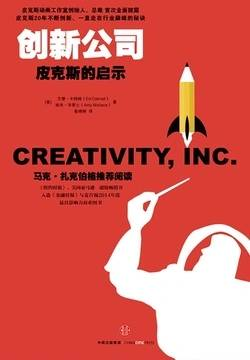

# 《创新公司：尼克斯的启示》

作者：【美】艾德·卡特姆（Ed Catmull） 埃米·华莱士（Amy Wallace）

## 【文摘】
### 第2章 皮克斯的诞生

无须多言，管理者单有智谋是不够的，他们还需要找到愿意为他们的理念埋单的受众，并得到这个群体的支持。这个原则，我铭记于心。

### 第3章 有了目标，才有一切

为了成为一个更好、更高效的管理者，我阅读了大量类似的书籍。我发现，这些书籍给读者的慰藉和保证大多都经不起推敲。这种将事物过于简单化的鼓吹是带有危险性的。书中满是朗朗上口的口号，比如：“敢于失败！”“跟随大众，大众才会跟随你！”“专注，专注，再专注！”（其中最后一句口号算是最受欢迎的一条伪建议。听到这句话，人们总是点头称是，仿佛这是什么至理名言，大家却没有意识到，这句话把他们的注意力从急需处理的问题上移开了：大家专注的重点到底是什么呢？而关于如何寻找专注点和如何专注的问题，却只字未提。

光明面往往会与阴暗面共存，而人们因为怕留下好抱怨的名声，往往不愿去探究阴暗的一面。

### 第4章 锤炼企业的个性

一条法则是“故事为王”。

这其中的寓意值得我们一再回味：组织一支得力的团队是保证点子发光的前提。不可否认，大家都想吸纳有才之人，但是这些人才之间的合作交流方式才是真正的重点。如果搭配不当，即使是最优秀的人才也组建不出一个有力的团队。也就是说，我们需要重视的是团队的协作，而非队员的个人才干。一个优秀的团队是由配合默契的人员组成的，找到配合默契的合适的人才，要比想出高明的点子更加重要。这一原则看似显而易见，但在我看来却一点儿也不简单

对于任何创意事业而言，人员的工作习惯、才华与价值才是我们应该重视的核心，而人才是无可争议的重中之重。

唯有坚信理念并实践理念才有效果。

### 第5章 诚信与坦诚

仅仅敞开心扉接受别人的点子是不够的。集思广益、广开言路，这是一个需要我们主动采取行动的长期积累的过程。作为管理者，你必须学会激发员工们的灵感，还应时常激励他们开动脑筋为公司出谋划策。

### 第6章 恐惧与失败

恐惧与失败恐惧是创意之路上最大的阻碍之一，失败在所难免，恐惧却不然。因此，我们所要做的，就是将失败与恐惧拆分开来，也就是营造出一种企业环境，让员工们不为犯错而担惊受怕。

你在计划上花费的时间越多，你就越容易陷入计划。

就像深陷泥沼中的车轮一样，你计划中不合理的理念也会在你的脑中越嵌越深，以至于在需要摆脱错误理念、换方向的时候，你却寸步难行。

信任是恐惧的解药，人们都希望在这个变化无常的世界找到可以信赖的东西。

### 第7章 饥饿的野兽与丑陋的婴儿

柯博先生说：“从很多方面来说，评论家的工作都是毫不费力的。我们只需冒很小的风险，凭借着高高在上的优越感，就可以对他人的厨艺和风格评头论足。我们总是从我们所写的负面评论文章中赢得荣誉，因为这种东西写起来容易，读起来有趣。然而，有一个我们不得不承认的残酷现实：从大局来看，就连一道最普通的菜肴恐怕都比我们的一纸空谈要有意义得多。可是，当一个评论家发现新生事物并决心美言几句的时候，却着实需要一番勇气。这世界对年轻的天才和新颖的创举往往充满了敌意，他们需要伯乐。”

### 第8章 变化是必然，也是机会

“宁愿与熟悉的魔鬼打交道，也不愿和未知的魔鬼一起冒险”，这句话反映了许多人对生活的态度。

随机自相似性

### 第9章 认清“暗藏势力”

所谓“确认偏见”，是指人们偏向于接受那些对自己的既成理念有着确定作用的信息，而不看这些信息的真假。

### 第11章 未来等你创造

### 后记 我们所知的乔布斯

没有任何人的人生可以与身边的人和事分离开来。