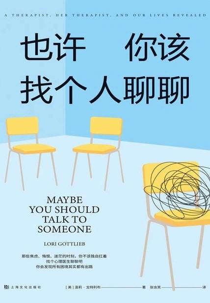

# 《也许你该找个人聊聊》

作者：洛莉·戈特利布

## 【文摘 & 笔记】
### 作者的话

这本书要提出的问题是：“我们如何改变？”答案藏在“与他人的相处中”。

### 序：当痛苦可以被言说

我们期待心理学为人生提供一份万试万灵的解忧良方，我们真正幻想的是，或许我们这一生（至少绝大多数时候），是有办法免除痛苦的。只要足够努力，找准方向，生命的苦痛无常会不会就是可以随时拂去的尘埃？
 
🖊：了解心理学，是在痛苦发生时，如何以不同的方式去应对，而不是陷入痛苦中。

### 引语

瑞士著名心理学家卡尔·荣格说过：“人们会想尽办法，各种荒谬的办法，来避免面对自己的灵魂。”但他还说过：“只有直面灵魂的人，才会觉醒。”

### 第一部分

>没有什么比从痛苦中解脱更令人向往了，也没有什么比丢开依赖更让人害怕了。
>——詹姆斯·鲍德温
>

#### 此刻就是未来

我们总是倾向于认为未来是还没到来的事，但却每天都在自己的脑子里构建未来

### 第二部分

>诚实是比同情更有效的良药，它有抚慰人心的力量，却往往深藏不露。
>——格蕾特尔·埃利希
 
#### 20 第一次忏悔

两百年前，哲学家约翰·沃尔夫冈·冯·歌德已经替我简明扼要地总结了这个观点：“太多父母费尽心思想要让孩子过得轻松点，到头来却让孩子们过得更辛苦了。”而在近现代历史上——准确地说，就是在2003年——诞生了一部有关过度育儿的现代先锋之作，这本书被恰如其分地命名为《操不完的心》。书中叙述道：“优质育儿的基本原则是适度、共情、顺应孩子的秉性——这些简单的原则并不会因为尖端的科学发现而发生改变。”

#### 22 牢笼

“安宁，不是要身处一个没有嘈杂、烦恼和辛劳的地方，而是即使身处繁杂之中依然保持内心的平静。”

#### 23 乔氏超市

“你必须采取行动，愿望才能一项项被划掉，”朱莉说，“不然的话那只是一连串你原本有机会实现的空想。”

### 第三部分

>让黑夜降临我们内心的，也会留下星星。——维克多·雨果

#### 36 渴求的速度

精神分析学家埃里希·弗洛姆在五十多年前就阐述过这样的观点：“现代人总是觉得如果做事不够迅速，就会损失一些时间。但面对省下来的时间又不知该怎么办，只能打发了事。”弗洛姆是对的，人们不会有多出来的时间去休息，或是联系朋友和家人。相反，他们总是试着往时间的缝隙里塞进更多的事情。

#### 41 完满还是绝望

在二十世纪中叶，埃里克森提出了社会心理发展的八个阶段 ：
 

• 婴儿期（希望）——信任/不信任
• 幼儿期（意志）——自主独立/羞怯怀疑
• 学龄前（目的）——主动/内疚
• 学童期（能力）——勤奋/自卑
• 青少年（忠诚）——同一性/角色混乱
• 青年成人（爱）——亲密/孤独
• 中年成人（关怀）——再生力/停滞
• 老年成人（智慧）——自我实现/绝望

他们小时候得不到的东西，现在竭尽全力让自己的孩子们能拥有，但却常常在不知不觉中因为孩子们拥有的幸福而为自己感到愤愤不平。

有时原谅是很微妙的，就像道歉一样。你向别人道歉，究竟是为了让你自己好过一些，还是为了让对方好过一些？你是真的为自己所做的事感到抱歉，还是其实觉得自己做的事完全在理，只不过是想通过道歉安抚那个认为你应该觉得抱歉的人？道歉究竟是为了谁？

### 第四部分

>尽管我们环游世界去发现美，但若不是怀揣着美的念想，我们将一无所获。——拉尔夫·沃尔多·爱默生 

#### 48 心理免疫系统

伊丽莎白·库伯勒·罗丝提出了著名的哀伤“五段论”：否认、愤怒、讨价还价、抑郁、接受。但很多人不知道，这个模型最初描述的是罹患绝症的病人如何接受自己的死亡。一直到几十年之后，这个模型才被应用到更广义的悲伤场景中。

#### 57 星期三的温德尔

《圣经》里有一句话，大致意思是说：“你得先放手去做，然后才能有所领悟。”有时候就是这样，必须放胆一试，从行动中去体验，意义才会最终显现。摒弃自我限制的思维是一件事，让自己做事不那么束手束脚又是另一回事。这是从语言到行动的转化，这个过程赋予了我自由的力量，让我想要把自己的行动从治疗室带到生活中去。

## 【想法】

读起来比较轻松的一本书，好似在看一本小说。

