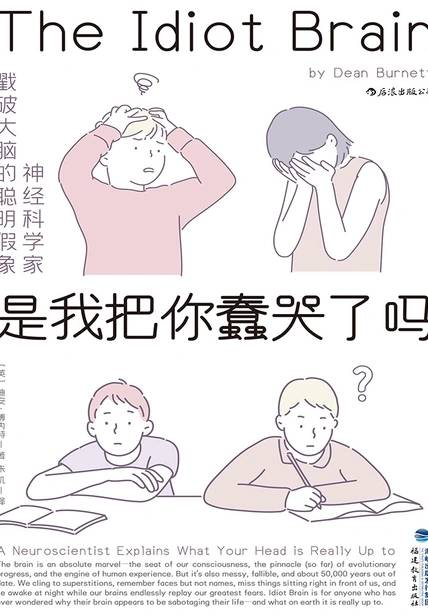

# 《是我把你蠢哭了吗》

作者：迪安·博内特

## 【文摘】
### 第1章 心智操控系统 大脑如何管理身体，又为何常常引起混乱

脊椎中有神经束控制着人体在没有意识参与的情况下运动。这些神经束被称为“模式发生器”，位于脊髓较低位置，属于中枢神经系统的一部分。它们刺激腿部的肌肉和肌腱，使其按特定的模式运动（模式发生器由此得名），于是人就行走了起来。模式发生器还会接收肌肉、肌腱、皮肤和关节的反馈，比方说检测出人是否在下坡，然后据此稍稍调整运动模式，以便更好地适应当时的情况

本体感觉（proprioception）

人的内耳中还有前庭系统，是一组内含液体的管道（这里指的是骨管），用来探测身体的平衡和姿势。

管理睡眠规律的是脑中的腺体——松果体，它分泌褪黑激素使人放松和困倦，并受光照调节。人眼的视网膜检测到光并把信号传给松果体，松果体接收到的信号越多，释放的褪黑激素就越少（但还是会产生少量激素）。

睡眠可以简要地分为四个时期：快速眼动睡眠期（REM）和三个非快速眼动睡眠期（非REM，即1期、2期、3期——神经科学家难得替外行人把事情搞得简单）。

REM睡眠有一个有趣（有时还有点儿可怕）的特征，就是“REM肌肉麻痹”。这是通过运动神经元控制运动的脑功能基本关闭，让躯体无法动弹的现象。

当恐惧感非常强烈时，人会产生幻觉，感受到房间里还有其他人，即所谓的鬼压床。

丘脑连接了大脑皮层处理意识的较高级脑区以及中脑和脑干等更为初级的“爬行脑”部分

除了大脑皮层，感觉信息还会传到另一个专门处理强烈情绪——尤其是恐惧——的脑区：杏仁核。杏仁核的做法十分直白，感觉到有什么东西不太对就直接亮起红灯，反应速度远远快过大脑皮层进行复杂分析所达到的速度。这就是为什么令人惊恐的感觉，比如气球突然爆炸，会瞬间引起人的恐惧反应，之后你才会意识到只是虚惊一场。

随后得到信号的是下丘脑。下丘脑位于丘脑的正下方（名字由此而来），主要负责在体内“让事情运转起来”。

由脑和脊髓组成的部分称为中枢神经系统，是做出重大决策的地方，正因为重要，它们被一层坚固的骨头保护着（也就是头骨和脊柱）。

位于脑和脊髓以外、伸到远处的神经和分叉被称为外周神经系统。

外周神经系统分为两部分。一部分是躯体神经系统，又名随意神经系统，它连接脑和骨骼肌，使机体能够在意识控制下运动；另一部分是自主神经系统，掌管所有不受意识控制、保持机能的过程，主要与内脏器官相连。

自主神经系统也分为两部分：交感神经系统和副交感神经系统。副交感神经系统负责维持身体较为平静的过程，比如饭后的消化，或是管理体内垃圾的排出。

交感神经系统常被称作“战或逃反应系统”，因为身体为了应对威胁所用的各种反应都由它引起。交感神经系统使瞳孔放大，确保有更多的光线进入眼睛，好让我们看清楚危险；它增加心率，同时调动外周和不太重要的器官、系统向肌肉输送血液（包括消化和唾液分泌，所以人在惊恐时会口干），来确保身体有尽可能充足的能量用于逃跑或战斗（于是就感到全身紧绷）。

### 第2章 记忆天赋（保存收据） 人类的记忆系统及其古怪之处

没错，酒精扰乱人的记忆系统。可是在某些非常特殊的环境下，酒精还真的会帮助回忆。这种现象被称为“状态特异性回忆（state-specific recall）”。

我们在前面说过，外界情境可以帮助人们回忆，身处与记忆获得时相同的环境能让人更容易提取记忆。不过还有更棒的，用到内部情境或者说“状态”，因此被称为“状态依存性回忆（state-dependent recall）”。简单地说，像酒精、兴奋剂或其他会改变脑活动的物质会带来特殊的神经活动状态。

情绪上也是如此。假如在心情正糟糕时得知了某事，之后当你又心情糟糕时就更有可能回忆起来。

记忆有很强的可塑性（也就是灵活可变不死板），能以各种方式被改变、抑制或曲解，即所谓的 “记忆偏差”。而记忆偏差往往受到“自我”的驱动。

还有一些记忆偏差也会被认为是自我中心。有一种“支持选择偏误”，是指在必须从几个选项中做出选择时，即使当时的选择并非最佳，人们也会记成自己做出了最佳选择。

有一种“自我生成效应”说的是人更容易回想起自己说过的话，而相对不容易记起别人所说的话。

一个人想要正常运转，拥有一定的自信和自我十分重要，哪怕这种自信是通过操纵记忆人为产生的。

### 第3章 恐惧：没什么好害怕的 大脑千方百计地让我们感到害怕

数据真理妄想（apophenia）

 控制点更大的人还会企图挫败被他们发现的“阴谋”，比如到处宣传发觉了阴谋、“深入”挖掘其中的细节（对来源的可靠性则几乎毫不关心），找一切机会向可能听信他们的人指出阴谋的存在，并宣称拒绝听信的人都是“无知的羔羊”或其他类似的话。迷信往往比较消极被动，迷信的人可能只是固守着迷信并照常过日子。阴谋论者投入的精力则往往要大得多。

广场恐惧症是害怕身处难以逃离或找不到帮助的场所

无巧不成书，恐惧时的紧张激动和糖果带来的满足感很可能依赖的是相同的脑区，即中脑-边缘通路。

皮质醇的分泌主要受下丘脑-垂体-肾上腺皮质轴（HPA轴）控制。

确认偏误（confirmation bias）：人们紧盯自己想要看到的东西，忽略其他不相干的信息。

### 第4章 是不是觉得自己很聪明呢 搞不懂的智力问题

因素分析（factor analysis）

知道的越多，越发现自己的无知。

 此外，聪明的人普遍养成了学习新事物、获取新知识的习惯，因而更有可能认识到自己不是什么都懂，知道在各种领域都还有好多东西需要学习，于是他们在下结论、做声明时就不敢那么信誓旦旦。

#### 小强填字并不能增智健脑　 （增强脑力为什么那么难？）

主动接触更多知识、信息和概念意味着记住的每样东西都会积极增强你的晶态智力，而经常运用液态智力设想如何应对各种局面会让你在事情真正发生时游刃有余。

现在研究者们普遍认为，成年人的液态智力已“定型”，主要取决于遗传因素和抚育阶段的发育因素（包括父母的态度、我们自身所处的社会背景和接受的教育等）。

#### 你在小个子里算是聪明的了　 （为什么高个子更聪明？谈谈智力的遗传率）

### 第5章 看到眼前这一章了吗 大脑观察系统的混乱性能

#### 玫瑰换一个名字……①　 （为什么嗅觉比味觉强大）

这五种感觉指的是：视觉、听觉、味觉、嗅觉和触觉，更通俗的说法就是看、听、尝、闻、摸。

普遍认为味蕾有五种类型，分别感受咸、甜、苦、酸和鲜。最后一种对谷氨酸钠起反应，也就是俗称的“肉味”。实际上味觉的“类型”不止五种，比如说还有涩味（例如蔓越莓）、辛味（姜的味道）、金属味（你能从……金属中尝到 ）。

#### 来呀，摸摸这噪声　 （听觉和触觉竟然有关联？）

声音实际上是空气中的振动传到人耳的鼓室，引起鼓膜振动，接着继续传递到一个充满液体、螺旋形的结构——耳蜗，于是声音就进入了我们的头脑。耳蜗十分精巧灵敏，实际上是一条含有液体的卷曲长管。声音沿着蜗管前进，而耳蜗的精巧布局和声波的物理特性意味着声音的频率（单位是赫兹，Hz）决定了振动可以沿蜗管前进多少距离。耳蜗内分布着柯蒂氏器，与其说是独立的结构，实际上更像一层膜。柯蒂氏器表面是毛细胞，不过毛细胞不是真正的毛，而是感受器

支配耳蜗的是第8对颅神经，即前庭耳蜗神经，它把信息通过耳蜗毛细胞发出的信号传送到大脑颞叶上方负责处理听觉的听皮层。

#### 耶稣显灵在……面包片上？　 （关于视觉你所不知道的）

#### 为什么耳朵会发热　 （注意力的强弱，以及为什么会不由自主地偷听）

### 第6章 人格：棘手的概念 复杂难懂的人格特征

斐瑞斯（E. Jerry Phares）①和查普林（William Chaplin）在他们2009年出版的《人格导论》（Introduction to Personality）一书中就“人格”提出了一个为绝大多数心理学家认同的定义：人格是一个人有别于其他人的特征性想法、感觉和行为的模式，并且具有跨时间和跨情境的一致性。

#### 完全没有个性　 （人格测试的可疑运用）

无数指纹都可以归于三种基本图案（弓型、箕型和斗型），多样化的人类DNA也只是由四种核苷酸（鸟嘌呤、腺嘌呤、胸腺嘧啶、胞嘧啶）的不同排列产生

“大五”人格特质

该理论认为，每个人的人格都会落在大五人格特质各维度的两极之间：

开放性（Openness）反映了你对新体验的开放程度。

责任感（conscientiousness）反映的是一个人在计划、组织和自我规范方面的倾向。

外向性（extroverts）是主动的、活泼的、寻求关注的，而内向性（introverts）是安静的、内敛的、偏爱独处的。

宜人性（agreeableness）反映个人行为和态度多大程度上受社交和谐需求的影响。

神经质（neurotic）的人在受邀去腐烂猪肉雕刻展时会谢绝并详细说明理由。

#### 发火吧　 （人为什么会愤怒，以及愤怒有什么好处）

愤怒究竟是什么？它是一种情绪上和生理上的唤起状态，通常出现在某种界限遭到侵犯时。

大脑左右两个半球都会产生动机和应答，但各司其职：右半球对不愉快的事情产生负面的、逃避的、退缩的反应；而左半球则产生积极的、主动的、靠近的行为。

受到别人威胁时的情绪反应是愤怒；采取某种行动对相关责任人造成伤害则是攻击（aggresssion）；为了达到满意的结果，思考如何对某人造成伤害，就是敌意（hostility），是攻击中的认知成分。

#### 相信自己，你什么都做得到……只要是合理的　 （不同人寻找并运用动机的差别有多大）

弗洛伊德的享乐原则（hedonic principle），有时候也被称为“愉悦原则”，主张活着的生物都要寻找、追求能带来愉悦的东西，避免引起痛苦和不适的东西。

1943年，亚伯拉罕·马斯洛（Abraham Maslow）提出了 “需求层次”，主张有几类事物是所有人类正常生存所必需的，因此产生了获取它们的动机。

马斯洛的需求层次常以金字塔形表示。最底下的一级是生理需求，比如食物、水、空气（少了空气的人无疑会产生强烈的驱动力寻找空气）。接着是安全需求，包括庇护所、个人安全、财产安全，使身体免受伤害的保护等。然后是“归属感”，人作为社会生物需要得到他人的认同、支持和喜爱（或至少是交流）。

再往上是“尊重需求”，不仅要被认可或喜爱，还要真正被他人尊重以及自尊。人们重视和遵守道德，并希望为此受到他人尊重，能实现这一目标的行为表现就成了动机来源。最后还有“自我实现”的需求，指的是发挥出个人潜能的渴望（动机）。

多科学家把外在动机和内在动机区分开来，也就是说，我们的动力究竟来自外界因素还是内在因素呢？外在动机来自他人。

内在动机是我们被自己的决定或欲望驱使着而想要去做什么。

1988年，美国心理学家德西（Deci）和瑞安（Ryan）提出自我决定理论（self-determination theory），描述了不存在任何外在影响、纯粹出于自身的内在动机。该理论主张，人有满足三大需求的动机，分别是自主性（autonomy，即对事物的掌控）、胜任力（competency，即擅长于某些事）和归属感（relatedness，即因为所做的事而受到认可）。

1973年，莱泊尔（Lepper）、格林（Greene）和尼斯比特（Nisbet）提出了“过度理由效应（overjustification effect）”。

大脑的自我倾向可能也是动机的一个因素。1987年，爱德华·希金斯（Edward Tory Higgins）提出自我差距理论（self-discrepancy theory），主张大脑有一系列“自我”。其中，“理想自我”是想要成为的自我，源于一个人的目标、偏见和优先项。

还有“应该自我”，指的是为了达到理想自我而感觉自己理应如何表现。

人格与动机也有关系，一个人的控制源（ locus of control，也叫内外控倾向）在其中起了关键作用。控制源指的是人们感觉事件在多大程度上受自己掌控。

“蔡氏效应（Zeigarnik effect）”：大脑很不喜欢未完成状态。

#### 是为了搞笑吗？　 （幽默的出其不意与不合常理）

心理学实验涉及两种变量：自变量（independent variable）和因变量（dependent variable）。自变量由实验者操纵（比如智力实验中用的智商测试题、记忆分析时用的词汇表等，都由研究人员设计和/或提供）；因变量是实验者根据被试者的反应测量到的数据（比如智商测试的分数、记住的物体数量、哪些脑区被激活等）。

### 第7章 抱团 他人对大脑的影响

关于人的塑造有一个经典的先天或后天之争，或者说是基因还是环境的作用？其实是两者的结合。基因对于我们会是什么样的人无疑举足轻重，但在成长过程中发生在我们身上的所有事情同样影响深远。对于发育中的大脑来说，他人就算不是最主要的也是重要的信息和经验来源之一。别人对我们所说的话、为人处事的方式、所做、所想，以及建议的、创造的、相信的东西，全都对一个还在成型期的大脑有直接影响。最关键的是，人的自我（包括自我价值、自尊、动机、志向等）大部分来自他人对我们的想法和做法。

#### 全都写在脸上　 （为什么掩饰自己的真实想法那么困难）

表情可以是随意的（也就是由大脑运动皮层控制），也可以是不由自主的（由边缘系统的深层区域控制）。

#### 胡萝卜和大棒　 （大脑是怎么让我们控制他人又反过来受控于他人的）

#### 伤痛破碎的脑⑩　 （为什么分手让人崩溃）

#### 人多力量大　 （大脑对成为集体的一分子有何反应）

信息性社会影响（informational social influence），指大脑在解决不确定情况时把他人看作可靠的信息来源（哪怕是错误的）。

“群体极化”，即人们在群体中表达的观点最终比其个人观点更加极端⑭⑮。

#### 我不刻薄，但我的脑子刻薄　 （神经的特性让我们恶劣地对待他人）

### 第8章 当大脑崩溃 心理健康问题是怎么产生的

单胺假说曾一度成为广为接受的一种病因理论。

最知名的抗抑郁药大部分都是靠提高脑中可利用的单胺类神经递质发挥功效的，目前使用最广泛的抗抑郁药是选择性5-羟色胺再摄取抑制药（SSRI）

5-羟色胺是一种单胺类神经递质，涉及焦虑、情绪、睡眠等功能的处理，也被认为有助于调节其他神经递质系统。

但是，单胺假说面临的质疑越来越多。

#### 紧急关停　 （精神崩溃是怎么回事）

创伤后应激障碍（PTSD）

#### 难以摆脱的沉重负担　 （为什么毒品会让大脑成瘾）

#### 被高估的现实　 （幻觉和妄想是因为大脑做了什么？）