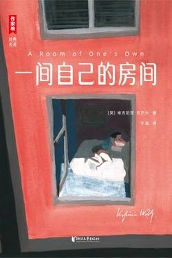

# 《一间自己的房间》

作者：[英]维吉尼亚·伍尔夫

## 【文摘】
### 一间自己的房间

#### 1

女人想要写小说，
她就必须有钱， 
还有一间属于自己的房间。

 无论如何，谁都不能指望在某个备受争议——任何牵涉到性别的问题都是如此——的议题上说出唯一的真相。我们只能如实展现自己何以得到并持有某种观点，且不管那是什么样的观点。对于听众，我们只能给出一种可能性：在了解讲演的种种局限、成见和个人偏好之后，让听众们得出自己的结论。

 就连我左右两边一丛丛不知名的灌木都闪耀着金黄与深红的色彩，宛如在高热的火焰中炽燃。对岸，柳树垂杨低拂，似要哀泣到永远。河水随心所欲地倒映天空、小桥和河畔色泽火亮的树叶，每当有大学生划船而过，倒影碎而复合，完好如初，好像那人从未来过。

#### 2

 我望着人行道上摩肩接踵的行人，心想，生活对于男女两性来说都不容易，一样是艰辛、苦难、无尽的奋斗。那需要我们付出无比的勇气与力量。或许，对于我们这些耽于幻想的人而言，更重要的是要有自信。没有自信，我们就好像摇篮中的婴儿。

 我把找回来的零钱滑进钱包，想起往日的艰苦，不禁想到：一笔固定收入竟能让人的脾性发生这么大的变化，这真是值得说道的事，千真万确。世间没有任何力量可以从我这儿抢走那五百英镑。衣食寓所，永远都是属于我的。消失的不仅仅是辛苦与操劳，还有愤恨与怨怒。我不需要憎恨任何男人，男人伤害不到我。我不需要取悦任何男人，男人什么都给不了我。于是，不知不觉间，我发现自己对另一半人类持有一种新态度了。

#### 3

 总有人会斩钉截铁地对你说——你不能做这件事，你也做不成那件事——而那恰恰是我们该去抗争、去克服的。

#### 4

没人付钱，物事就显得轻薄；有人付钱，同样的物事就有了身价。

强调人类应当满足于平静的生活，无异于徒劳的空话。人应当有所行动，要是找不到机会，那就该自己创造。

我们所说的，是小说家的真诚，是指小说家让人相信：这是真实的。读者会想，没错，我永远想不到事情会是这样，我从没见过有人会那样做；可你让我相信了，那好吧，就让事情这样发生吧。

#### 6

一本书若是不能给人启迪，无论它具有多强的震撼心扉的力量，终究是无法渗透到读者内心深处的。

你只能回溯到莎士比亚，因为莎士比亚是雌雄同体的，济慈、斯特恩、柯珀、兰姆和柯勒律治也是如此。雪莱可能是没有性别的。弥尔顿和本·琼生的男性气质就未免太多了。华兹华斯和托尔斯泰也太多了。在我们这个时代里，普鲁斯特完全可堪雌雄同体，不过，女性气质或许偏多了一点。

任何人，写作时总想着自己的性别，都会犯下毁灭性的错误。纯粹只做男人或女人，也是毁灭性的。必须做男性化的女人，或是女性化的男人。

写下你想要写下的，那才是最要紧的；至于你写的东西会流传百世，还是过眼云烟，无人能定论。

五百英镑的年收入代表了沉思的力量，门上的锁意味着独立思考的能力，但即使这只是一种允许更多阐释的象征笔法，你们仍会说，思想应超脱于这些俗事；还有，大诗人往往穷困潦倒。

我希望你们能用写书或别的方法给自己挣到足够多的钱，去四处旅行，去无所事事，去思索世界的未来或过去，去看书、做梦或是在街头闲逛，让思考的钓线深深地沉到溪流中去。

**首要的是获取经济的能力，有了经济基础，才能自由的去做更多事。**

### 应该怎样读一本书？

## 【想法】

第一部分，以“小说与女性”为题做的演讲。

看介绍说作者是女权运动先驱之一。

