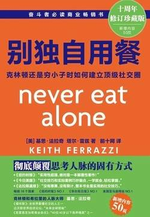

# 《别独自用餐：克林顿还是穷小子时如何建立顶级社交圈》

Never eat alone

作者：基思·法拉奇/塔尔·雷兹

## 【文摘】
### 前言

社会研究告诉我们，满足与人交往的诉求不仅仅是“创造美好生活”的软性条件，也是激发创造力并不断取得进步的硬性条件，而这种关系链终端的要素则是——利益。

### 02慷慨待人

和其他物质资源不同的是，信息是有寿命的，它们可能随时兴起（人们发现信息、传递信息），也可能随时灭亡（信息过时）。要得到急需的最佳信息，要求人与人的完美合作、共同创新、相互沟通，这样才能管理好关系，顺利完成工作。

### 04未雨绸缪

在很多情况下，我们都兢兢业业地做着毫无实际意义的事，我们只在乎自己是不是待在岗位上把这天混过去了。

### 05初生牛犊的天赋

接受失败，把它当作学习的机会，正如萨缪尔·巴克特（SamuelBeckett）所说：“失败，再失败，接着失败的姿态就没那么难看了。”

### 12分享你的激情

分享利益信息是建立任何一座“关系”大楼的基石。

### 17聊天的艺术

乔哈里窗”（JohariWindow）

### 23成为内容之王

随着我们分享和更新信息、照片，我们给自己的网络生活和过去留下了线索。我们现在不仅能讲述正在发生的故事，还可以告诉别人我们到过哪里、分享过什么，以及将来可能发生什么。

### 24创造机遇

研究人员称这种人才聚集地为“十字钉”（Spikes）。

### 25做个有趣的人

如果没有相应的回报，那么创新一点儿价值也没有。工作的底线就是能挣更多的钱。销售和资金流动是每一个公司的血液。在商界，不管你的主意多好，如果没人买单，那它就是毫无价值的。

### 26创建个人品牌

你的内涵由你的专业知识和人性决定。专业和人性决定又称为GVAC，包括包容度、脆弱性、责任心、公正度，是你个人品牌的指路灯，把你所有的努力聚合起来，为一个统一且强大的事业服务。

### 27推广你的个人品牌

### 29建起组织，朋友自会来

“USP”，即独特的销售主张（UniqueSsllingProposition）

你独有的个人筹码是什么？答案可以是你的专业技术、兴趣爱好，甚至是你对某项特定事业的兴趣或热情，这些都可以为你日后建立组织和俱乐部奠定基础。

### 32所谓“平衡”不过是无稽之谈

当我们渐渐感到孤独时，我们就会从心理自助书籍中寻求答案。但我认为，我们需要的不是“自助”，而是“他助”。

### 33欢迎进入社交时代

比之生活是一个追求的过程，生活更像是一个缝制百衲被的过程。我们将自己帮助他人找到人生方向的所有大胆尝试缝制在一起，在这个缝制的过程中，我们找到了生命的意义、爱和幸福。而我们编织起来的人际关系则会拼凑成一个精致永恒的图案。

在一部很好看的电影《恋爱编织梦》（HowtoMakeanAmericanQuilt）里，有一句台词很好地总结了这门人生哲学：“年轻的恋人追求完美，年老的恋人则将碎布缝制在一起，在繁杂的碎布中发现美的存在。”

## 【想法】

一切的起点还是自己处于什么位置，能接触到什么样的人，自己有没有勇气去尝试认识？

