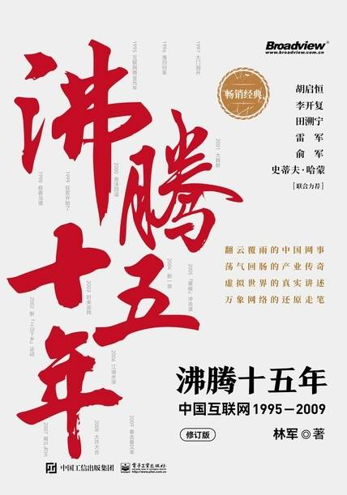

# 《沸腾十五年：中国互联网1995-2009（修订版）》

作者：林军

## 【文摘】
### 李国庆设计让亚马逊买下卓越

将股权增值的一部分分给管理团队做股权激励

老虎基金则将买走的部分股权赠送给当当的管理团队做股权激励，使管理层持股不低于51%。

### 2009 春去春又来

这一年，也是3G之年。2009年1月7日，所有的媒体头条消息都与3G有关：工业和信息化部为中国移动、中国电信和中国联通发放3张第三代移动通信（3G）牌照。其中，批准中国移动增加基于TD-SCDMA技术制式的3G牌照，中国电信增加基于CDMA2000技术制式的3G牌照，中国联通增加基于WCDMA技术制式的3G牌照。TD-SCDMA为我国拥有自主产权的3G技术标准。

### 移动互联网掀起第三浪

当时饭否网的CTO张一鸣则与我们一起分享了Facebook能超越MySpace的关键点，那就是Facebook更早地应用了信息流推送技术，让SNS的信息流转更有效率，使用户交互起来更方便。