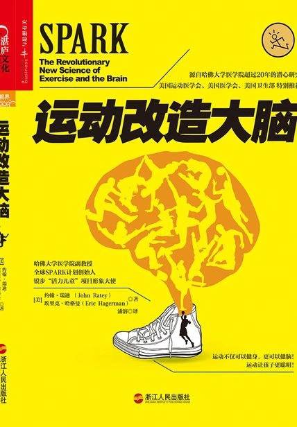

# 《运动改造大脑》

作者：约翰·瑞迪/埃里克·哈格曼

  
## 【文摘】

人类天生就要动

● 内啡肽（endorphine）一种通由身体和大脑产生的激素，它就像是天然的吗啡。当身体和大脑负荷过重时，就会释放出内啡肽阻止疼痛信号。

运动让大脑保持最佳状态

### 引言 不一样的体育课

● 心率（heart rate）心脏每分钟跳动的次数。正常成年人安静时的心率有显著个体差异，平均在75次/分左右（60~100次之间）。心率可因年龄、性别及其它生理情况而不同。

尽全力比跑得快更重要

四肢很发达，头脑不简单

前额叶皮层（Prefrontal cortex）

### 01学习越动越多的脑细胞

要理解大脑如何工作以及运动如何通过提高大脑功能来优化大脑，可塑性（Plasticity）的概念必不可少。

#### 运动平衡大脑

● 神经可塑性（neuroplasticity）由于经验原因引起的大脑的结构改变。大脑有神经元细胞和神经胶质细胞构成，这些细胞互相连接，通过加强或削弱这些连接，大脑的结构可以发生改变。

● 阈值（threshold）又叫临界值，是指刺激生物体时，释放某种反应所需的最小刺激强度。● 突触（synapse）神经元之间，或神经元与细胞、腺体之间通信的特异性接头。● 血清素（serotonin）一种抑制性神经递质，最早于血清中发现，在脑皮层质及神经突触内含量很高。血清素能增强记忆力，保护神经元免受“兴奋神经毒素”的损害。

由于血清素有效地掌控着大脑活动，所以它经常被叫成大脑警察。血清素可控制坏情绪、冲动、愤怒以及攻击行为。

● 脑源性神经营养因子（BDNF）是一种大脑内合成的蛋白质，负责建立和保养神经细胞回路，是“大脑的优质营养肥料”。● 长时程增强效应（longterm potentiation，LTP）给突触前纤维一个短暂的高频刺激后，突触传递效率和强度增加几倍，且效果能保持数小时至几天的现象。

● 突触可塑性（synaptic plasticity）包括突触传递可塑性、突触发育可塑性和突触形态的可塑性，一般如未作特殊说明，即指突触传递可塑性。其主要表现形式有长时程增强效应（LTP）和长时程抑制(LTD)。

#### 运动让神奇的“脑细胞肥料”变多

BDNF为突触提供工具以接受、处理、关联、记住信息，并把它放入相关背景中加以理解。

#### 大脑真的会长大

● 神经新生（neurogenesis）从神经元干细胞、祖细胞中再生神经元的过程。

新生的神经元是完全空白的干细胞（stem cell），要经历一个发育过程才能形成神经细胞。在这个过程中，它们必须找到事情做才能生存下来，但大多数都没有成功。一个新生的细胞要经过28天才能加入到一个神经网络中。

#### 锻炼身体的同时，也在锻炼大脑

BDNF聚集在突触附近的储备库中，随着血液的泵出而被释放出来。

● 胰岛素样生长因子（IIGGFF11）

#### 做出运动选择：兼顾技巧训练和有氧训练

● 最大心率（Maximal Heart Rate, MHR）指进行运动负荷时，随着运动量的增加，耗氧量和心率也增加，在最大负荷强度时，耗氧量和心率不能继续增加心率达到最高水平。在测定心脏最大工作能力和最大耗氧量时，最大心率是一个重要的参考依据。目前最流行的最大心率计算公式为：最大心率= 220 实际年龄。

### 02压力最艰巨的挑战

● 压力接种（Stress inoculation）通过积极应对替代何带来焦虑应对方式，是可以有效帮助患者控制焦虑的过程。

● 杏仁核（amygdala）位于海马体未端，呈杏仁状，是边缘系统的一部分，是产生、识别和调节情绪，控制学习和记忆的脑部组织。

● 促肾上腺皮质激素释放因子（CRF）大脑分泌的一种调节人体面对压力环境时作出生理及行为上的应激反应的分子。

● 皮质醇（Cortisol）主要的长效压力激素，它有助于调动能源、提醒注意和记忆，同时让身体和大脑做好准备对破坏的挑战。

#### 压力让人专注，也会让你上瘾

● 肾上腺（adrenal glands）位于双侧肾脏上方的小型器官，生产和释放肾上腺素来启动应激反应；并在HPA轴信号的控制下，释放皮质醇和皮质醇样激素来增强应激反应。● 肾上腺素（epinephrine）由肾上腺髓质分泌的一种儿茶酚胺激素。在应激状态、心脏神经刺激和低血糖等情况下，释放入血液循环，促进糖原分解，促进脂肪分解，引起心跳加快。

#### 压力促进能量补给，也能拖垮大脑

慢性压力的问题之一是，一旦下丘脑–脑垂体–肾上腺轴大量消耗能量来保持系统的警觉状态，那么大脑的思维功能所需的能量就会被侵占。

生长因子是压力、新陈代谢和记忆之间的一个关键纽带。

#### 运动：阻断大脑压力反馈回路的推手

● 心钠素（atrial natriuretic peptide， ANP）一种由心房合成、贮存和分泌泌的活性多肽，具有强大的利钠、利尿、舒张血管、降低血压和对抗肾素–血管紧张素系统和抗利尿激素作用。

#### 员工爱运动，公司倒不了

压力和久坐不动是现代生活的一对孪生特征，它们会引发关节炎、慢性疲劳综合征、纤维肌痛以及其他自身免疫性疾病。

#### 焦虑：糟糕表现的元凶

焦虑以多种形式表现出来，包括广泛性恐惧症、恐惧症（panic disorder）、特定恐惧症（specific phobias），以及社交恐惧症（social anxiety disorder）。

● 广泛性焦虑症（generalized anxiety disorder）主要临床表现是持续性担忧，其特征是过分和不切合实际的担忧，并出一系列躯体和心境症状。● 社交恐惧症（social anxiety disorder）恐惧症的一种亚型，以过分和不合理地惧怕外界某种客观事物或情境为主要表现。其他两种亚型为广场恐惧和特殊恐惧症。

#### 运动让大脑知道，焦虑是一种认知错误

焦虑就是恐惧，那恐惧又是什么呢？在神经学术语中，恐惧就是对危险的记忆。一旦我们患上某种焦虑症，大脑就不断给我们输出会产生焦虑的记忆，迫使我们生活在恐惧中。

选择性血清素再吸收抑制剂（SSRIs）抗抑郁药物的总称，是治疗抑郁症、焦虑症、强迫症及神经性厌食症的常用药物，以取代较旧及副作用较多的三环素类药物。

蓝斑（locus caeruleus ）亦称青斑核，是位于脑干的一个神经核团。其功能与应激反应有关，参与唤醒与警戒。

β受体阻滞剂（βblocker）β受体阻滞剂主要作用机制是通过抑制肾上腺素受体,减慢心率,减弱心肌收缩力,降低血压,减少心肌耗氧量,防止儿茶酚胺对心脏的损害。

#### 身体真的可以影响心理

中央核（central nucleus）杏仁核核团，接受基底核、外侧核和副基底核的传入，其传出神经广泛分布于大脑的各个部位；它参与情绪反应。

运动是我们应对每天生活中各种焦虑形式的简易方法，它对身体和大脑都十分有效。它是如何发挥作用的呢？

1.分散注意力。

2.缓解肌肉紧张。

3.增加大脑资源。

4.提供不同的结果。

5.变更神经回路。

6.提高恢复能力。

7.让你自由。

### 04抑郁让沉睡的大脑苏醒

  
情绪障碍（mood disorder）

#### 马拉松：内啡肽旋风

● 内啡肽快感（endorphin rush ）类似内啡肽带来的心理上的欣快感，甚至像内啡肽一样，可以减轻身体疼痛。

#### 抑郁症：出现连接麻烦的大脑

习得性无助（learned helplessness rush）美国心理学家马丁 · 塞利格曼1967年提出的一个概念。指一个人长期或反复经历挫折和失败后，面临问题时会产生

#### 挣脱抑郁枷锁：别让大脑留在离线状态

前扣带回（anterior cingulate）位于大脑额叶的内表面，参与人类一系列的行为，包括认知控制、基于强化的学习、疼痛、情绪、动作功能等。

### 05专注力远离分心障碍

● 注意力缺陷多动障碍（ADHD）是一种神经性行为发育障碍，常见于全世界大约3%~7%的19岁以下人群中。该症状多见于青少年时期，其集中表现为注意力不集中、行为多动、记忆力不佳以及自身行为控制较差等。

#### 集体分心倾向：蔓延的全球资讯网

多巴胺也把信号传递到伏核。伏核也叫奖励中枢，那里是利他林（Ritalin）、安非他明（Adderall）和其他一些来自咖啡、巧克力、可卡因等兴奋剂活性成分的最终目的地。奖励中枢必须达到一定的兴奋度才能履行其重要职责：通知前额叶皮层某件事需要关注。奖励中枢保证执行功能按优先顺序处理事情，而这是动机的核心要素。

#### 注意力系统与运动紧紧相连

● 基底核（basal ganglia）是大脑深部一系列神经核团组成的功能整体。它与大脑皮层，丘脑和脑干相连。目前所知其主要功能为自主运动的控制。它同时还参与记忆、情感和奖励学习等高级认知功能。

#### 从瘾君子变成运动家

成瘾（addiction）患者对药物产生了生理上依赖，与习惯的根本区别在于停药后产生戒断症状。还包括生理成瘾与心理成瘾，许多毒品的生理依赖治愈后，心瘾仍无法去除。

#### 用运动戒瘾

“社交阅读障碍”，即他不知道如何与人交谈，或者不知道如何轻松灵活地交谈。

《劲舞革命》（DDR）

#### 跳舞机游戏

有规律的身体运动能让大脑忙碌起来，并重新指示基底核连接到另一个反射替代行为，转而注意毒品以外的事物。

#### 天然的快感

● 戒断反应（withdrawal）突然失去成瘾物质后，自身机体发生的一种自然、本能、依赖的条件反应，又叫“戒断综合征”。● 四氢大麻酚（THC）大麻中的主要精神活性物质，是一种经曲大麻素受体激动剂。

躯体变形障碍（body dysmorphic disorder）躯体变形障碍是指身体外表并不存在缺陷或仅仅是轻微缺陷，而患者想象自己有缺陷，或是将轻微的缺陷夸大，并由此产生心理痛苦的心理病症。

#### 拿回主动权：让大脑开启运动模式

● 自我效能（selfefficacy）人对自己能否成功进行某一成就行为的主观判断，与自我能力感同义。成功经验会增强自我效能，反复失败则会降低自我效能。● 自我节律（selfregulation）内、外环境发生变化时，机体器官、组织、细胞可不依赖于神经和体液调节而产生的适应性反应。

### 07激素对女性大脑健康的影响

经前期综合征（PMS）

#### 经前期综合征：自然的潮起潮落

● 经前期综合征（PMS）妇女在月经周期的后期表现出的一系列生理和情感方面的不适症状，症状与精神和内科疾病无关。

#### 孕期：动？还是不动？

2002年，美国妇产科医师学会（American College of Obstetricians and Gynecologists，ACOG ）开始建议，孕期和更年期女性每天至少进行30分钟中等强度的有氧运动。

压力、焦虑和抑郁对孕期有极为可怕的影响，而且最严重的会导致流产、出生体重低、先天畸形或婴儿死亡。心情不好的孕妇生出来的婴儿更敏感、反应更慢、难以安抚而且有着难以预测的睡眠习惯。

#### 别忘了宝宝：孕期运动是孩子大脑发展的关键

#### 产后抑郁症：突如其来的低潮

产后抑郁症（postpartum depression）产妇在分娩后出现的抑郁障碍。其表现与其他抑郁障碍相同，严重时失去生活自理和照顾婴儿的能力，悲观绝望、自伤自杀。

#### 停经：巨大的改变

最大摄氧量（VO2 max）在人体进行最大强度的运动，当机体出现无力继续支撑接下来的运动时，所能摄入的氧气含量。是反映人体有氧运动能力的重要指标，高水平最大摄氧量是高水平有氧运动能力的基础。

#### 运动可以预防大脑退化

阿尔茨海默病（Alzheimer disease，AD）一种起因隐匿的进行性发展的神经系统退行性疾病。65岁以前发病者，称早老性痴呆；65岁以后发病者称老年痴呆。

细胞凋亡（apoptosis）为维持内环境稳定，由基因控制的细胞自主而有序的死亡。

#### 认知衰退：别让你的心智字典萎缩

对大脑来说，人际交往是一种很重要的刺激形式。孤立和不运动会助长细胞的死亡，并由此导致大脑的萎缩。

#### 情绪的衰退：别让生命热情凋谢

痴呆症（dementia）是一种功能的丧失，它严重破坏了我们日常生活的自理能力。当大脑某个特定区域受损或停止工作时就会发生痴呆症。

中风是由于脑部任一区域的毛细血管塌陷、破裂或阻塞而引起的。

淀粉样蛋白（amyloidβprotein，Aβ）为维由β淀粉样前体蛋白(APP)水解而来，由细胞分泌,在细胞基质沉淀聚积后具有很强的神经毒性作用，Aβ的沉积是阿茨海默氏病患者脑内老年斑周边神经元变性和死亡的主要原因。以交互使用，具有同等意义。

1.运动强健心血管系统功能。

2.运动调节能量。

3.运动可以减肥。

4.运动提高压力阈值。

5.运动改善情绪。

6.增强免疫系统。

7.运动增强骨骼。

8.运动提高动机。

9.运动促进神经可塑性。

#### 闲散的大脑是魔鬼的工坊

#### 饮食：吃得对，吃得轻

我们知道，维生素D的重要性不仅在于增强骨骼，而且还是一种预防癌症和帕金森氏病的手段。我建议大家每天服用1000 IU（国际单位）的维生素D，女性同时再服用1500毫克的钙。我还推荐大家服用至少含800毫克叶酸的维生素B。叶酸能改善记忆和记忆速度。

#### 运动：持之以恒就对了

你应该从四个方面来制订一个整体计划：有氧能力、力量、平衡能力以及柔韧性。

#### 体能越好，大脑越有复原力

根据我的定义，中等强度指的是最大心率的65%~75%的范围内，而高强度则是最大心率的75%~90%。

若你采用的是高强度运动方案，45岁，那么根据一个通用的公式，用220减去你的年龄，理论上就能得出你的最大心率是175。如果计算最大心率的75%~90%，你的高强度运动的下限和上限分别应是131和158。这就是你运动时的目标心率范围。

#### 快跑：强烈运动间隔训练，大幅提升HGH浓度

无氧阈值（anaerobic threshold）二氧化碳呼出量曲线的拐点，有氧阈值出现的时间要早于无氧阈值出现时间。● 人体生长激素（HGH）由脑垂体前叶，含有嗜酸性颗粒的生长激素（GH）分泌细胞分泌，随着年龄的增长而分泌量趋于减少。● 间歇训练法（interval training）对多次练习的间歇时间做出严格规定，使机体处于不完全恢复状态，并反复进行练习的一种训练方法。

#### 迈出第一步，让自己动起来

有氧代谢（aerobic metabolism）一种长时间能量转换的模式，在氧气充足的条件下，机体分解能源：首先分解脂肪和储备的葡萄糖——以此向活跃的肌细胞提供能量。有氧代谢模式发生在低强度到中等强度的运动中，并可以持续相当长的时间。● 无氧代谢（anaeribic metabolism）一种能量转换模式，在供氧不足的情况下，机体把脂肪和葡萄糖转换成可以利用的能源。当身体进行快速而剧烈运动时，参与运动的肌肉所需的新鲜氧气量超过了血液的输氧能力，肌肉分解能源的效率开始降低。