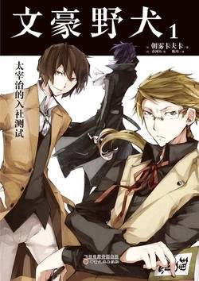

# 《文豪野犬-01-太宰治的入社测试》

作者：朝雾卡夫卡

## 【文摘】
### 序幕  

无论理想再怎么耀眼，如果让它变成现实的道路遥遥无际，那么耀眼就等同于虚假，理想也等同于梦话。

而如此一座腐朽的废弃医院，就更显得诡异了。月光从破碎的窗子射入，照亮了周围，落在瓦砾上的影子发出幽幽的青，沉积在地板上的水洼显出缺血的紫。只有在前院绽放的彼岸花露出刺眼的红。

前后一片黑暗，什么都看不到。误入建筑物缝隙的狂风发出的声音仿佛女人的哭声一般。

抬头仰望天空，太阳已经升得很高了，在一片蔚蓝之下，白色的日光被云朵打碎，落在我们头上。然而我的心里一片阴霾。

### 幕间一

“国木田君，妄想着理想的世界一定存在于某处的人，才会憎恨这个不理想的世界，才会伤害周围的人。‘苍王’就是这样。他贯彻着自己的理想与正道，到头来伤害的却是身边的弱者。”
