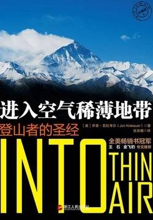

# 《进入空气稀薄地带：登山者的圣经》

作者：乔恩·克拉考尔

## 【文摘 & 笔记】
### 02 至关重要的信任

我走上通往房间的台阶时，经过一张名为“喜马拉雅三部曲”的巨幅四色海报，上面印着珠穆朗玛峰、乔戈里峰和洛子峰，它们分别是地球上的最高、次高和第四高山峰。

1980年霍尔18岁，参加了攀登阿玛达布拉姆峰北坡的探险队。此峰位于珠峰南侧24公里，海拔6812米，风景秀美无比。

### 03 神秘的夏尔巴村庄

我环顾四周，看到了一幅壮美的景致：脚底下600米处，杜德科西河在暗处泛着微光，像一条蜿蜒的银色沙带将周围的岩床切开了一道深深的缝隙；头顶上3000米处，阿玛达布拉姆峰熠熠生辉的巨大峰尖俯视着整个山谷，犹如幽灵一般；而令阿玛达布拉姆峰相形见绌的，是比它还高2000多米的躲在努子峰身后高耸入云的珠穆朗玛雪峰。像通常所看到的景象一样，一缕凝结的水汽像冰冻的烟雾从山顶向水平方向飘动，昭示着喷涌而出的风暴。

  

### 05 最初的考验

孔布冰瀑让人紧张恐惧，但同时也展现了巨大的魅力。当黎明洗尽天空中的黑暗，支离破碎的冰川呈现出一幅三维空间的美幻景色。

  
### 14 决定生死的15分钟

冒险充满了危险，这种危险往往非常隐蔽、难以察觉。它们只是偶尔出现，但却是与人的意志背道而驰的凶兆，这种捉摸不定的东西萦绕在人的脑海和心间挥之不去。而意外具有复杂性抑或是突然性，它们总是带着恶意的目的、无法控制的力量、肆无忌惮的残忍向人们袭来，摧毁人们的希望、恐惧和疲惫时对休息的渴望。这意味着粉碎、摧毁和消灭人们所看到的、所知道的、所热爱的、所享受的甚至是所憎恨的一切，所有无价且必需的东西——阳光、记忆和未来；这意味着用剥夺生命这种简单而可怕的方式将整个宝贵的世界从他的视线中抹去。约瑟夫·康拉德|《吉姆老爷》

【想法】

费希尔允许队员自由活动，结果使得他不得不多次往返护送受伤的队员，导致他自己体力耗损严重，加之疾病，很晚才登顶。 洛桑等4名向导，本应在最前面固定路绳，结果要么睡懒觉出发晚了，要么在拖一个体力孱弱的人前进，结果是大部队在拥挤的地方卡住上不去。 霍尔劝道森登顶？ 台湾队执意要同一天冲顶！ 南非队不愿接电台！