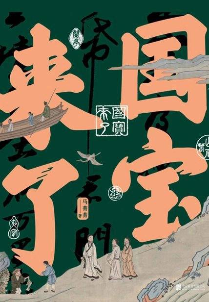

# 《国宝来了》

作者：马菁菁

## 【文摘】
### 序言

一场安史之乱，颜家满门忠烈，血洒战场。这一场祸事令向来以字体骨骼端正著称的颜真卿方寸大乱，当时景，当时情，透过一张薄纸，倾泻而来。

郑板桥话：一枝一叶总关情。其实就是一笔一画总关情。

### 〇一 延绵千年的筵席——兰亭集序

《兰亭集序》唐　冯承素摹纵　24.5厘米横　69.9厘米纸本行书北京故宫博物院  

### 〇二 国宝墨皇——平复帖

《平复帖》西晋　陆机纵　23.7厘米横　20.6厘米牙色麻纸墨迹北京故宫博物院

从《平复帖》右边看起，最显眼的莫过于宋徽宗用瘦金体所题的“晋陆机平复帖”，下钤“双龙小印”，并有“宣和”“政和”二印。这说明宋徽宗主持编纂的《宣和画谱》收藏过《平复帖》，并且“平复帖”这个名字，是由宋徽宗所起；左边还有一行小楷，“原内史吴郡陆机士衡书”。经考证，此处缺了两个字，完整应为“晋平原内史吴郡陆机士衡书”。

### 〇四 书法之神——祭侄文稿

《祭侄文稿》唐　颜真卿纵　28.3厘米横　75.5厘米麻纸本水墨台北故宫博物院  

### 〇五 千年传颂——寒食帖

《寒食帖》北宋　苏轼纵　34厘米横　119.5厘米纸本台北故宫博物院

结来生未了因

### 〇七 女神恒久远——洛神赋图

《洛神赋图》东晋　顾恺之纵　27.1厘米横　572.8厘米绢本设色辽宁省博物馆

### 〇九 万国来朝——职贡图

“疏体画”

### 十 天涯癫狂——高逸图

后世以“传神阿堵”来形容人物画的传神。

### 十二 大宋之光——西园雅集

《西园雅集图》南宋　马远纵　29.3厘米横　302.3厘米绢本设色美国纳尔逊·艾特金斯艺术博物馆  

### 十三 千古一画——瑞鹤图

《宣和画谱》共二十卷，记录魏晋至北宋画家二百三十一人，作品六千三百九十六件，画科分十门：道释、人物、宫室、番族、龙鱼、山水、畜兽、花鸟、蔬果、墨竹，按年代排序，记录每一门的起源与发展、门下画家的生平及作品，可以说是一部魏晋两宋书画史。

### 十四 让自然活起来——写生珍禽图

黄家父子之后，真正在技法和意境上成功突围的是明朝徐渭。他抛弃了“双钩填色”法，转而使用“没骨”法，完全抛开了此时此景，打开了时空大门，让四时花卉同时开放，将具象之物抽象化，再具象到笔下。

### 十五 山水之祖——游春图

《游春图》隋　展子虔纵　43厘米横　80.5厘米绢本设色北京故宫博物院

《游春图》还有了最原始的远景、中景、前景之分，也奠定了中国画平远、深远、高远的“三远”法则。

《宣和画谱》称赞展子虔：“写江山远近之势尤工，故咫尺有千里趣。”

一九四九年，张先生将收藏尽数捐献国家。我们今日所见，都是先生经过战乱贫穷，散尽家财，一生的心血。在张先生眼中，这种结局才是国宝最好的归宿。

### 十七 纪念碑——溪山行旅图

《溪山行旅图》北宋　范宽纵　206.3厘米横　103.3厘米绢本水墨台北故宫博物院

说起李成，读者必须要厘清一个师承关系。李成的老师是关仝，关仝的老师就是中国山水画的祖宗——荆浩。荆浩本是唐末开封的一个小官，官做得一般，但画画极好。他跑去给唐僖宗特赐名字的寺庙“双林院”画壁画，画出了名气。

《匡庐图》五代　荆浩纵　185.8厘米横　106.8厘米绢本水墨台北故宫博物院

《秋山晚翠图》五代　关仝纵　140.5厘米横　57.3厘米绢本水墨台北故宫博物院

《晴峦萧寺图》五代宋初　李成纵　111.4厘米横　56厘米绢本淡设色美国纳尔逊·艾特金斯艺术博物馆

荆浩创作只用墨色，并且升级了山水画技法，创造了皴擦法。

荆浩、关仝、李成、范宽四个人是师承关系，并且都是北方人，所以被后世称为“北派山水”。他们的山水画在布局上有一个很大的特点，就是全景式满山满水，因而《溪山行旅图》才会有这样大的尺幅。

荆浩发明皴擦法之后，每一代画家都有新技法出现，李成是蟹爪皴，范宽是雨点皴。

### 十八 朗朗乾坤天地间——早春图

《早春图》北宋　郭熙纵　158.3厘米横　108.1厘米绢本水墨台北故宫博物院

郭熙画山的技法叫作卷云皴，也是学于李成。米芾称赞李成画作“石如云动”，山石如天空中飘着的云朵一样，是不是很形象？卷云皴最大的特点是每一笔都向内卷起，用中锋或侧锋蘸浓墨，勾勒出山石形状，在转折处使用比较大的角度，呈钝状，显示出山石的粗重质感，又兼有云朵形状，一块块叠加上去，山势高低起伏，既厚重又灵动。

郭熙写了一本在古代非常出名的美学理论作品《林泉高致》，正式将荆浩开创的三远法上升为理论。“山有三远：自山下而仰山颠，谓之高远；自山前而窥山后，谓之深远；自近山而望远山，谓之平远。”

### 十九 自古宋朝出少年——千里江山图

《千里江山图》北宋　王希孟纵　51.5厘米横　1191.5厘米绢本设色北京故宫博物院

中国绘画除了水墨，还有“丹青”——有颜色的画作，水墨丹青也就成了中国画的代称。赭石、石青石绿、朱砂、珍珠白，再加上黑色，以这五色为主创作的画作便统称为青绿山水或金碧山水。皇家喜用金碧青绿，文人隐士爱用黑白水墨。隐士朴素，用黑白也好理解。问题是，皇家为什么一定要用这五种颜色？

石绿为青，朱砂为红，赭石为黄，珍珠白为白，再加上黑，青红黄白黑五色对应的正好是木火土金水五行。

### 二十 复兴之路——水村图

《水村图》元　赵孟頫纵　24.9厘米横　120.5厘米纸本水墨北京故宫博物院

《秀石疏林图》元　赵孟頫纵　27.5厘米横　62.8厘米纸本水墨北京故宫博物院

赵孟頫以书法笔力入画，多使用渴笔浓墨，在画面中造成“飞白”效果。

赵孟頫画中山石的画法源自董源的披麻皴。

“书画同源”只是文人画的一部分，一幅画是不是文人画，需要看它是否满足四个元素——诗、书、画、印。

### 二一 画中之兰亭——富春山居图

《富春山居图》（无用师卷）元　黄公望纵　33厘米横　636.9厘米纸本水墨台北故宫博物院

《富春山居图》（剩山图卷）元　黄公望纵　31.8厘米横　51.4厘米纸本水墨浙江省博物馆

《渔父图》元　吴镇纵　84.7厘米横　29.7厘米绢本水墨北京故宫博物院

### 番外 其一 故宫与《石渠宝笈》