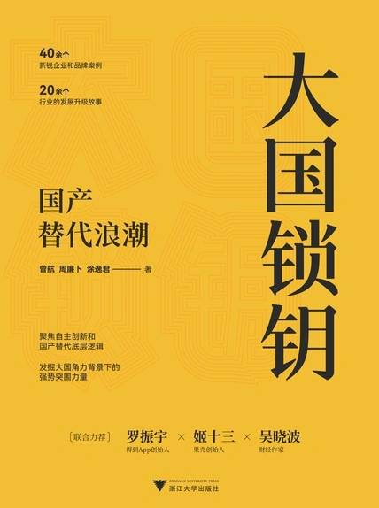

# 《大国锁钥：国产替代浪潮》

作者：曾航/周廉卜/涂逸君 

## 【文摘】
### 第四章 基础科研、教育与国产替代

《制造业人才发展规划指南》

### 第五章 半导体产业的国产替代

常规来看，诸如台积电、中芯国际这样的大型晶圆厂往往会划分7个彼此独立的车间来完成芯片制造的不同工序。由于工序不同，每个车间所需要的设备自然也完全不同。这7个车间分别是：热处理(thermal process)，光刻(photolithography)、刻蚀(etch)、离子注入(ion implant)、薄膜生长(dielectric deposition)、抛光(CMP)、金属化(metalization)。

### 第六章 中国正在新能源汽车领域实现超越

2015年，工信部推出了动力电池企业“白名单”，日韩企业被拦在了名单外。这就意味着，中国车企如果想用日韩企业的电池，就不能享受国家的补贴，采购成本暴增。

IGBT芯片（insulated gate bipolar transistor，绝缘栅双极型晶体管）

### 第七章 中国光伏：靠“补贴”砸出来一个“世界第一”

“公地悲剧”

也称“公共资源悲剧”

### 第九章 中国心脏支架行业的国产替代

心脏支架迄今为止一共经历过4次变革：1977—1986年，中继球囊扩张(PTCA)时代；1986—2001年，裸金属支架(BMS)时代；2001—2011年，药物洗脱支架(DES)时代；2011年以后，雅培创造了生物可降解支架(BRS)，但目前仍然不是市场主流。

DRGs(diagnosis related groups)中文翻译为（疾病）诊断相关分组

### 第十章 沈飞引进苏-27生产线的案例

歼-11填补了国产重型歼击机的空白，歼-15填补了舰载战斗机的空白，歼-16则成为我军实现“攻防兼备”战略转型的核心武器。

而到80年代后期，歼-7的产量逐步上来了，但歼-6依然是空军的主力飞机。而当时的美国和苏联，部队已经普遍装备了第三代战斗机F-15和F-16、米格-29和苏-27，这与我们的大国地位形成了强烈的代差感。

1995年12月，时任中央军委副主席的刘华清再次率团访俄。中方坚持要俄方转让生产技术，同时，中方还与俄罗斯签署了第二批24架苏-27采购合同，原则同意完全以美元购买。最终，双方基本达成苏-27生产技术转让的共同精神。1996年4月和7月，第二批共24架苏-27SK抵达中国广东某基地。同年12月，俄副总理波雷纳科夫访华，与中方正式签下引进苏-27生产线的协议。 

### 第十二章 中国的“大飞机”：从未“下马”的大飞机运-10

如果要评价运-10，用周总理的这句诗便可以概括：“面壁十年图破壁，难酬蹈海亦英雄！”

#### 扩展阅读

古人云“国之大事，在祀与戎”，国防和军事从来都是一个国家最重要的事情之一。

### 第二十四章 中国游戏为什么能在海外“割韭菜”

1994年4月20日，中科院以及北大、清华率先通过一条64K的国际专线，接入了国际互联网。这是中国第一次进入互联网，这一年被称为中国互联网元年。

### 第二十五章 “中国制造”的短板——工业软件

CAD、CAE就是工业软件家族里颇为典型的两类软件，而工业软件是一个庞大而繁杂的体系。根据其所在的环节划分，大致可以分为四类。第一类，研发设计，包括计算机辅助设计(CAD)、计算机辅助工程、计算机辅助工艺规划(CAPP)、产品数据管理(PDM)、产品生命周期管理(PLM)、电子设计自动化(EDA)等。第二类，生产制造，包括可编程序逻辑控制器(PLC)、分布式数控(DNC)、集散式控制系统(DCS)、数据采集与监控系统(SCADA)、高级计划与排程(APS)、环境管理体系(EMS)、制造执行系统(MES)等。第三类，运维服务类，包括应用性能管理(APM)、维护维修运行(MRO)管理、故障预测与健康管理(PHM)等。第四类，经营管理类，包括企业资源计划(ERP)、项目管理(PM)、供应链管理(SCM)、客户关系管理(CRM)、人力资源管理(HRM)、企业资产管理(EAM)、知识管理(KM)等。

#### 扩展阅读

《浪潮之巅》

中央电视台2014年出品的10集大型电视纪录片《互联网时代》也很值得一看

《沸腾十五年：中国互联网1995—2009》和其续作《沸腾新十年：移动互联网丛林里的勇敢穿越者》

《大数据时代》

关于阿里巴巴的图书很多，这边我们推荐阿里前高管语嫣写的《生长》一书，这是一本为阿里巴巴“正本清源”的书  

### 第二十七章 今天，我们还在为“三鹿”还债

今天的婴幼儿奶粉基本上都是“配方奶粉”。而配方奶粉的黄金标准则是天然母乳。对婴儿来说，牛奶的营养是完全不够的，母乳中含有对婴儿发育至关重要的DHA、乳铁蛋白、核苷酸、牛磺酸等物质。所以简单来说，所有奶粉厂商的任务就是利用现代科技，设计各种配方，还原一个不论是营养成分还是口感都无限接近于母乳的产品。