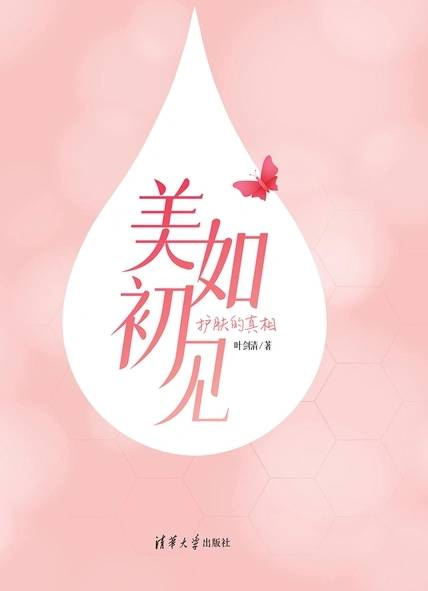

# 《美如初见：护肤的真相》

作者：叶剑清

## 【文摘】
### 1 成分党小秘诀

临床上还有一种Fitzpatrick皮肤分型方法，就是根据皮肤对日光照射后的反应和特点，分为6型（I~VI型），各类型特点如图1.2所示。

在选择防晒产品的时候，不要光看SPF，因为它只是衡量防晒产品防晒红、晒伤的性能标准。欧美白种人容易晒红、晒伤，他们高度关注SPF是无可厚非的，但是我们黄种人除了关注SPF之外，还要关注防晒黑的指标，也就是PA。

前者如油性皮肤优先选择氧化锌+酒精配方的防晒乳霜，后者如出门时提前涂抹防晒乳霜，用量一定要足，如果出汗造成流失还要定期补涂。

### 2 防腐

防腐剂的负面作用主要有两方面：一方面是会刺激皮肤，例如红肿、刺痛；另一方面是会扰乱皮肤的菌落平衡。

由于酯的碳链越长，油溶性越好，在体内积累的可能性就越大，所以尤其要尽量避开羟苯丙酯和羟苯丁酯。

总结：尼泊金酯总体安全，假如担心它影响激素的分泌，最好的办法是控制护肤品的使用，夏天留在脸上的产品不超过3种，冬天不超过4种。

常用的有机酸防腐剂包括苯甲酸和山梨酸，它们要在酸性条件下才能发挥抗菌防腐作用。

苯甲酸最早是从安息香树脂中获得，所以俗称安息香酸。

国家规定苯氧乙醇的允许用量不得超过1%，它在高浓度下会产生发热感和轻微的刺痛感，一般添加量是在0.4%左右。由于它很常用，所以可以用它来作为化妆品成分浓度高低的判断参考点。

化妆品中使用的一个含碘的防腐剂叫作碘代丙炔基氨基甲酸丁酯，英文缩写为IPBC，是目前最有效的防霉剂。

碘代丙炔基氨基甲酸丁酯是目前最有效的防霉剂，但可能会导致碘过量

除了香水之外，各种不含水的固体产品，例如爽身粉、洁颜粉或者粉状面膜也不需要防腐剂。

不添加防腐剂的第二种情况是加了防腐剂，但是不告诉你，它往往是在生产环节之外的其他环节添加进去的。

不添加防腐剂的第三种情况是用一些不叫防腐剂的防腐替代成分，来起到防腐的作用。

常用的防腐替代成分包括二元醇、对羟基苯乙酮、辛酰羟肟酸、脂肪酸甘油单酯、EDTA、氧化锌，以及某些天然植物提取物、发酵产物或者酶体系等。

### 3 清洁

表面活性剂在化妆品中最重要的是清洁作用和乳化作用。脸上的油用水洗是很难洗干净的；但是加了表面活性剂之后，油就能够被水带走了，这就是表面活性剂的清洁作用。

加入表面活性剂就能够使水和油稳定共存，形成乳或者霜，此时的表面活性剂又称为乳化剂。

表面活性剂分为4种，分别是带正电的阳离子型表面活性剂、带负电的阴离子型表面活性剂、既带正电又带负电的两性离子型表面活性剂、不带电的非离子型表面活性剂。

皂基洁面产品便宜好用，目前还是市场上的主流，但是要科学使用，它适合健康的油性皮肤夏季晚间使用；春、秋、冬季可以用于周护理，一周用一次足矣。中性皮肤、干性皮肤少用慎用；敏感性皮肤最好敬而远之。

怎样判断一个洗面奶是不是皂基配方呢？下面给出两条判断规则。规则一：如果成分表有氢氧化钾，就有80%的把握说这是一个皂基配方。规则二：如果氢氧化钾排在成分表的前7位，就有99%的把握说这是一个皂基配方。

硫酸酯盐有两个典型的代表：一个是月桂醇硫酸酯钠，缩写是SLS；另一个是月桂醇聚醚硫酸酯钠，缩写是SLES。

氨基酸洁面产品是以酰基氨基酸盐为主要表面活性剂的产品。

酰基氨基酸盐清洁力好，刺激性小，对于多数人来说是最稳妥、最不出错的选择。这样的产品必须含有酰基氨基酸盐，并且不能是皂基配方或者硫酸酯盐配方。

两性离子表面活性剂的特点是亲水基团既带正电荷又带负电荷，常用两性咪唑啉和甜菜碱。这两类成分的清洁力很弱，刺激性很低，可以单独用在敏感肌或者婴幼儿产品中；也可以和其他表面活性剂复配，帮助清洁和产生泡沫，以降低刺激。

椰油基甜菜碱配合椰油酰甘氨酸钠清洁，对于不化妆的中性和干性皮肤来说一年四季都足够用了。

非离子型表面活性剂的亲水基团不带电荷，最典型的是烷基糖苷，也称烷基葡糖苷，英文缩写是APG。

甜菜碱、烷基糖苷和月桂醇聚醚硫酸酯钠表面活性剂都有“假滑”的现象，就是用了之后感觉滑滑的，好像没洗干净一样，用水都很难彻底冲洗掉，感觉不如皂基清爽，这种假滑的肤感有时候会影响我们对产品的喜好和选择。

总结：磺基琥珀酸酯盐用作起泡剂，甜菜碱和烷基糖苷用于刺激性很低的洁面产品。

1．皂基

2．硫酸酯盐

3．聚醚硫酸酯盐

4．酰基氨基酸盐

5．磺基琥珀酸酯盐

6．甜菜碱

7．烷基糖苷

如果洗面奶添加果酸或者水杨酸，可以加快角质层代谢，疏通毛孔，起到温和祛痘的效果；这些成分的效果已经在临床上得到验证了，是有科学根据的。

### 5 保湿

常用的亲水性成分有甘油、丙二醇、丁二醇、山梨糖醇、双丙甘醇、乳酸／乳酸钠、吡咯烷酮羧酸钠、尿素、尿囊素、海藻糖、透明质酸（钠）、泛醇、聚乙二醇、氨基酸、葡聚糖、各类水解产物（如水解大豆蛋白）等。疏水性成分根据来源可以分为动物油、植物油和矿物油，从外观大致可以分为油（液态）、脂（半固态）和蜡（固态）。

甘油又称丙三醇，是最常用的保湿原料之一，排在第二位的时候可以将它的用量预估为5%。

总结：丙二醇、丁二醇、双丙甘醇是常用的二元醇保湿剂，配方特点与甘油类似。

玻尿酸也叫透明质酸，是皮肤自身就有的成分，分子结构很特殊。亲水性非常强。商品化的透明质酸一般为钠盐，即透明质酸钠，人们习惯上仍称其为透明质酸。

添加量一般在0.1%以下

透明质酸分子量大，很难进入皮肤深层。外用涂抹后可以在皮肤表层形成一层膜，使皮肤显得紧致有光泽，就像剥了壳的鸡蛋里面那层膜一样。但这只是暂时的效果，一洗脸就打回原形了。

如果真正想要用透明质酸改善皱纹，最有效的办法还是去正规医院注射。

总结：透明质酸是很好的吸湿成分，在保湿护肤品中应用广泛。它的添加量一般在0.1%以下，可以作为判断成分浓度的参考点。

总结：天然保湿因子是一组水溶性小分子物质，成分安全，价格便宜，在护肤品中很常用。

总结：补水是一个营销概念，不是科学概念。如果用了补水产品后还觉得皮肤很干，说明水分流失了，需要用滋润的乳霜加强保湿。

以干皮为例，有些人的足部在冬季会出现皲裂的现象（图5.1），可以将脚部清洁后在皲裂部位涂一层凡士林，再套上一个保鲜袋，穿上棉袜，第二天就可以体会到皮肤宛若新生的感觉啦！

总结：凡士林是矿脂的俗称，有很好的修护作用；也可以指一个品牌或者某个产品。极干燥或极不稳定的皮肤可以选择医用凡士林或者成分单一的修护晶冻。

无论是面部还是眼唇的卸妆产品，用后最好都用洗面奶进行二次清洁，防止残留。

总结：高纯度的矿物油很安全，虽然会引起某些人长粉刺。想要避免粉刺，就要学会正确选择和使用产品，特别是保湿和卸妆产品。

总结：外用橄榄油和油酸含量高的植物油可能会损伤皮肤屏障功能，引起红斑，甚至导致出现粉刺。

油酸有引起粉刺的顾虑，而亚油酸有助于预防粉刺和黑头，在发用产品中可以补充毛囊营养，促进生发。

总结：亚油酸和亚麻酸都有很好的护肤作用，特别是修复和改善皮肤屏障功能。

总结：牛油果树果脂的保湿效果好，不皂化物含量高，可以用作保湿和抗衰老成分。由于熔点高，在乳霜类护肤品中的添加量要适当。

想要改善黑头，就要恢复毛孔的通畅。办法有很多，例如可以通过外力强行将油脂粒挤出来；也可以通过化学上“相似相溶”的原理，以油溶油，溶解油脂粒。有些人用了一阵子卸妆油后，发现黑头有改善，原因就在这里。

总结：霍霍巴油是一种液态蜡酯，有一般液态油脂的特点和功能。它的油酸含量很低，油性皮肤可以用纯霍霍巴油改善黑头以及卸妆，没有诱发粉刺之虞。

总结：辛酸／癸酸甘油三酯肤感滋润不油腻，可用于修复角质层；甘油三（乙基己酸）酯可用于防晒产品；甘油单酯有防腐的作用。

总结：肉豆蔻酸异丙酯和棕榈酸异丙酯是很常用的润肤剂，能降低油腻感，帮助渗透吸收，但有致痘的风险。

痤疮患者皮脂中角鲨烯含量显著高于正常皮肤，而黄褐斑患者的皮脂中角鲨烯含量则远远低于正常皮肤。

总结：角鲨烯是人体皮脂的成分之一，可以预防皮肤衰老，也会导致炎症和痘痘，所以最好还是用于不容易长痘的肤质。

角鲨烷是良好的润肤剂，渗透力极佳，有助于恢复皮肤的柔嫩触感，常用于高档的乳霜，可以作为高品质产品的判断方法，如果在成分表中排名比较靠前的话，这样的产品肯定不会差。

总结：角鲨烷是良好的润肤剂，渗透力极佳，有助于恢复皮肤的柔嫩触感，常用于高档的乳霜。

所谓PEG化合物，简单理解就是和环氧乙烷发生加成反应，结果就是产物从疏水变成亲水，PEG后面的数字越大，表示加上去的环氧乙烷越多，产物的亲水性就越强（但是潜在的刺激性可能就越高）。

总结：PEG化合物可以增溶，增加化妆水的仪式感，常用的是PEG-40氢化蓖麻油和PEG-60氢化蓖麻油，一般用量为0.5%左右。

总结：矿油、矿脂的保湿力最强，水溶性成分的保湿力最弱，普通的油、脂、酯、蜡成分位于中间。

### 6 防晒

UVA（ultraviolet A）是长波紫外线，波长范围320~400nm，又称晒黑段紫外线，穿透力很强，能深入到基底层，加快黑色素的生成。还能到真皮层，使胶原纤维断裂，失去弹性。

UVB（ultraviolet B）是中波紫外线，波长范围280~320nm，又称晒红段紫外线，主要引起红斑和晒伤。

UVC（ultraviolet C）是短波紫外线，波长范围200~280nm，又称杀菌段紫外线，伤害性最强，但一般都会被臭氧层吸收，不会产生明显危害。

紫外线指数通常用0~15表示，分为5个等级（图6.2）。图6.2强度值的含义为：1~2是低风险，3~5是中等风险，6~7是高风险，8~10是极高风险，10以上是极端风险。不同等级对应的防护措施不一样（表6.1）。

表6.1　不同等级对应的防护措施

根据《化妆品安全技术规范》（2015年版）的规定，SPF的定义为使用防晒化妆品防护皮肤的最小红斑量与未防护皮肤的最小红斑量之比。最小红斑量是引起皮肤出现红斑所需要的紫外线照射最低剂量，单位为J/㎡。强度相同的时候，剂量和时间成正比，所以剂量的单位也可以是s。参考SPF的定义，规定式中：MED1——涂抹防晒产品的皮肤白天接受太阳照射的紫外线剂量；MED2——未涂抹防晒产品的皮肤白天接受太阳照射的紫外线剂量。

总结：防晒产品的用量和SPF同样重要，优先选择清爽舒服的防晒产品保证用量，然后选择SPF适当高的产品。

总结：要达到满意的防晒效果，防晒产品用量一定要足够多，消耗速度一定要足够快。一瓶50mL或50g的防晒乳霜70天左右要用完。

首先看两者针对的对象，SPF针对的是UVB，是衡量防晒产品防晒红、晒伤的能力；PA针对的是UVA，是衡量防晒产品防晒黑、晒老化的能力。

总结：黄种人既会晒红、晒伤，也会晒黑。要关注SPF，更要关注PA，尽量避免晒黑和光老化的现象。

总结：防晒剂是防晒产品最核心的功能原料，可以分为物理防晒剂、化学防晒剂两大类。目前市场主流是将两者结合在一起使用，优势互补。

总结：氧化锌的UVA防护性能优异，不会光降解，可以抑菌吸油，特别适合追求稳定的UVA防护。

总结：二氧化钛主要用于防护UVB，遮瑕力很好，在遮瑕产品中也很常用。

总结：甲氧基肉桂酸乙基己酯的UVB防护性能优异，配伍性能卓越，安全性总体良好，价格便宜，是目前使用频率最高的防晒剂。

总结：丁基甲氧基二苯甲酰基甲烷是一个高效的UVA吸收剂，但是不稳定，配伍性也不好。

下面把比较重要的化学防晒剂（尤其是防UVA的成分）名称汇集以供参考。

1．丁基甲氧基二苯甲酰基甲烷缩写：BMDM或者BMDBM俗名：Avobenzone、阿伏苯宗商品名：Parsol 1789INCI名称：butyl methoxydibenzoylmeth

2．甲氧基肉桂酸乙基己酯缩写：EHMC俗名：OMC、Octinoxate商品名：Uvinul MC80、Parsol MCX、Escalol 557INCI名称：ethylhexyl methoxycinnamate

3．亚甲基双-苯并三唑基四甲基丁基酚缩写：MBBT商品名：Tinosorb M、天来施MINCI名称：methylene bis-benzotriazolyl tetramethylbutylphenol

4．双-乙基己氧苯酚甲氧苯基三嗪缩写：BEMT商品名：Tinosorb S、天来施SINCI名称：bis-ethylhexyloxyphenol methoxyphenyl triazine

5．二乙氨基羟苯甲酰基苯甲酸己酯缩写：DHHB商品名：Uvinul A PlusINCI名称：diethylamino hydroxybenzoyl hexyl benzoate

总结：化学防晒剂的名称非常复杂，同一个防晒剂有多个名称，可以重点关注防UVA的成分。

在有选择的情况下，应尽量避免使用二苯酮-3。

物理防晒剂不建议用于防晒喷雾中

总结：避免使用含有二苯酮-3和PABA类防晒剂成分的产品，尽量选择安全、温和、稳定性较好的防晒成分。

图6.5　光的互补色

总结：夏天用防晒后出现皮肤或衣服发黄的现象，往往和防晒剂有关系，解决办法是避开这些成分或者不让浅色衣服接触到防晒产品。

总结：美国防晒产品以丁基甲氧基二苯甲酰基甲烷为核心，性价比高。日本防晒产品以氧化锌搭配甲氧基肉桂酸乙基己酯为核心，肤感清爽，适合油性皮肤。欧洲防晒产品总体上肤感滋润，适合干性皮肤。

先说稳定性的问题，如果配方中没有丁基甲氧基二苯甲酰基甲烷这个成分，就不需要补擦；如果有，尽量隔2小时补擦一次，以保证防晒效果。再说防流失的问题，如果配方是油包水的结构，或添加了成膜剂而有防流失的效果，那么不一定需要补擦。

洗面奶的清洁力要看表面活性剂，以氢氧化钾为主的皂基配方清洁力最强；其次是月桂醇硫酸酯钠和月桂醇聚醚硫酸酯钠，清洁力也很强；接下来是酰基氨基酸盐，清洁力中等，不温不火；最弱的是甜菜碱和烷基糖苷，单独使用很难彻底洗掉防晒产品。

将防水的防晒乳霜涂在手上，然后将水淋上去，由于表面张力的差异，水在皮肤上形成的是一颗颗水珠（图4.1）。用洗面奶清洁防晒乳霜之后，再将水淋上去，如果形成的是一颗颗水珠，说明洗面奶没有把防晒乳霜洗干净，要换成更加强力的清洁或者卸妆产品；如果没有出现大量水珠（可以有少量），那就说明洗干净了。

其实搓泥和缺水、去角质都没有关系，搓泥主要是因为无机粉料（二氧化钛、氧化锌）和高分子化合物发生反应。

最容易搓泥的高分子化合物是卡波姆，这是一种非常有用的原料，很多凝胶类质地的产品里面都有它的身影。当它遇到二氧化钛、氧化锌这些无机颗粒的时候，就容易搓出“泥”了。

（3）看防晒剂成分，这是重中之重，以下成分特别值得关注。防UVA成分：氧化锌、二乙氨基羟苯甲酰基苯甲酸己酯、双-乙基己氧苯酚甲氧苯基三嗪、亚甲基双-苯并三唑基四甲基丁基酚。防UVB成分：甲氧基肉桂酸乙基己酯、二氧化钛、胡莫柳酯、奥克立林、水杨酸乙基己酯。

3．分析防晒产品的肤感

  
6.27　防晒ABC

### 8 祛痘

维A酸类药物不是单独一个，而是一大类药物，包括第一代的全反式维A酸和异维A酸，以及第三代的阿达帕林和他扎罗汀。综合考虑，阿达帕林最值得推荐

阿达帕林是治疗轻度和中度痤疮的最佳选择。

以上外用的维A酸类药物祛痘效果都差不多，无论是哪种药物，都要坚持使用（至少3个月）。实在没有效果时，再考虑更换治疗方案。

帕林治疗效果好，刺激性低，性质稳定，质地清爽，用着舒服，是治疗轻度和中度痤疮的最佳选择。

总结：外用维A酸类药物容易导致脱皮、发红、刺痛，降低刺激的秘诀在于“短小低少”，即接触时间短、面积小、浓度低、次数少。

总结：外用维A酸类药物的前几周有可能出现痘痘增加的现象，这是正常的现象，也是药物发挥作用的表现；维A酸和克林霉素共用有助于减少爆痘。

果酸是指从水果中提取的小分子有机酸，也叫羟基羧酸，简称AHA。最常见的果酸有甘醇酸、苹果酸、柠檬酸和乳酸。

如果不确定自己能不能耐受果酸的刺激，可以将超市的乳酸酸奶敷在脸上，看看会不会产生刺激，因为乳酸也是果酸的一种。

总结：果酸可以疏通毛孔，改善堵塞，帮助皮脂排出，对黑头和闭口粉刺有明显的效果。刚开始使用果酸的时候最好是选择洁面类产品，相对安全有效。

相比之下，霍霍巴油的油酸含量很低，大约只有1.4%，适合油性皮肤用来卸妆以及改善黑头。

总结：黑头是皮脂和角质混合后，堵塞于毛孔中的顽固的油脂栓，可以通过“以油溶油+刷酸”的方式来改善。去黑头要注意不伤害皮肤，目前没有能够根治黑头的方法和措施。

宋奉宜医生使用的是安全的r-PGA（聚麸氨酸）这种水溶性凝胶。

维生素B5保湿液

总结：白头除了常规的处理方法之外，还可以考虑用含水量高、安全性高的产品，将足量水分闷进毛孔里面去，将粉刺泡软泡滑后推出来。

总结：颌下反复长痘痘往往提示有免疫系统的问题；额头长痘的最主要原因是睡眠不足；脸颊长痘要从饮食和化妆两方面来分析。

由于毛孔的成因很复杂，所以最简单的改善办法就是医疗美容，激光或者黄金微针以及强脉冲光之类的医美手段都可以考虑。医美能够同时改善导致毛孔粗大的多个因素，效果确切，具体选哪一种医美手段需要和医生多沟通。

宣称可以改善毛孔粗大现象的成分有很多，抛开那些玄学一般的植物提取物和多肽不谈，目前改善作用比较明确的主要有两个：一个是水杨酸，一个是双甘氨肽。

总结：毛孔粗大的原因很复杂，最简单的改善办法是医疗美容；外用药物或者护肤品有辅助作用，特别是水杨酸。

总结：自慰属正常生理现象，目前没有科学证据证明自慰和痤疮之间有因果关系，所以不需要焦虑或自责，以平常心待之即可。