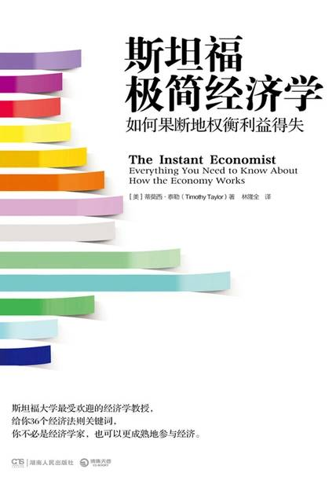

# 《斯坦福极简经济学》

作者：蒂莫西·泰勒

## 【文摘】
### 序言

我们可以把经济学的研究分成两大类：微观经济学和宏观经济学。微观经济学是从个人、企业的观点展开研究，宏观经济学则是探讨经济的整体观点。有一个古老但贴切的比喻：宏观经济学就像在看森林，而微观经济学则像看个别的树木。学好经济学的诀窍，就是对森林和树木两者能有一个整体的理解。

本书前18章主要让读者对微观经济学有所认识。

本书后半部分会探讨宏观经济学的议题，包括经济增长、失业、通货膨胀、国际贸易、货币政策与财政政策。

### 微观经济学篇

我们先从经济学的三个基础问题开始：· 社会应该生产什么？· 应该如何生产？· 谁来消费所生产的东西？

为了像经济学家般思考，你必须务实，并跳出市场与政府之间的意识形态之争。

应该严肃看待“权衡取舍”（trade-offs）。

自利（self-interest）是组成社会的有效方式。

亚当·斯密（1723～1790）：英国哲学家、经济学家，所著《国富论》为第一本阐述欧洲产业和商业发展历史的著作，这本书发展出了现代经济学学科，也提供了现代自由贸易、资本主义和自由意志主义的理论基础。

“看不见的手”（invisible hand）的概念，就是你在追求自己的利益时，可能也会给别人带来好处。

所有成本都是机会成本（opportunity cost）。

当你做一个选择时，你没有选择的东西就是经济学家所谓的“机会成本”。

#### 02 做自己最适合做的事，就有更好的生产力

分工使企业得以利用规模经济（economics of scale）。“规模经济”是个专有名词，用来说明大厂相对于小厂可以用较低的平均成本来生产。

“价值链分解”（breaking up the value chain），意即更广泛分散地生产零件。

在市场经济里，商品的价值就是它的价格

#### 03 市场均衡点并不表示人们对结果感到满意

循环流向图

对非经济学家来说，价格是关于个人价值取向的价值承载（valueladen）。经济学家试图避免这类价值判断，我们称之为“钻石与水的矛盾”（diamond-water paradox）。这个说法出自经济学家始祖亚当·斯密，他在《国富论》里区别了“交换价值”（value in exchange）与“使用价值”（value in use）。

一个商品的交换价值与其稀有性有关——商品值多少钱，和多少人想要拥有它有关。

“替代效应”（substitution effect）

“收入效应”（income effect）

“需求量”是指在某一特定价格下，人们想得到该商品的特定数量。

“需求”则是价格与需求量之间的关系，指的是在任何可能的价格或每种价格下，人们想要该商品的数量是多少。

需求量是一个点，而需求是一条曲线。

供给是指商品的供给量与价格之间的关系。

供给量是指在某个特定价格下所生产的特定数量，供给是指在每种价格下生产多少数量。供给量是一个点，而供给是一条曲线。

#### 04 在任何情况下都必须有所取舍

价格上限造成供不应求

价格上限（price ceiling）：产品价格的最大值

价格下限（price floor）

指土地利用时，收益与成本相等，无法取得超额利润的土地。边际土地在经济上成为耕作地与非耕作地的界限，低于此界限的，称为边际以下土地或次边际土地（sub-marginal land）；高于此界限的，称为边际以上或超边际土地（super-marginal land）。

边际土地（marginal land）

#### 05 增加的生产成本可以转嫁给消费者吗？

“弹性”（elasticity）

需求弹性的定义是需求量变动的百分比除以价格变动的百分比

供给弹性的定义是供给量变动的百分比除以价格变动的百分比

当商品需求量变动的百分比刚好等于价格变动的百分比时，我们说它是单一弹性（unitary elasticity）。

#### 06 你的薪水最终由你的产出决定

劳动力市场与工资：在每个人才市场，工资的均衡点是由该市场的劳动力供给量相对于劳动力需求量而决定的。

产出（也就是不同的商品与服务）的需求变动，会改变劳动力需求。

在每个人才市场，工资的均衡点是由该市场的劳动力供给量相对于劳动力需求量而决定的。

劳动力是一个市场，你的薪资及福利，是根据你的产出定出的价格。

#### 07 折现值是个很重要的观念

“金融投资”（financial investment）

“实物资本投资”（physical capital investment）

相较于未来还款所付出的代价，你该如何计算这笔贷款目前的价值？经济学家利用折现值（present discounted value）的概念来计算，它是把不同时间点发生的成本或效益拿来直接比较的一种方式，指的是未来所要得到的款项，如果现在就回收，会值多少钱。

折现值（PDV）等于未来值（FV）除以“1+利率（r）”的t次方，t为年期。或者把它写成公式：PDV=FV/（1+r）t。

留存收益（retained earnings），较常听到的说法是利润。“留存”的意思是企业决定持有这笔钱，将它再投资于企业而非以股利付给股东。

企业还可以用两种方式筹钱——向银行借钱或是发行债券。

债券有面额、利率与期限三项要素

债券所付的利率是根据风险而变动的。

较不稳定的企业可能会发行高利率、高风险的债券，或称“垃圾债券”（junk bond）。

企业筹资的最后一种方式是通过有价证券，较常听到的是公司股票。

#### 08 人一生积累财富的关键是什么？

个人投资：评估投资标的时，要衡量四个要项：报酬率、风险、流动性、税负。

家庭所面临的重要的经济决策之一，就是如何为退休生活而储蓄。

人一生累积财富的关键，在于复利（compound interest）的力量。

投资特定公司或特定债券的风险，可以借由“多样化”分散投资而减少。多样化（diversification）的意思是购买许多不同投资标的，以降低整体风险。

流动性”，是把投资转换为现金的意思。

债券是在一段固定时间内，可以预先决定报酬率的一种投资工具。

在大部分情况下，债券的报酬率是一个固定利率，这表示如果通货膨胀与市场利率上升，你就会被锁在这个较低的固定利率上，因而吃了亏。

蓝筹股（blue chip stocks）指的是大型、知名公司的股票，例如通用电气、沃尔玛、美孚等公司。

随机漫步是一种数学统计模型，由一连串轨迹组成，其中每一次都是随机的。证券价格的波动是随机的，就像醉汉走路，价格的下一步将走向哪里，是没有规律的。

“随机漫步”（random walk）

#### 09 垄断的本质是对勤劳者课税

微观经济牵涉到市场上（商品、劳动力与资本市场）供给与需求互动的力量。

独资（proprietorship）是由单个人所有；合伙（partnership）是由一群人所有；公司（corporation）则是有法律实体的组织，独立于其持有者，可能由一人或一群股东所有。

完全竞争”（perfect competition），有很多小企业在制造几乎一样的产品；

“垄断”（monopoly），单一生产者在特定市场几乎拥有全部的营收；

“垄断竞争”（monopolistic competition），是指很多企业争相销售稍微不同的产品，例如每家餐厅都卖食物，但所提供的东西各有不同的风格与质量；

寡头垄断”（oligopoly），它有点接近垄断，只是并非由一家企业囊括全部的市场营收，而是少数企业在特定市场拥有大部分或全部营收。

完全竞争产业的主要特征是价格接受（price taking），也就是说，完全竞争的企业必须接受市场给定的价格。

#### 10 是大池塘里的小鱼，还是小池塘里的大鱼

反托拉斯与竞争政策：独家交易、掠夺性定价等名词的定义，看起来模糊且不确定，但的确就是如此。

反托拉斯（antitrust）

企业反托拉斯的其中一项任务，是定义市场上的竞争程度，然后判定是否为充分竞争。衡量竞争程度最简单的方式是四大企业集中度（four-firm concentration ratio），做法是将该产业前四大企业的市场占有率（简称市占率）加总起来。

赫芬达尔-赫希指数（Herfindahl-Hirschman Index，HHI，或称赫氏指数）是一个更精确的竞争程度衡量指标。

在判断市场竞争程度时，除了观察市占率，另一个方法是观察市场价格的模式。

标准石油瓦解案：美国石油大王约翰·洛克菲勒（John D. Rockefeller）在1882年联合40家相关企业，集体由标准石油托拉斯（Standard Oil Trust）统筹管理业务，以哄抬或控制价格。美国政府为解决这个不正当垄断现象，于1890年通过了《谢尔曼法案》（Sherman Act），并起诉标准石油，标准石油因此于1911年宣告瓦解。此后，反垄断即被称为反托拉斯。

20世纪早期的标准石油（Standard Oil）即是有名的瓦解案例

价格垄断（price fixing）的卡特尔（cartel）组织，是由同一市场的一群企业组成的，彼此协议共同设定产出水平和价格

家交易（exclusive dealing）

搭售（tie-in sale）或捆绑销售（bundling），是指顾客只有在买了某个产品时，才能买另一个产品。

掠夺性定价（predatory pricing）

#### 11 最佳的管制法或许就是解除管制

历史上，公用事业定价最常见的方法是成本加成管制法（cost-plus regulation）：精算过公司的生产成本后，允许一个较低的获利水平（通常以一般企业在竞争市场可赚到的报酬为依据），且锁定价格以便能获取该水平的利润。

成本加成管制法的替代方案，是价格上限管制法（price-cap regulation）。

“管制俘虏”（regulatory capture）

斯德哥尔摩症候群：又称“人质情结”，指犯罪的被害者对犯罪者产生情感，甚至反过来帮助犯罪者的一种情结，源自1973年在瑞典斯德哥尔摩发生的一起银行抢劫事件。

斯德哥尔摩症候群 （Stockholm Syndrome）

解除管制（deregulation）

#### 12 主张绝对的零污染是不可行的

在这里，核心的经济学概念是“外部性”（externality），指在直接的买家与卖家之外，有第三方直接受到这笔交易的影响。

污染是负外部性（negative externality）最重要的例子

“命令与控制”（command and control）是经济学家专指这类管制政策的用词，它规定了可合法排放污染的最大量。

其一是对生产者每单位的污染课征污染税或污染费。

另一个市场导向的环保政策，是“可交易的许可”（marketable permit）制度

市场导向环保政策的另一个选择方案，就是以财产权（property right）做激励。

#### 13 自由市场并不保证会给发明者奖励

就新技术而言，生产者与消费者交易之外的人，不需补偿发明者就可从中受益。因此，创新是正外部性（positive externality）的一个例子。

推动创新的关键因素，是创新者从研发投资中得到大部分经济利益的能力，经济学家称之为“专属性”（appropriability）。

保护知识产权发展出四种形式：· 专利（patent）是由政府授权，于特定、有限期间内（在美国通常是20年），独家制造、销售或使用一项发明的法律权利。· 商标（trademark）是表明商品来源并帮助卖家建立商誉的字词、名称或符号。常见的商标例子有Chiquita（金吉达）香蕉品牌名称，或Nike（耐克）的打钩符号。目前，有超过80万个商标在美国政府注册。只要商标仍然在使用，厂商就可以无限期地更新商标。若产品停止使用，该商标就会失效。· 著作权（copyright）是以法律保护原创作品（包括文学、音乐、艺术），未获作者同意，别人不能复制或使用。目前的著作权保护期限是作者终生有效，再加上70年。大体而言，专利法保护发明，著作权则保护图书、歌曲与艺术。在某些领域，例如软件，法律对到底要不要把它当作发明或作品来保护仍没有定论。· 商业机密（trade secret）是指配方、过程、装置或信息项目给予企业凌驾于竞争者的优势，它们不是常人所知或易于被发现的，企业会用合理的努力来保守机密。最有名的商业机密也许是可口可乐的配方，它不是用著作权法或专利法来保护，而是由公司自己来守护。窃取商业机密有很多种方式，1969年有一个著名案例，两位摄影师驾驶飞机在杜邦化学厂上方盘旋，拍摄新的甲醇生产过程，结果被判窃取商业机密罪。法院裁决，杜邦以书面方式或使用围墙与警卫等实际手段，已经用合理的距离来守护生产过程的秘密，因此从飞机上拍照属于不适当取得商业机密的手段。

#### 14 缴税是用强迫的方式克服搭便车问题

“公共物品”（public goods）

公共物品有两个重要特性：它们是非竞争性（nonrivalrous）与非排他性（nonexcludable）

非竞争性是指商品本身不会因为更多人使用而变少。

非排他性是指卖家无法排除那些没付钱也能使用商品的人。

当某些人从公共物品中受益，却没有付出相对合理的成本时，经济学家把这个问题称作“搭便车”（free-rider）。

#### 15 社会福利计划是在援助与激励之间拔河

社会保障网不应该成为吊床，不应该成为很难进入或很难出来的东西，它应该更像高空秋千表演者下方的安全网，缓冲你掉落下来的力道，帮助你再弹上去。

“负所得税”（negative income tax）。政府在一个人赚到额外收入时减少他的福利，就会产生负所得税。

#### 16 什么样的收入不均程度算合理？

收入分配（income distribution）

标准方法是把收入分配分成5等份、10等份甚至100等份，然后算出每一等份的人的收入占整体收入的比重。

#### 17 品牌可以让消费者对质量比较放心

信息完全（perfect information）

信息不完全（imperfect information）

保险市场包括个人保险（例如健康保险、汽车保险、财产保险、人寿保险）和社会保险（例如社保退休金、失业保险、职业灾害补偿、灾难救济）。

第一个主要问题叫作道德风险（moral hazard），意思是拥有保险会使人不太会采取预防措施来避免或阻止坏事发生。

保险市场的另一个重大议题是逆选择（adverse selection）：特别可能遭遇坏事的人更可能购买保险，而风险很低的人不太可能会购买。

### 宏观经济学篇

宏观经济学的观点是总合的、由上而下，它把整个经济视为一个大型有机体，内容包括经济增长、失业、通胀、贸易差额等。

为了提供一个思考宏观经济政策的概括架构，我们将研究宏观经济政策的四大目标，然后以一个分析架构来思考目标之间的关系，再以两组工具来完成这些目标。

宏观经济政策的四个目标是：经济增长、充分就业、物价稳定和国际收支平衡。

讨论宏观经济政策的架构称作总供给与总需求模型，这个架构有助于构建宏观经济分析，并使我们能够分析经济增长、失业、通胀和贸易差额之间的取舍关系。

宏观经济政策的两组主要工具，是财政政策和货币政策。

财政政策是政府税收和支出的政策，包括政府预算和预算赤字。

货币政策是指中央银行的政策，它会影响利率、信用以及社会上借款与放款的数量。

“国内生产总值”（Gross Domestic Product,GDP）的概念，它是一个国家经济规模的衡量标准。

GDP=消费+投资+政府支出+出口-进口

人均GDP是一个有用的比较工具，因为它会自动调整不同国家或不同时间的人口差异。

实际国内生产总值（real GDP），它是经过通胀调整后的GDP。

股市的大幅涨跌对GDP也完全没有直接影响。

GDP呈现明显且持续的下滑，就叫作经济衰退（recession）。

#### 20 为什么人们重视经济增长？

经济增长：长期来看，经济增长是唯一会影响生活水平的因素。

经济增长会随着时间产生复利效果。年增长率的若干差距，会在一代或两代人后造成生活水平的巨大差异。预测一个经济体未来的价值（FV），公式是拿它的现值（PV）乘以“1+经济体的增长率”的t次方，t是年期数[PV（1+r）t=FV]。

生产力增长的三大驱动因素是：实物资本增加（意即有更多的资本设备让员工使用）、更多的人力资本（意即员工有更多的经验或更好的教育）以及更好的技术（意即更有效率的生产方式）。

#### 21 经济衰退，薪资很少会大幅下降

失业：劳动需求量下降，才会导致失业。

#### 22 通胀率走高会使市场运作不顺畅

通货膨胀，是指任一商品与服务的价格全面上升的现象。

“一篮子”商品

消费者价格指数（Consumer Price Index,CPI）

生产者价格指数（Producer Price Index,PPI）

批发价格指数（Wholesale Price Index,WPI）

GDP平减指数（GDP Deflator）

#### 23 贸易顺差的真正意思是借钱给国外

贸易差额：贸易顺差与逆差，谈的是金钱的流向，以及向哪边的流动比较大。

贸易差额（balance of trade）

贸易顺差（trade surplus）

贸易逆差（trade deficit）

“商品贸易差额”（merchandise trade balance）

经常账户余额（current account balance）是单一统计值，可描绘一个国家贸易余额最全面的轮廓。

对经济学家来说，贸易逆差真正的意思是，结算下来，一国是从国外借钱，而且有国外的投资流入。同理，贸易顺差真正的意思是，结算下来，一国是借钱给国外，且有对外投资的流出。

恒等式（identity）

国民储蓄与投资恒等式始于一个基本概念：金融资本的总供给量必须等于金融资本的总需求量。

金融资本供给有两个主要来源：国内资金的储蓄加上国外资金的流入。金融资本需求也有两个主要来源：国内实物资本的投资需求和政府借款。

无论国家还是个人，借款后的挑战都是如何运用这笔借来的资金，使其产生充分的效益或回报以偿还贷款。

企图提高经济增长与维持合理贸易逆差的政策是相似的：都应该鼓励国内储蓄。

#### 24 短期看需求，长期看供给

总供给与总需求：对整体经济来说，总供给量必须等于总需求量。

总供给与总需求模型（aggregate supply and aggregate demand model）

总供给是宏观经济中所有产品的总供给，它受到潜在国内生产总值（potential GDP）的限制。

潜在GDP也称为“充分就业GDP”，表示工人和机器都被充分运用。

可以把总需求定义为由五个要素构成，那就是C+I+G+X-M，我们用它们来决定GDP，也就是消费+投资+政府支出+出口-进口。

在看重总供给的萨伊定律和看重总需求的凯恩斯法则之间，有一个看似可行的、务实的折中方案：凯恩斯理论强调总需求的重要性，它和短期政策更有关联；而新古典经济理论强调总供给的重要性，对长期经济更重要。这大概是当代经济学家的主流观点。

#### 25 菲利普斯曲线是一种短期现象

菲利普斯曲线（Phillips Curve）

我们可以把弗里德曼的思想重点归纳为：长期而言，经济总会回复到潜在GDP及自然失业率状态。

我们所强调的短期与长期差异，反映了宏观经济学家之间的分歧。支持凯恩斯法则（需求创造其自身的供给）的经济学家，倾向于更注重短期几年内的经济周期；而支持萨伊定律（供给创造其自身的需求）的经济学家，更倾向于注重长期。

#### 26 政府的钱是怎么花的？

财政政策和预算赤字：财政政策是用来概括政府的租税与支出政策的一个专有名词。

财政政策（fiscal policy），是经济学家用来概括政府的租税与支出政策的专有名词。

当政府的支出超过税收时，要去哪里筹钱？答案是发行债券。

第一个宏观经济目标是经济增长，它受到实物资本、人力资本、技术等长期投资因素的影响。

#### 27 权衡性财政政策，知易行难

使社会的总需求增加或购买力提高的政策，称作“扩张性”（expansionary）宏观经济政策，或称作“宽松”（loose）的财政政策。扩张性政策包括减税与增加支出，两者都会使更多的钱流入社会。反之，用来降低总需求的政策，称作“收缩性”（contractionary）政策或“紧缩”（tight）的财政政策。增税或减少支出的政策属于收缩性财政政策，会降低社会的购买力。这种财政政策的基本目的是平衡经济衰退和扩张。

租税是自动的、反经济周期的财政政策，或者说它是一种自发性稳定机制。

#### 28 美国累积负债的长期前景很糟糕

经济理论的“挤出效应”（crowding out）认为，如果政府借越来越多的钱来管理它的赤字，就会减少民间企业可取得的用于投资的资金。因此，政府借款增加意味着私人投资减少。相反，政府借款减少就表示企业可取得更多资金用于投资。

第三个理论称为“挤入效应”（crowding in），意思是政府大量借款会带来贸易逆差。

衡量国债状况的标准做法是，用某一年的政府总负债除以GDP。

#### 29 金钱对我们没有任何用处，除非把它花掉

经济学家不是用货币形式来定义货币，而是把社会上具备下列三个功能的任何物品定义为货币：交易媒介（medium of exchange）、价值储存（store of value）、计账单位（unit of account）。

交易媒介是可以拿来交换任何待售商品的某样东西。

作为价值储存的工具，货币是可以暂时持有而不会失去有效购买力的物品。

货币的最后一个功能是作为计价单位，意思是大部分商品的价格是用货币来衡量的。

M1货币包括通货（硬币与钞票）、旅行支票与个人支票账户。

M2是更广义的货币，是由M1加上储蓄账户构成的。

银行是金融中介机构（financial intermediary）

银行是通过放款的过程来创造货币。

#### 30 中央银行既有权力，也有责任

货币政策是指货币供给的扩张或收缩，其目的是助长或抑制总需求。

中央银行有三个传统工具，可在银行与货币的架构内运作：法定准备金（reserve requirement）、贴现率（discount rate）、公开市场操作（open market operation）。

还有一个因2007～2009年经济衰退而开发的工具，称作量化宽松（quantitative easing）。

法定准备金是银行不可贷放出去的存款比率。

再贴现率是央行扩大或抑制放款的另一种方式

如果银行为此向中央银行借钱，所需支付的利率就是再贴现率。

所谓公开市场操作，是指中央银行购买或销售债券，以增加或减少货币供给。

债券不是货币，不是M1或M2的一部分。

货币政策工具的最新方法是量化宽松，过去只是理论，2008年以前从未在美国使用。它可以用两种方式来操作，其一是美联储可以把钱贷给金融市场的参与者。

量化宽松的另一个做法，是由美联储购买较长期的证券。

如果美联储想让货币供给增加，有四个选择：降低法定准备金率，降低再贴现率，向银行购买债券，或是购买与借款有关的证券。这些措施都可以称为扩张性（或宽松）货币政策，它们往往能降低利率并促进放款。根据总供给与总需求模型，它们会增加社会的总需求。

如果美联储想要降低货币供给，或者至少是抑制货币供给的增长率，就会结合一些工具来制定收缩性（或紧缩）货币政策：较高的再贴现率，较高的法定准备金率，把债券卖给银行，或是把持有的证券卖回市场。这些措施往往会使货币供给紧缩，提高利率且抑制放款。根据总供给与总需求模型，它们会降低总需求，或至少限制总需求的上升。

#### 31 你可以牵马到河边，但不能强迫它喝水

当通胀率出现负数时，称作通货紧缩（deflation），意即货币的购买力不但没有随着时间变低，反而随着时间变得更高。

实际利率（real interest rate）等于名义利率（nominal interest rate）减去通胀率。

中央银行需要提防通货紧缩。事实上，很多央行的目标是让通胀率保持在2%上下而非零，这样可保留一些缓冲空间，以避免可能的通货紧缩。

当价格上涨不是出于商品本身的任何属性，而是因为投资人期望价格持续上涨时，泡沫就出现了。

#### 32 不用扩大贸易就很富裕的国家根本找不到

“价值链分解”

#### 33 全球化的整体方向将提高全世界的生活水平

实施保护主义有几种方式。进口配额（import quota）是对进口采取数量限制，关税（tariff）是提高进口成本的一种税。

#### 34 汇率剧烈波动会对经济造成很大干扰

长期来看，经济学家相信汇率将朝“购买力平价”（purchasing power parity）汇率（或称PPP汇率）移动。

控制汇率的另一个替代方案是在外汇市场直接买卖本国货币。若一国想使其货币走强，可以在外汇市场买入本国货币；想使其货币走弱，则卖出本国货币。

外汇储备（foreign exchange reserve）

#### 35 美元大幅贬值对美国并没有显著的负面影响

#### 36 未来的经济不再是零和游戏