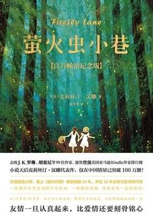

# 《萤火虫小巷》

作者：克莉丝汀·汉娜

## 【文摘 & 笔记】
### 1

她们相信这份誓言能坚守到永远，她们会一起变老，坐在老旧露台的两张摇椅上，回顾往事一起欢笑。

### 2

至于外公……唉，他不想安静都不行。中风之后他只能躺在床上，偶尔会摇铃叫人，只有这种时候塔莉才会看到外婆匆忙的模样——铃声一响起，她会微笑着说声“噢，老天”，然后踩着睡鞋尽可能以最快的速度赶往走廊。（【评】*美好婚姻最重要的意义，最起码有一个人可以体面的度过晚年。*）

眼泪刺痛双眼，涌出眼眶，滑落脸颊，她站在那里痴痴地等候，努力鼓起勇气。

### 12

“电视是大众的鸦片。”（【评】*确实是，现在的短视频平台更甚！*）

### 22

她们两个都明白，全天下所有家庭主妇都明白，女人无论选择家庭或事业都必须付出代价。

### 24

凯蒂凝视着女儿，心头一阵刺痛。时间过得好快，女儿的童年已经到了尾声。“我爱你，妈妈。”玛拉说。对世人而言，这只是平凡一天中的平凡时刻，但对凯蒂而言却意义非凡，这就是她放弃事业选择当全职妈妈的原因。她也许太过放大人生中的微小片段，但这一刻在她心中永远无法被取代：“我也爱你。所以今天我们一起逃课，去看下午场的《哈利波特与密室》。”

### 30

十一月时，冬天一下子来临，整座小岛笼罩在灰蒙蒙的阴雨中。光秃秃的树木在寒风中瑟瑟颤抖，死命留住最后几片干枯变黑的叶子，仿佛放手就输了。

### 33

每逢佳节，回忆总是缠着她不放，上个月甚至跟到了世界尽头，如假包换的天涯海角。（【评】*每逢佳节倍思亲，无论古今中外，都一样呀*）

### 35

发炎性乳腺癌（Inflammatory Breast Cancer，缩写为IBC）

