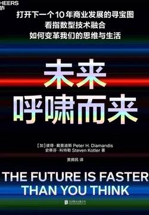

# 《未来呼啸而来》

作者：彼得·戴曼迪斯 史蒂芬·科特勒

## 【文摘 & 笔记】

### 作者简介

“预测未来的最好方法，就是创造未来。”（The best way you can predict your future is to create it.）

### 第1章 技术的融合

### 第2章 飞速发展的9大指数型技术（一）

里格蒂计算公司（Rigetti Computing）

现在，你只需访问里格蒂计算公司的网站，就可以下载他们的量子开发人员工具包。这个工具包为我们进行量子计算提供了一个用户友好的界面。有了它，几乎任何人都能编写可以在里格蒂计算公司的有32个量子位的计算机上运行的程序，现在它已经运行了超过1.2亿个程序。

“指数型技术6D框架”：数字化（digitalization）、欺骗性（deception）、颠覆性（disruption）、非货币化（demonetization）、非物质化（dematerialization）和大众化（democratization）。

### 第3章 飞速发展的9大指数型技术（二）

自从向法官展示虚拟现实技术以来，杰里米·拜伦逊和他的团队花了20年时间探索虚拟现实导致人类行为改变的能力。他开发了第一人称虚拟现实体验程序，用来帮助说明种族主义、性别歧视和其他形式的歧视。例如，在他创造的虚拟现实中，用户可以体验一下住在巴尔的摩街头的年老、无家可归的非裔美国妇女的生活，这种体验会给用户带来持久的变化：在移情能力和理解程度方面的重大转变。

区块链

这是因为地球上有相当一部分人是居住在不是他们自己拥有的土地上的（或者，不是由他们正式拥有土地所有权的土地上）（【评】*土地私有化也是世间最不公平的事之一*）

软件先驱埃里克·普里尔（Eric Pulier）创立的Vatom公司正在使用区块链打造各种“智能物件”。

简而言之，生物技术就是把生物作为技术来使用。它正在把生命的基本组成部分——基因、蛋白质、细胞，变成操纵生命的工具。

### 第4章 指数型技术融合带来的7大加速力量

力量1：节省下来的更多时间

力量2：更多可得的资金

首次代币发行是一种新兴的、以区块链技术为基础的众筹形式。初创公司可以通过创造和出售自己的虚拟货币来筹集资金，这种虚拟货币被称为“代币”或“虚拟币”。这些代币可以让投资者拥有初创公司一定比例的所有权（至少是投票权）和分享未来利润的权利，或者也可以采取证券的形式，代表对不动产或类似东西的部分所有权。

力量3：更多的非货币化

力量4：更多的天才

S. 拉马努金（S. Ramanujan）

“神经义肢”（neuro-prosthetics）

“脑机接口”（brain-computer interfaces）

力量5：富足的通信

力量6：全新的商业模式

1. 众包经济（The Crowd Economy）。

2. 免费／数据经济（The Free/Data Economy）。

3. 智能经济（The Smartness Economy）。

4. 闭环经济（Closed-Loop Economy）。

5. 去中心化的自治组织（Decentralized Autonomous Organizations）。

6. 多世界模型（Multiple World Models）。

7. 转型经济（Transformation Economy）。

力量7：更长的寿命

已知的3种主要抗衰老方法，它们都是当前研究的热门

首先是“抗衰老细胞药物”（senolytic medicines）。

接下来，是所谓的“年轻血液”方法。

干细胞是我们要讨论的第三种方法，也可能是最有希望的一种方法

### 第5章 零售业的未来

未来10年，3D打印将在以下四个关键方面重塑零售业。

1. 消灭供应链

2. 消灭废料。

3. 消灭配件市场。

4. 用户设计产品崛起。

融合的零售业

体验经济是一种新的颠覆性的商业模式，它以预先制造的体验代替了预先制造的配料，满足了一种新的需求。

3D人体扫描技术已经日臻成熟。

### 第6章 广告业的未来

欢迎来到现实2.0或Web 3.0，又或者可以称为空间网络（Spatial Web）。

趣志（Pinterest）也提供了大量的视觉搜索工具，比如其中的“买你所见之物”（Shop the Look）功能，该功能会将照片中的每个物体都加上标签。你喜欢这个沙发吗？单击对应沙发上的标签就可以了，接下来网站会帮你搜索正在出售的类似产品。

### 第7章 娱乐业的未来

用户生成内容（user-generated content，简称UGC）

将Otoy公司的软件、LightStage的图像捕捉和光场实验室的投影仪结合起来，我们就拥有了构建全息甲板的所有基本组件——这是迄今为止最具沉浸感的娱乐形式。

### 第8章 教育业的未来

（Global Learning X PRIZE）

### 第9章 医疗保健业的未来

现在，活着的患有肺动脉高压病的患者人数已经从以前的不足2 000人上升到了4万人。

细胞医学是20世纪90年代干细胞被发现后才首次出现的概念。这个概念新颖而简单，就是将细胞作为对抗疾病的武器。

生成式对抗网络（generative adversarial networks，简称GANs），即通过让两个神经网络相互竞争，系统可以应用最少的指令产生新奇的结果。

AlphaFold。

### 第10章 长寿业的未来

科学家现在一般认为，人类衰老的主要“原因”有9个，我们可以把它们称为人类的“末日九骑士”。

1. 基因组不稳定性（genomic instability）。

2. 端粒缩短（telomere attrition）。

3. 表观遗传学改变（epigenetic alteration）。

4. 蛋白质内稳态丧失（loss of proteostasis）。

5. 营养感应失调（nutrient sensing goes awry）。

6. 线粒体功能异常（mitochondrial dysfunction）。

7. 细胞衰老（cellular senescence）。

. 干细胞耗竭（stem cell exhaustion）。

1. 细胞间信息通信改变（altered intercellular communication）。

Wnt信号通路

### 第12章 食品业的未来

### 第13章 亟待解决的5大风险

### 第14章 未来世界的5次大迁移