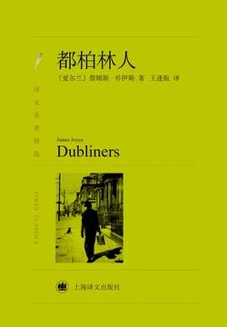

# 《都柏林人》

作者：[爱尔兰]詹姆斯·乔伊斯

## 【文摘 & 笔记】
### 一次遭遇

一直待在家里的人不可能有真正的冒险：要冒险非到外面去不可。

### 两个浪汉

八月，灰色温暖的夜晚已经降临到这座城市，街道上流散着一种柔和温暖的气息，一种夏日的记忆。由于星期天休息，商店关门，街道上到处是身着盛装的人群。街灯像发光的珍珠，从高高的电杆的顶端照射着下面活动的群体图形，它们不断改变形状和颜色，将单调的、不绝于耳的低声细语抛向暖洋洋的灰色夜空。