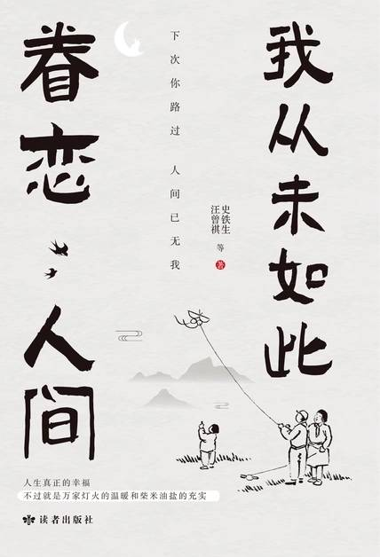

# 《我从未如此眷恋人间》

汪曾祺 史铁生等

## 【文摘 & 笔记】

### 再添几句闲话的闲话乘便妄想解围

但我每回咒或是骂的对象（他说）永远是人类的全体，不指定这个那个个人的。我想我也并没有什么不对，我真的觉得没有一件事情你可以除外你自己专骂旁人的。该骂是某时代的坏风气坏癖气，该骂是人类天成的恶根性。（【评】*只不过自以为是罢了，所谓坏风气、劣根性，不都是某个人、某些人的行为而已，又何以咒骂全人类！*）

### 四位先生

最近二年，何容先生不知戒了多少次烟了，而指头上始终是黄的。（【评】*就像我戒游戏，下载安装，玩一段时间后决定不再玩了，卸载，过一段时间，觉着无聊，又一次下载安装，如此反复多次！！！*）

### “无事此静坐”

静，是一种气质，也是一种修养。

### 无题（因为没有故事）

人是为明天活着的，因为记忆中有朝阳晓露；假若过去的早晨都似地狱那么黑暗丑恶，盼明天干吗呢？是的，记忆中也有痛苦危险，可是希望会把过去的恐怖裹上一层糖衣，像看着一出悲剧似的，苦中有些甜美。无论怎说吧，过去的一切都不可移动；实在，所以可靠；明天的渺茫全仗昨天的实在撑持着，新梦是旧事的拆洗缝补。

### 月夜之话

月光光，照河塘。骑竹马，过横塘。横塘水深不得过，娘子牵船来接郎。问郎长，问郎短，问郎此去何时返。

共哥相约月出来，怎样月出哥未来？没是奴家月出早？没是哥家月出迟？不论月出早与迟，恐怕我哥未肯来。当日我哥未娶嫂，三十无月哥也来。

与他相约月出来，怎么月出了他还未来？莫不是我家月出得早？莫不是他家月出得迟？不论月出早与迟，只怕他是不肯来了吧！当日他没有娶妻时，没有月的三十夜也还来呢。

七月七夕鹊填桥，牛郎织女渡天河。人人都说神仙好，一年一度算什么！

### 故都的秋

梧桐一叶而天下知秋

### 看花

那时已是黄昏，寺里只我们三个游人；梅花并没有开，但那珍珠似的繁星似的骨朵儿，已经够可爱了；我们都觉得比孤山上盛开时有味。大殿上正做晚课，送来梵呗的声音，和着梅林中的暗香，真叫我们舍不得回去。在园里徘徊了一会儿，又在屋里坐了一会儿，天是黑定了，又没有月色，我们向庙里要了一个旧灯笼，照着下山。（【评】*疏影横斜水清浅，暗香浮动月黄昏。*）

我爱繁花老干的杏，临风婀娜的小红桃，贴梗累累如珠的紫荆；但最恋恋的是西府海棠。海棠的花繁得好，也淡得好；艳极了，却没有一丝荡意。疏疏的高干子，英气隐隐逼人。

“只愁淡月朦胧影，难验微波上下潮。”

### 养花

北京的气候，对养花来说，不算很好。冬天冷，春天多风，夏天不是干旱就是大雨倾盆；秋天最好，可是忽然会闹霜冻。在这种气候里，想把南方的好花养活，我还没有那么大的本事。因此，我只养些好种易活、自己会奋斗的花草。

### 死的浮想

但是，我心中并没有真正达到我自己认为的那样的平静，对生死还没有能真正置之度外。（【评】*晚上躺在床上睡不着，胡思乱想，一想到自己死去，孤零零一座坟墓，瞬间毛骨悚然！！！*）

## 【想法】

生老病死，衣食住行（吃喝玩乐），七情六欲，这便是人生！