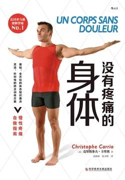

# 《没有疼痛的身体》

作者：克里斯多夫·卡里奥

## 【文摘 & 笔记】

### 第一章 身体平衡定律

肌肉失衡是指两组对应的肌肉群的长度和强度不平衡。

### 第二章 了解人体运动模式

一般运动模式（也叫做基本运动模式），由信息和基本动作构成，这个模式适用于所有人。

复杂运动模式（也叫做复杂或特定运动模式），这与复杂且精确的动作紧密联系。

枕后位（脸朝前）是指胎儿头部偏离了正常的偏转方向，过于偏向身体后方。

出现枕后位主要是由于以下原因：·不正确的姿势；·母亲的坐姿不正确会影响胎儿腰部脊椎的正常弧度，甚至造成过度弯曲；·上半身稳定肌群萎缩；·腹横肌、斜肌、多裂肌和腹直肌支撑不当；·缺乏合适的手动按摩治疗；·在分娩前期、期间及后期，对胎儿结构性矫正不够完善。

### 第三章 了解肌肉链的原理

人体运动系统由三个子系统组成：

- 肌筋膜系统：由肌肉、筋膜和肌腱组成，在身体静止或者运动时维持、稳定、建立或者减缓关节活动。
- 关节系统：由关节和骨骼组成。
- 神经系统：由神经和本体感受器组成，本体感受器负责将力学信息（肌肉、筋膜、肌腱和皮肤的压力情况）转化成由大脑收集和分析的电子信息，随后大脑利用神经系统与身体进行交流。

### 第四章 坐姿对体态的影响

人体的脊椎有24节椎骨，脊椎对于失去活动能力和弯曲弧度非常敏感。脊椎的结构实际上包含三个弧度，即颈椎前凸，脊椎后凸和腰椎前凸

### 第六章 炎症、疼痛和触发点

疼痛是一个包含了多种由各个身体组织发出的信号的程序。

### 第七章 深入了解关节病变

关节病变是一种炎症。

### 第八章 情绪和体态

最简单的呼吸抗压方法是保持规律的心跳。