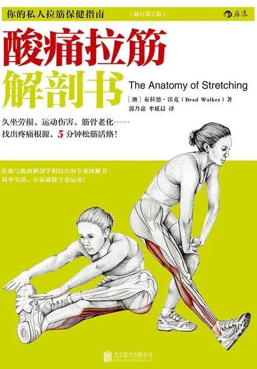

# 《酸痛拉筋解剖书》

作者：布拉德·沃克

## 【文摘 & 笔记】
### |第一部分|写在练习拉筋伸展操之前

人体有超过215对骨骼肌，这些骨骼肌大约占我们体重的40%。之所以将其命名为骨骼肌，是因为这些肌肉大部分都连接在骨骼上，能使骨骼运动，也正是这些肌肉负责我们的运动。

一块骨骼肌一般由一条动脉来提供养料，由数条静脉带走代谢废物。

骨骼肌纤维有三种类型：慢缩红肌、快缩中间肌和快缩白肌。

### |第二章|拉筋伸展操的原理

静态式拉筋伸展操及动态式拉筋伸展操

本体感觉神经肌肉促进疗法（PNF伸展法）

伸展合并等长收缩（Isometric Stretching）

有效而完整的热身运动应该包含下面四个关键因素：

### |第六章|背部和肋部的拉筋操

背阔肌是背部最宽的肌肉，它可以向下和向后拉动肩部，或在双手固定时将躯干向上拉动。

菱形肌位于肩胛骨和脊柱之间，因其形状呈菱形而得名。大菱形肌比小菱形肌要大一点。

腰方肌横穿腰部，从髂骨到骨盆，从髂腰韧带到最低的肋骨和L1至L4横突。腰方肌可以使躯干侧向弯曲，也可以抵抗在躯干另一侧被施加的侧向拉力。

肋间外肌

竖脊肌，也被称为骶棘肌，包含三组平行排列的肌肉。