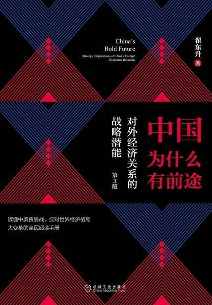

# 《中国为什么有前途：对外经济关系的战略潜能（第3版）》

作者：翟东升

## 【文摘 & 笔记】

### 第3版前言

全球化是一种与主导性帝国的兴衰相伴而行的历史性趋势，曲折运动，有进有退。

世界历史告诉我们，贸易战仅仅是逆全球化时代的一种常见症状而已，此外往往还有思潮极化、强人政治乃至大国战争等并发症。

春有百花秋有月，夏有凉风冬有雪。

### 当代世界市场体系的构造

世界体系内的国家和地区大体可以分为四类，分别为中央国家、准中央国家、外围工业国家以及原料提供国家。

### 世界市场体系的基本特点

在日常生活中我们不难发现这样一种现象，人越是穷越借不到钱，越是富越是有人抢着借给他钱。所以我们常常戏说银行家们的行为特点是“天晴的时候他们哭着喊着要把伞借给你，一旦下雨他们又哭着喊着要把伞拿回去”。这个道理在国家间也是如此。

全球市场体系尽管在短期内有上文所说的“劫贫济富”的特点，从长期来看却又有“损有余而补不足”的特点。

结构的鲁棒性

### 作为中央国家的收益、代价与条件

获取和保有中央地位的条件

中央国家承担的成本分析

### 外围国家发展道路上的常见陷阱

外围国家发展道路上的三类陷阱。

“资源诅咒”陷阱

欲速不达的“赶超”陷阱

发展过程中的政治陷阱
### 当代中国在体系中的地位变迁

在本书的主要章节中，我们将分别介绍改革开放以来中国对外经济关系的若干重要方面，尤其是中国的对外贸易、引进外资（外国直接投资）和对外货币安排。在这40年间，尤其是1992～2012年，中国同世界市场体系的经济联系基本上可以用这“三位一体”的政策组合来解释，在本书中我称之为“三外路线”，包括外贸、外资和外汇三方面。

### “三外路线”在中国何以实现

工业化和现代化的历史使命

体制根源

思潮和意识形态因素

### 中国对外贸易发展的轨迹

外贸的惊人增长

外贸的结构改善

商品类别

贸易性质

出口目的地的变化

出口企业性质。

### 中国对外贸易发展的动能

观念的变迁

制度的变迁

### 鼓励出口的政策组合

国际体系环境

### “三外路线”下的外资政策及其效果

招商引资与缺口论

渐变的外资政策

招商引资的成就

外资的贡献

协助中国转变在全球分工中的角色

原本按照“头雁”日本的设计，中国的角色是向这个以日本为起点的产业链条出售原材料并购买其最终工业制成品

帮助缓解就业和城市化挑战

帮助积累外汇。

提升中国的技术能力和产业层次。

### 中国外资政策的未来趋势及政治和战略潜力

联合国贸发会议将FDI（foreign direct investment，即外商直接投资）分为四类：“资源开发型”“市场开发型”“战略追加型”“效率追求型”，它们各自的投资驱动因素是不同的。

未来中国市场可能仍然存在一定程度的保护而不是完全开放，但是这种保护的目的不再是养活国有企业，或者实现进口替代，甚至不是今天所谈的促进产业升级；未来保护的目的就是要确保外资乐于进入中国，而且乐于主动变成中资。

多边投资规则相比双边投资协定，其根本好处在于提高投资自由化和市场准入水平，而且大大降低了对他国在外国投资问题上违规违约行为的惩戒成本。

### 产业升级与资本形式

一个好政府的主要任务是，确保没有人能不劳而获，让人民都劳有所得。

### 人民币汇率的政治经济学

不可能三角理论

资本自由流动、固定汇率和货币政策独立性三者之间存在着“不可能三角”

汇率制度的分类

### 人民币汇率变动背后的政治

通过货物贸易实施的资本渗入方法

### 人民币国际化

国际货币的基本职能

日元国际化的失败首先是由于日本政府顽固地坚持出口导向型经济发展模式，并为了维持日本的出口竞争能力而持续干预货币市场。日本人不愿意接受贸易逆差，这导致日本付出巨大的宏观经济代价来满足自己对顺差的偏好。日元国际化意味着日本政府需要想办法让国外的企业、个人和政府手中持有日元，但是他们又不愿意“吃亏”，不愿意用大规模购买他国商品和服务的方式来输出日元。同时，他们的对外投资额一时也比较有限，所以日本政府通过对外签订（低息）日元贷款协议来推动日元国际化。中国获得的大量低息日元贷款正是在这个背景下出现的。问题在于，当日元贷出去之后，表面上看日元国际化程度似乎有明显的增长，但是日元的持续升值让贷款国损失很大，因为他们还款时需要筹集远比当初多得多的美元来还本付息。协商不成、沟通未果的结果反复发生后，亚洲各国政府倾向于将日元债务尽快还清并从此不再碰它，这导致了日元国际化的成果普遍短命，在绕了一圈之后发现自己回到了原点。

### 国际化的条件和战略

### 外汇管理制度的改革与储备的形成

30年来，外汇管理体制改革大致经历了三个大的阶段，分别是1979～1994年汇率制度改革，1994～2001年中国入世，以及2001年入至今。

第一个阶段主要是以双轨制为特征，实施外汇留成制度，建立和发展外汇调剂市场，外汇管理体制开始呈现计划和市场相结合的特点。

1994年1月1日起实施的外汇体制改革，掀开了第二个时期的序幕，外汇与汇率制度转向市场主导，并用强制结售汇制度取代外汇留存和上缴制度，建立了统一的银行间外汇市场。

按照国际货币基金组织的定义，所谓外汇储备是指货币当局能够有效控制并可随时动用的对外资产

### 从对外资本输出看中国在世界市场体系中的地位

在解释企业对外直接投资的基本动能方面，20世纪60年代以来，出现了多种不同学派，如海默的垄断优势论、巴克利的内部化理论、费农的产品周期理论等，20世纪70年代末英国经济学家邓宁（John H. Dunning）在上述理论的基础上提出了折中性的三优势组合论。他认为企业之所以可以进行跨国经营，主要源于所有权、内部化和区位三方面优势。

### 中国资本输出的现状与未来

“考虑到当今美国国内政治的氛围，任何一位政治家敢于公开提出与中国谈自由贸易，那属于政治自杀。”

### 主权财富基金的发展及其投资规则之争

主权财富基金（sovereign wealth funds, SWF）是一种政府金融投资工具，主要以外汇资产形式持有。它与官方外汇储备的不同之处主要在于：外储追求资产低风险和高流动性，因此主要从事固定收益类金融产品的投资，而主权基金更偏好收益率，可以较多地投资股权等较高风险的市场；此外，外汇储备的资产体现在央行的资产负债表上，而主权基金的资产负债则不并入计算。

### 国际投资法与中国的选择

国际法的发展历史告诉我们，从来是主导性大国的利益不断地塑造和改造着国际法潮流，而不是相反。中国的学者必须有那种与大国身份相称的眼界和气魄，要敢于从中国崛起的需要出发思考何种国际法逻辑对我们有利，如何在国际上引介并推广我们所偏好的原则和模式，而不是单单局限在诠释、论证和整理现存的国际法条文体系中。

### 中国的能源安全

### 高油价有利于中国崛起

这些对美国而言的“麻烦制造者”有一个重要共同点：它们的财政力量都直接或者间接地源自能源市场。能源价格越高，它们就越有力量为美国及其盟友制造更多麻烦。

### 开放经济环境下的中国粮食安全

### 中国援外的历史与现实

要理解和衡量改革开放前对外援助的利弊得失，我们应当注意以下几个基本观念：一是将它放在本身的历史背景中去理解，而不是用今天的标准和观念去简单批判；二是综合考虑其得失，既考虑政治经济安全各方面的得失，也将机会成本和潜在风险纳入考虑；三是不能陷入道德主义的悖论和政治宣传的迷雾中。国家间的援助本来就是一种基于各自利益判断而展开的理性行为。

### 构建“中国特色援外理论”

在现实中，政府不是慈善基金会或者教会，外交使团不是慈善大使和传教士，国家的对外援助不是慈善活动，各国政府的援助政策不是利他主义冲动的产物，而是理性的广义“国家利益”拓展的需要。

### 改进中国的援外政策