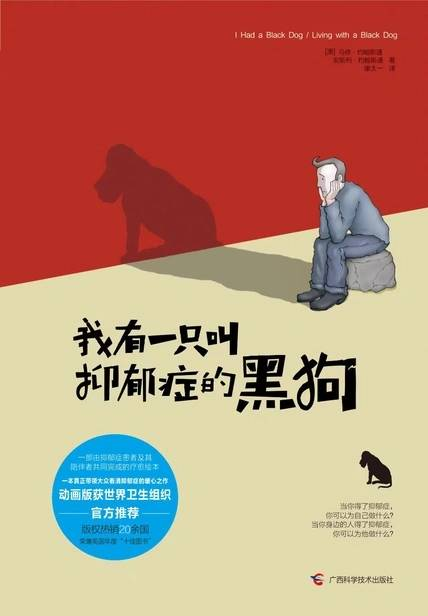

# 《我有一只叫抑郁症的黑狗》

### 【文摘 & 笔记】

你越是抓住某事不妨，越有可能被其定义。 

### 序一 黑狗是可以被驯服的

我们大多数人都身处疯狂忙碌的生活当中，很少停下来，也极少真的谈话、真的倾听和真的反思。我们都有点儿像那种水栖昆虫，轻轻掠过水面，却很少真的浸润自身。并不是说我们需要不断去谈“深刻并有意义”的内容，但是如果我们能偶尔用心、动情、真诚地说说话，也会带来令人惊叹的满足感、治愈以及对生命的肯定。

### 给患者

疲劳与压力是黑狗的食粮，你越是压力大，它就叫的越凶。所以学会如何适度休息和安定心神很重要。瑜伽、冥想和自然放松，都可以帮你喝退这只狗，将它拒之门外。

黑狗又胖又懒，因此它也非常乐意看到你懒在床上，为自己暗自神伤。它通常也讨厌运动，因为它知道运动会让你感觉更好。所以，当你最不愿意动弹时，恰恰是你最该运动的时候。
出去走走，或跑跑步，把那个小畜生远远甩在后面吧。

坚持记“情绪日志”会非常有用。将你的想法写下来是一种深度释放，同时也会让你更具洞见，思想深刻。

### 给看护者

不要这么说或做：

提示天气有多好，其实这令人厌烦有毫无意义。

提不提“袜子”对心理健康都没什么用。如果人们可以“摆脱抑郁，迅速振作起来”，他们会的。没有人是自己想要得抑郁症的。（“提起你的袜子”（pull your socks up）是一句英式俗语，意为试着改善你的表现、工作、行为等。）

你可能有非常正当的理由对他说：“是你想太多了！”但请不要那样说。这样说肯定没有帮助，尤其是当他们已经是个有担当的爷们儿时。抑郁症是一种病，而不是懦弱的表现。

别做个纸上谈兵的将军，净给些毫无根据的建议与指令。

体贴入微与善意好心总是不会错的，但请不要试图哄他们一起开心，这很可能让他们感觉更糟。

永远不要对他们说“你不过是在博关注、博同情”，这样的话是在贬低和伤害他们。他们并不是在博取关心，他们只是非常需要你的关心。

不要跟他们强调这个世界上还有很多人比他们的境遇差多了。这只会增加他们的内疚和无望。

不要强迫他们去做他们不想做的事情，时候又为他们不如你所愿的行为找借口。这样只会助长他们的绝望以及消极否定的心态。

那些有益的话和该做的事：

对如何去触碰这个话题要体察入微、敏感谨慎；毕竟许多人都不习惯谈及他们的心理健康情况或是从不谈起。跨国那条界限，只是意味着你真的关心。

如果你想分享（与抑郁症）相关的信息，要从微妙之处着手。

试着不要说话，只是倾听。真心陪在他们身边，不要表态或判断，是你能给予他们的最好的礼物之一。

如果对方能都接受，最好鼓励他们去寻求专业的建议。提议帮着找一个好医生，预约一次诊疗，甚至陪他们一起去，都会是非常有益的。

如果可能，试着让他们偷点小懒，得以放松。这很重要，但是，切记不要替他们做好一切。保持一定程度的常规生活对于他们的自尊自信与自我评价至关重要。

鼓励他们参与任何形式的常规运动，身体健康会消弱黑狗的力量。

如果你真的担心某人，可以阻止他的密友与家人和他梅泰诺保持联系。这会对他有帮助，即便只是一起喝被咖啡或简单打个招呼。

帮他们制定一个简化生活的策略，无论是在家里还是在外，压力是抑郁症的最大动因之一。所以，少些压力，少些黑狗。

给他们做一个有“摆脱黑狗”字样的盒子，鼓励他们用最喜欢的照片、书信，或任何能让他们想起生活中的美好存在的东西，放满这个盒子。包括一本“白狗日志”，他们能够以此确认抓过你太进展，记录令他们开心的事情并制定要完成的目标。

同他们一起了解病情，知识就是力量，而数据校验也是一味良药。

一起尝试并学习识别可能的诱因和早期预警迹象。此外。也要知道何时给彼此一点独立的空间。

如果孩子的年龄足够大，就告诉他们发生了什么。他们需要知道黑狗并不会在此久留。孩子们常常会觉得是他们的错；所以，一定要告诉他们这并不是他们的错，让他们放心。

作为看护者，同情、同感与理解是至关重要的，但一定要承认光凭你个人的力量是无法解救你所爱之人的。专业的帮助往往才是最需要的。

寻求专业帮助的一大障碍是花费的问题。一定要帮助他们意识到如果不能得到正确的帮助，他们会付出的代价会比诊疗费高得多，黑狗会让他们失去婚姻、友情、工作，甚至是生命。

找到对的医生能让所有的分歧与指标差额都回到一条恢复健康的路上。

如果他们要想某人倾诉自己的问题，那个人应该是他们尊敬且能轻松自在与之相处的人。鼓励他们不要害怕去做一个初步评估，也不要在感觉不对的情况下，碍于情面而勉强坚持治疗。

抑郁症会让大脑中的化学质失衡，这也是为什么有时候需要用化学药剂去矫正治疗的原因。抗抑郁药对有些人可能是维持生命的必需品，但并非对所有人都是。当然，还有许多自然疗法与天然药物可以帮助缓解抑郁症状。对此，你可以做一些研究，了解一些基本情况，然后多问问医生。

去见一见他们的医生可以帮助你了解他们可能要经历些什么。你还可以由此洞悉在治疗期间你该如何对待你们之间的感情关系。

“看护着疲劳”并不少见，如果你有，就需要去看看你自己的心理医生。那里是个可以分享故事的安全港，最重要的是，你可以在那儿得到支持。

看护着的自我保护：

在某些人的黑狗面前暴露过度，就会给它感染你的机会。搞不好你们就“同病相怜”了，所以尽可能不要陷入那个漩涡中，认知并尊重你自己的需求、极限和界限很重要。

困难的情况在你平静的时候会更好处理一些。瑜伽与冥想是达到平静、锻炼控制力的好方法（这些同样适用于患者，所以试着鼓励他们同你一起做）。

加入一个互助小组。跟一屋子理解你的人分享你的故事，那种感觉无与伦比。

经常出门，做你自己的事情和会见朋友都很重要。朋友可能没法解决你的问题，但是他们可以给你令人难以置信的安慰、支持和处事智慧。

本书动画版为世界卫生组织官方推荐宣传片：

[我有一条黑狗它名叫抑郁[高清版]_腾讯视频} (qq.com)](https://v.qq.com/x/page/z0163nb0d8k.html)

## 【想法】

[读书·《我有一只叫抑郁症的黑狗》](https://mp.weixin.qq.com/s/83Iz59QLOmJQh4WzPyW5Hg)