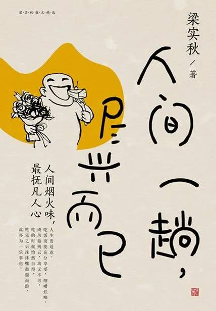

# 《人间一趟，尽兴而已》

作者：梁实秋

## 【文摘 & 笔记】
### 插图

菜根谭所谓“花看半开，酒饮微醺”的趣味， 才是最令人低徊的境界。

### 窝头

真正的窝头是玉米做的，玉米磨得不够细，粗糙得刺嗓子，所以通常羼黄豆粉或小米面，称之为杂和面。杂和面窝头是比较常见的。制法简单，面和好，抓起一团，翘起右手大拇指伸进面团，然后用其余的九个手指围绕着那个大拇指搓搓捏捏使成为一个中空的塔，所以窝头又名黄金塔。因为捏制时是一个大拇指在内九个手指在外，所以又称“里一外九”。

### 辑贰 故人旧事 三三两两

母亲说我乖，也说我孤僻。如今想想，一个人能有多少时间可以偎在母亲身旁？

### 北平年景

过年须要在家乡里才有味道，羁旅凄凉，到了年下只有长吁短叹的份儿，还能有半点欢乐的心情？而所谓家，至少要有老小二代，若是上无双亲，下无儿女，剩下伉俪一对，大眼瞪小眼，相敬如宾，还能制造什么过年的气氛？

### 厨房

郇厨 xún chú · 唐代韦陟袭封郇国公，精治饮食，时称“郇厨”。后以“郇厨”为誉人膳食精美之辞。

### 结婚典礼

假如人生本来像戏，结婚典礼便似“戏中戏”，越隆重则越像。

### 敬老

敬老尊贤四个字是常连用的，其实老未必皆贤，老而不死者比比皆是，贤亦未必皆老，不幸短命死矣的人亦实繁有徒，惟有老而且贤，贤而且老，才真值得受人尊敬。

### 图章

我们旧制是帝王用者曰玺曰宝，官吏曰印，秩卑者曰钤记，非永久性的机关曰关防，秩序井然。

### 门铃

阒无一人 qù wú yī rén · 同“阒寂无人”。静悄悄的，没有人影。形容非常寂静。