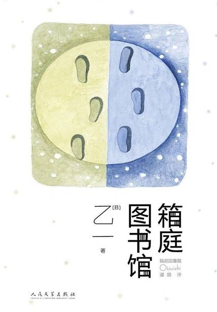

# 《箱庭图书馆》

作者：[日]乙一

## 【文摘 & 笔记】

### 小说家创造法
#### 2

因为太在意故事的发展以至于到站都不下车（【评】*于我而言，读小说读下去的动力是想看结局😁*）

### 便利店日和！

我既没有热衷的兴趣爱好，也没有可以谈天说地的伙伴。
#### 2

“请便，要动手就干脆点儿。反正这人没有梦想，没有爱好，每天只知道吃了睡，睡了吃，浑浑噩噩地混日子。对社会毫无贡献。简直就是害虫！蛆虫！杀了他反而是给他一个解脱。” “够了！别说了！”男人说。

#### 4

“人生不过是一个行走的影子，一个在舞台上指手画脚的拙劣的伶人。登场片刻，就在无声无臭中悄然退场。”  （出自《麦克白》第五幕第五场。此处引用为朱生豪的译文。）

### 青春绝缘体

不知何时已染上微红色调的阳光透过窗户斜斜地照在书架上，陌生作家的古老全集闪闪发光。  

#### 2

河堤旁略微蜿蜒的小路一直延伸到远方，极目远眺，不知何时被夕阳染成橘色的天空占据了大部分视野，放学回家的学生像一排排前进中的小蚂蚁。  

#### 3

大颗大颗的雨滴从电线上落下，打在伞上发出烟花爆裂般的噼啪声，又像是电流火花四射的声音。  

### 白色足迹

#### 2

我停在三岔路口中央，思考该往哪边走。向右？还是向左？仔细想想，人生就是一连串的岔路，往那边走是一种未来，往这边走又是另一种未来。  

#### 4

人生最初的目的地是母亲的怀抱，然而不知不觉间，我背井离乡，独自来到远方生活。我们看不到人生之路通往何方，就像不得不走夜路，却没有手电一样。哪怕有一丝光能照亮前程也好啊。  

### 解说

书写有时会反过来让人认识自己，而阅读则会让自己打开另一个世界的门。  