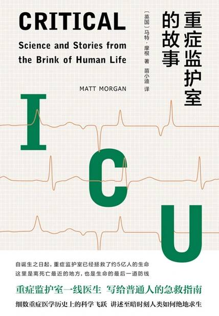

# 《重症监护室的故事》

作者：马特·摩根

## 【文摘 & 笔记】
### 主编序 生命、医学和人文故事

在第23周时，你猛增到一个木瓜的大小。这时你的听力已经相当发达，开始能识别妈妈的声音，以免日后一“出门”就认错了人。至于爸爸的声音嘛，没那么重要，再等一个月（第27周）吧。

### 第一章 欢迎来到重症监护医学的世界

命脊髓灰质炎病毒

### 第二章 免疫系统

在当地医院，克里斯托弗的胸部X光片显示出一片絮状的白色区域，那里本应是黑色的空气区域。这一病状被称作肺实变，在X光片上，感染便是以这种白色形式显现的。克里斯托弗患的是肺炎。

能引起多器官衰竭的严重感染，最常见的是由细菌引起的。

那些呈串珠状且吸收革兰氏染料的细菌被称为“链球菌”，那些簇拥在一起的细菌则被叫作“葡萄球菌”

### 第三章 皮肤与骨骼

即便关于一个病人过往的事实是真的，医疗也并非须通过价值来准许获得的商品。用不予治疗作为惩罚手段，对社会来说是一种谬误，它让我们失去了对人类生命的尊重。医疗不是对人们的选择颐指气使的武器，无论这些选择看起来多么愚蠢。医疗资源的配置应该考虑的是那些影响成功率的要素，而不是对病人人生选择的价值评判。如果社会选择不给老烟枪或酒鬼提供治疗，那它是不是哪天也会选择不治疗肥胖者、内向者、摩托车骑手、冒险运动爱好者或不按正确方式系鞋带的人呢？责任本是条双车道，社会有责任给所有人提供救治，包括那些曾做过糟糕决定的人。

即便我有能力做出“正确选择”，这些选择也不过是我被给予的一整片机会沙漠中的一粒沙罢了。山姆·哈里斯关于“自由意志幻象”的论断为我这种观点提供了神经科学方面的证据。

### 第四章 心脏

复苏的三个要素上，即A、B和C。

“A”与病人的呼吸道（airway）有关，呼吸道是外部世界与肺之间的无障碍通道，空气正是在这里变为呼吸

心肺复苏的这个“B”，即是提供人工呼吸（artificial breathing），并由此给肺部供氧。

心肺复苏的“C”代表的是压力（compressions）。

选择胸骨中部的位置，每分钟向下压100次，这样会让胸腔的自然反冲力推动血液向心脏涌入，从心脏泵出。

自动体外除颤器（AED）

举起你的右手，把坚硬的掌丘放在你两个乳头连线的正中间位置。现在把左手放在右手上面。

引发心脏停搏的条件因素有很多，但大多数时候问题出在以下三个系统之一：心脏（问题最可能出在心脏上）、肺部和大脑。在电视剧里，患有心脏病的角色通常会因疼痛而手捂胸口，但事实并非如此，心脏病在大多数情况下表现为猝死。

### 第五章 肺

嚼食速溶咖啡可能不是什么让人愉快的经历，但对患有严重哮喘且无法获得帮助的人来说，这的确可以挽救他们的生命。

### 第六章 脑

达尔和液压工程师斯坦利·韦德、神经外科医生肯尼斯·提尔合作制造的韦德—达尔—提尔（WDT）阀于1962年获得专利。

### 第七章 消化道

当你命悬一线时，你的血管和各个器官的脆弱内层就会破裂，导致体液渗出。体液渗出则会导致面部、手臂甚至肠道肿胀。因此，我们用静脉输液来弥补这些体液损失，并使用监护仪来小心平衡补给量。

### 第八章 血液

目前人类不活跃的、久坐办公的生活方式让血液无法有效流动。缺乏规律的肌肉收缩会使血液静止，从而导致血液粘滞和血液凝块。

人体内最大的血管是腹主动脉。直径通常仅有2厘米，它从心脏左侧腔室出发。它的第一个分支流向冠状动脉，冠状动脉会向心脏补充血液。然而它会弯曲成马蹄形，此处出现第二个分支，流向头部和胸腔。最后，它在双肺之间向下延伸，硬挤着通过横膈膜上的开口，穿过横膈膜后它就成了腹主动脉。

### 第九章 灵魂

死亡并不总意味着失败；有时，对很好地度过一生的人而言，这是一个合适的结局。

脑干是大脑与脊椎之间长约七厘米的延长物，分为中脑、脑桥和延髓三个部分。脑干很小，却称得上大脑和整个人体的“主板”。它与基本生命功能（包括呼吸、咳嗽、代谢控制和心律）密不可分。没有了功能正常的脑干，人就不可能活下来。

### 注释

锚定效应（anchoring bias），指当人们需要对某个事件做定量估测时，会将某些特定数值作为起始值，起始值像锚一样制约着估测值。在做决策的时候，人们会不自觉地对最初获得的信息给予过多重视。

维克多·埃米尔·弗兰克尔（Viktor Emil Frankl，1905—1997），美国临床心理学家，犹太人大屠杀幸存者，意义治疗的奠基人，代表作有《活出生命的意义》《追求意义的意志》《无意义生活之痛苦》等。