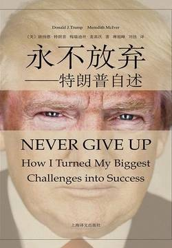

# 《永不放弃：特朗普自述》

作者：唐纳德·特朗普 梅瑞迪丝·麦基沃

## 【文摘 & 笔记】
### 5 我喜欢好好打拼——特朗普苏荷区酒店式公寓

空间权（air rights）

命途多舛是一种常态。一般而言，你想醒过来发现一天到晚什么麻烦都没有，这种可能性小之又小。你要接受命运的这种挑战，不要因此而感到失望。要有足够的信心去战胜困难。为你的命运去斗争吧，命运女神给你的收获自然不会让你失望。

### 10 和抱怨者割席而坐——你可以给自己带来好运

如果仅仅是抱怨而不能积极采取行动的话，那么这反而会对身心造成伤害。

如果能朝积极的方面去考虑，而且创造性地去谋划一些应对之策是需要耗费脑力的。相反，整日怨天尤人却是一种偷懒的方法。

莎士比亚在名著《恺撒大帝》中说过这样一句名言：“布鲁特斯，错误并不在于星象，而在于我们自己。”这句话言简意赅，我们要对自己的行为负责，要对自己的运气负责。这一说法确实振聋发聩。如果你觉得责任心是一种无聊游戏的话，那么你就没有真正意识到其背后所隐藏的巨大机遇。

### 12 勇气并非躲避恐惧，而是克服恐惧

“勇气就是优雅地面对压力。”

### 15 培养一种求索精神——来自我幼儿园老师的一封信

“和自己的内在相比，过去和未来的一切都是微不足道的。”

### 33 弗雷德·特朗普的成功四步骤法则

“成功四步骤法则”——入场、做事、做好、退场。

我们不妨把成功四步骤法则进行如下分解：
1. “入场”，其实就是启动计划的简称。如果你想融入一个行动，那么只做个旁观者是无济于事的。你需要给自己定一个目标，并让自己专注在这个目标上。你不妨把目标写下来。现在的很多资料显示，如果你把想做的事情列一张表，即便是在脑子里形成这样一个列表（我就是这样做的），都会对你做事很有帮助。我觉得在你的脑子里始终要有3张列表：第一张是你每天的目标列表，第二张是你的年度计划，第三张是你的人生目标计划。你每天都要看一看或是想一想这3张列表，它们能帮你集中精力。很多人都没有意识到，其实我们之所以会有压力，正是因为我们无法集中注意力。因此，如果你学会了控制自己的注意力，那么你就学会了在人生道路上克服压力。
2. “做事”，有时候，说着容易做着难，因为在做事的过程中你会碰到障碍，所以要做好迎接困难和问题的准备。它们之所以存在，就是让你在逾越它们之后离成功更近。这种态度会帮你在人生中扬起新的风帆。你的态度应该是“这是意料之中的”，而非“我真可怜，看看老天对我多不公平啊”！把自己的注意力集中在解决问题上，这样一来，你所遇到的问题就会像每天的日出日落一样平常了。
3. “做好”，我一直都认为凡事“做好”是很不容易的。我知道什么叫伟大，什么叫平庸。我和平庸是格格不入的，我对自己有很高的要求，因此我做事会追求最好，而不会认为比较好就够了。这也是为什么特朗普的品牌一直都是精品的代名词。如果你自己生产一款产品、有一个品牌或是一家公司，那么你最好也有和我一样精益求精的态度，否则你做事就不够认真。我注重这一点，这也给我带来了很高的声誉。我不仅有能力把事情做完，还可以把它们做好。不论一些人是不是喜欢我，这都是大家不争的事实。我总能不负众望，大家也都知道这一点，这是铁的事实。你也可以像我一样去为荣誉而战。
4. “退场”，这个方法能帮助你找到那些在等待着你的、有意思的新项目。这也是你有意识地集中注意力的表现。如果一项工作已经完成，那么你就需要继续去寻找下一个目标。我会聘请别人来打理我的项目，有些别人能替我做的事我却非得亲力亲为，这样做是没有意义的。我的工作是要找到值得让大家一起努力的项目。你也可以想一想你的职责是什么，然后剔除一些牵扯精力的事，把自己的精力集中在核心业务上。

### 34 转机往往源于积极创新的想法——辛辛那提1200间抵押出售的公寓

积极的思考方式其实就是创造性的思考方式

如果你不能对自己的处境有创造性的想法，那你也无法用乐观的心态看待世界。

### 35 从每一天收获最多的成果

即便你还没有取得过什么大的成就，你也完全可以高抬起头颅做人。

### 附录1 特朗普的10条成功法则

1. 永不放弃！不要惬意地躺在舒服的地方睡大觉。骄傲自满容易让你一事无成。
2. 富有激情！如果你热爱自己的事业，那么它就不会枯燥乏味。
3. 集中精力！扪心自问：我现在脑子里应该想些什么？排除干扰。在这个时代，需要你应付的往往有好几项任务，因此抗干扰是一个很值得你具备的技巧。
4. 保持活力！倾听、领悟、前进。不要耽搁。
5. 把自己看成一个常胜将军！这会让你把注意力集中在正确的方向上。
6. 坚忍不拔！百折不挠会催生奇迹。
7. 享受好运！常言说的“天道酬勤”是完全正确的。
8. 相信自己！如果连你都不相信自己，那么没有人会相信你。你不妨把自己想象成是在孤军奋战。
9. 扪心自问：我的盲区在哪里？尽管有些事看起来并不那么理想，但是也许中间孕育着很好的机会。艰难的逆境也能变成伟大的胜利。
10. 把注意力集中在解决之道上，而不要抱怨出现的问题。不要轻易放弃，永远不要随便说放弃。这个观念值得说上千百遍，也值得你去记住并践行。这一点至关重要。